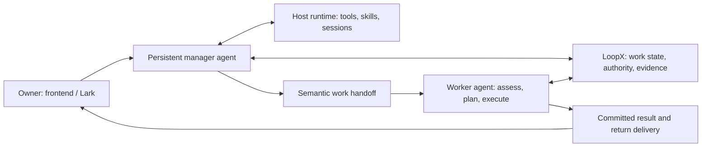

# RFC: Capable Agent Manager and Semantic Work Handoff (v0)

- **RFC status:** Accepted
- **Supersedes / closes:** none
- **Delivery maturity:** Partial; private runtime profile, team-plan confirmation and Todo materialization shipped; complete M1–M4 remain unqualified.
- **Authors / owners:** LoopX maintainers; manager engineering owner
- **Created / last normative revision:** 2026-09-13 / 2026-09-15
- **Implementation baseline:** `7eb4b7bb1661bd5eff63a8725a33169792d5964b`
- **Language mirror:** [中文版](capable-manager-semantic-handoff-v0.zh-CN.md)
- **Related contracts:** [Effect interpreter](agent-loop-effect-interpreter-v0.md), [Manager continuity](../../reference/protocols/manager-evidence-and-continuity-v0.md), [Goal Vision/Replan](../../reference/protocols/goal-vision-replan-contract-v0.md), [Desktop frontends](desktop-execution-frontends-v0.md), [Shared authority](shared-goal-authority-state-provider-v0.md), [Shared Goal alignment/amendment](shared-goal-alignment-and-governed-amendment-v0.md), [TS migration](typescript-control-plane-migration-v0.md)

## Document map and maintenance contract

Sections 1–3 and 5–12 are proposed normative design and acceptance requirements. Section 4 records source-audited baseline facts, not deployment claims. Appendices preserve rationale and evidence; Appendix C separates official Grok Bot documentation from implementation unknowns and LoopX design decisions. English and Chinese are semantic mirrors. This RFC does not declare new tools, schemas, permissions or migrations implemented merely by naming them.

This is the proposed product-level successor to the staged **Manager evidence and continuity v0** design. Keep that protocol as the implementation/migration reference until individual milestones replace its restrictions. Absorb the pending same-Goal handoff design from [#4312](https://github.com/huangruiteng/loopx/pull/4312) as a migration input, not an architectural restriction. Refine the manager portions of Desktop Frontends and Goal Channel, preserving direct conversations with working Agents. Integrate the merged [explicit continuation Stage A](cross-session-memory-substrate-v0.md) from #4094 as the existing CLI/ownership-transfer adapter, retaining its bounded contract until the replacement qualifies (§5.13). Do not replace the effect interpreter, Goal Vision/Replan or shared-authority RFCs.

## 1. Decision summary

Build the manager as a **capable, persistent agent on the user's host**, using the installed runtime's normal tools and skills under the owner's durable authority. It should investigate, decide, do appropriately scoped work, and coordinate workers. Reading a repository must not require inventing a repository-specific manager protocol when ordinary file/Git/API tools already solve the task.

Build handoff as **continuation of work with semantic state**, not only forwarding a sentence or generating a Todo edit. Preserve purpose, context, decisions, constraints, evidence, current commitments and the expected return. Preserve LoopX's authoritative work semantics while refactoring their implementation into a coherent collaboration boundary. Existing module locations, file layouts and manager-only protocols are migration inputs, not constraints on the target design.

The comparison target is the persistent **Grok Bot** product, not only `@grok` on X. **Always available is not the same as long-horizon.** The former keeps an agent reachable; the latter sustains a goal through execution, evidence, replanning, interruption and acceptance. LoopX's architectural advantage is making connected agents long-horizon through durable task and continuation semantics, rather than requiring each runtime to invent them. This RFC brings that strength to the manager and handoff. Grok Bot documents persistence and asynchronous collaboration; the reviewed sources do not establish equivalent goal-continuation guarantees. That evidence limit is not proof that Grok Bot cannot do long tasks. Appendix C grounds the comparison; Section 5.11 and acceptance tests make the LoopX claim concrete.

The division of responsibility is:

- The agent decides how to investigate, whom to involve and what the evidence means.
- LoopX owns accepted Goal/Todo/Vision/claim/evidence transitions and recoverable coordination.
- The runtime owns tool execution, session persistence and actual host permissions.
- Frontend and Lark are conversation/feedback entrances to the same service, scoped to their audiences.

For an authenticated owner on a configured trusted host, the intended default is useful autonomy within existing grants, including ordinary reversible work without repeated approval. Restricted/shared-audience operation remains available. Neither a message nor a capability switch silently expands OS, provider or audience authority. This RFC proposes that default change; it does not activate it.

## 2. Problem and motivation

A user asks a manager to review a change, incorporate several follow-up constraints, coordinate implementation and report back. The current experience can fail independently at each step:

| Friction | Architectural diagnosis | Required change |
| --- | --- | --- |
| A strong model repeatedly says it lacks a PR diff available through local tools | Read-only planner instructions and a narrow projected context define its effective ceiling | Give the manager normal permitted investigative tools and enough task context |
| An explicit instruction becomes a preview requiring another confirmation | Chat proposal mode is confused with the owner's already-authorized intent | Match existing authority and execute or delegate; ask only for a real missing decision |
| A routing list omits the appropriate worker | Discovery is treated as a fixed allowlist of responsibilities | Discover registered active agents, inspect roles/work and select best effort |
| A worker gets “review the points above” without the points | Original-message fidelity does not preserve conversational meaning | Carry relevant context and its provenance, alongside the original input |
| “Forwarded” is reported although the worker has not assessed it | Transport, interpretation, work and return delivery are collapsed | Preserve independent receipts and automatically return a useful conclusion |
| A complete answer is replaced by a format-error notice | User text and control output share a fragile decoding/delivery path | Separate control effects, saved answer and transport recovery |

These failures have different causes. A better model can improve investigation and routing; it cannot guarantee delivery or reconstruct missing context. A denser packet cannot compensate for a runtime forbidden to inspect the evidence it references. Both assumptions must be implemented and tested together.

### Invariants

1. One authoritative owner per kind of work state; no editable manager copy of progress.
2. Existing durable authorization is reused; genuine missing authority remains visible.
3. Read access, action permission and permission to disclose the result are distinct.
4. Receipt, assessment, plan change, completed work and delivered answer never stand in for one another.
5. A worker controls its plan and accepted commitments. Delegation does not silently interrupt it or raise priority.
6. An unresolved request survives restarts and context compaction; failures produce actionable feedback.

## 3. Scope and non-goals

Include global manager conversations, host-native investigation, ordinary authorized actions, responsibility discovery, semantic handoff, receiver planning, automatic return, cross-entrypoint visibility and recovery. Support manager→worker and worker→worker as two real consumers of the same handoff semantics.

Do not build a replacement agent runtime, a second scheduler, an external-agent marketplace, a new repository API, a universal workflow DSL or a duplicate task database. A substantial refactor of the current manager, collaboration and adapter boundaries is explicitly in scope; conserving current code volume or module names is not an acceptance goal. Do not require OpenViking, a shared online database or A2A to make local handoffs correct. Do not copy private reasoning traces or complete historical transcripts into every request. Complex financial and other domain effects remain owned by their capabilities and execution adapters.

### Current cross-RFC route (2026-09-16)

At `43d362532`, the private `manager_runtime` profile, steward executor configuration and team preview→frontend confirmation→initial Todo materialization have implementations. #4547/#4548/#4552 supply confirmation UI, bundle and browser fixture; they do not prove worker execution. DSH Chat remains a bounded read-only segment without cross-turn host sessions and cannot borrow Codex `trusted_owner` qualification.

The [overall roadmap](loopx-overall-roadmap-v0.md) records verified F1–F7 and R1–R7. Repair R1 commitment preservation, stale basis and recovery first, then qualify R2 small teams; M2/M3 converge through R3, and M4 requires real user journeys. Section 4 retains its older baseline as migration input, not an override of this checkpoint. Partial merges do not complete M1–M4. Parallel joins, pipeline dependencies, peer help/review, execution responsibility continuation and cross-host collaboration between long-running LoopX Agents follow the roadmap Section 5 matrix. R2 requires real inter-Agent handoff; M2/M3 cannot reduce to steward broadcasts or one-turn forwarding.

The local semantic exchange now extends the existing `manager-context` owner:
`collaboration_brief_v0` preserves corrections, constraints, relative artifact
versions, acceptance and return requirements alongside the unchanged owner
message. Same-Goal peers independently assess requests and return conclusions;
the requester receives results again until explicit consumption. Owner-local Chat
shows the brief and live read/decision/return facts in the original conversation.
The optional identity-scoped stdio tools support sandboxed managed dsh workers.
See the [three-Agent allocation demo](../../../examples/collaboration-delivery/README.md)
for dependent artifacts, two review rounds and owner correction. The controller
selects phases and transfers files; request transport adds no scheduling, lease
transfer or shared-intent mutation. This is a bounded R3 slice, not M2–M4/G1
completion; external-audience peer forwarding and cross-host continuation remain
with their existing roadmap owners.

Receiver recovery now exposes later pending requests through the existing CLI
and identity-scoped MCP `next_cursor`. Deferred requests awaiting conclusions no
longer prevent access beyond the first 20. `tests/test_inbox_pagination.py`
qualifies 45 durable requests, process restart, scope rejection, live registration
revocation and independent result return. This covers the local receiver paging
part of A20 and restart evidence for A5/A13. It does not qualify cross-day managed
execution, live Lark, frontend journey completion or the remaining M1–M4 work.

## 4. Current-system contract: audited facts

The baseline already has substantial reusable machinery:

| Existing owner | Source / fact | Consequence |
| --- | --- | --- |
| Manager identity/config | `loopx/chat_manager.py`: `open_manager_session`, `manager_workspace`, `manager_model_config` | Stable global role, audience-derived private workspace, `resume_latest`; default Codex model is `gpt-6-astra` / `high` |
| Host execution | `loopx/chat_agent.py`: `_turn_prompt`, `CodexChatAgentSession.start`; `loopx/chat_runtime.py`: adapter creation/restoration | Codex app-server start/resume exists. Planning uses read-only sandbox and never approvals; only the manager read dynamic tool is added by this path |
| Manager behavioral restriction | `MANAGER_AGENT_OBJECTIVE` and the planning prompt | Shell/arbitrary repository reads and mutations are restricted; outside intent delegation, durable changes become preview/apply proposals |
| Session restoration | `loopx/chat_runtime.py` | Saved upstream identity is resumed when compatible; context-version and audience changes can force a new thread. This is not evidence that every deployed request resumes successfully |
| Evidence reads | `manager_context/inspection.py`, `ssh_evidence.py`, global-manager CLI | Core portfolio/Todo/delivery reads, pagination and host provenance exist; the initial projection is not full external artifact evidence |
| Context transfer | `manager_context/__init__.py` | Original ingress provenance, exact recipient, request digest, inbox and receiver hook exist; the current wire is `loopx_manager_context_entry_v1` |
| [#4094](https://github.com/huangruiteng/loopx/pull/4094) explicit Todo continuation | `coordination/todo_continuation.ts`, `local_authority_runtime.ts` | Existing promoted-local path for a current, lease-free Todo and registered same-machine agents; not a general pre-Todo/cross-Goal/leased handoff |
| Return path | `manager_context/tracking.py`, `roundtrip.py` | Read, acknowledge, canonical Todo/evidence links, immutable reply and return transport exist; preserve these facts during replacement, without keeping duplicate transition owners |
| Semantic work state | Goal Vision/Replan protocol and typed control plane | Agent-scoped direction, acceptance, path delta, current Todos, evidence and claims already describe work beyond status labels |
| UI | `apps/presentation/dashboard/src/data/chat.ts`, `chat-model.ts`, capability settings/workbench | Existing conversation and configuration projections should expose the richer runtime and exchange |

A separate pending [#4312](https://github.com/huangruiteng/loopx/pull/4312) at `13085665a9377f160025ec6c01885e889f0df5c9` adds same-Goal agent handoff. Its proposed `agent_handoff.py` owns a Todo/from/to-derived dispatch identity and dispatched/read/claim receipts; this is outside the named `main` baseline. Treat its same-Goal, unclaimed-Todo and independent-review predicates as the semantics of that specific dispatch path, not universal rules for all work requests. Its `same-goal-agent-handoff-inbox-v0` RFC should be absorbed as a historical adapter/migration reference when this direction is accepted.

The reviewed [PR #4306](https://github.com/huangruiteng/loopx/pull/4306), subsequently closed as recorded in Appendix B, proposed a special GitHub evidence reader with revision guards, pagination, typed failure handling and routing policy. Its latest reviewed shape was read-first, so it was not merely a forwarding workaround. Nevertheless, the manager should not need this additional per-resource tool surface for ordinary host investigation. Section 6 rejects it as the chosen product path, retaining useful regression requirements.

- Checkpoint moved to the execution ledger: [Cross-RFC implementation checkpoint](ledger/capable-manager-semantic-handoff-v0/2026-09-13-cross-rfc-implementation.md).

### 4.2 Four questions, four ownership boundaries

- **#4330:** how does the user give work to a capable manager, how is its meaning continued by another agent, and how does the conclusion return?
- **Alignment/amendment:** which shared objective and acceptance remain binding, when may an agent replan its own lane, and which shared changes may be committed?
- **Shared authority:** which state transition actually committed, who holds a current lease, and how are the original receipt and one writable source recovered?
- **TS migration:** where are those semantic decisions and complete transactions implemented, which adapters remain, and when can their old rules/writers be deleted?

These are complementary contracts. A manager is not a Goal-amendment authority; a collaboration ledger is not the Todo authority; a database is not an agent planner; translating code does not promote a provider. The integration rules below take precedence over interpreting a proposed module name as a new owner of all four concerns.

## 5. Proposed architecture

### 5.1 A persistent, capable manager



Keep a neutral private manager workspace to avoid inheriting one project's identity. This is an instruction home, not the limit of knowledge. Supply the host/project catalog and let the runtime access owner-authorized repositories, documents, tools and configured hosts. Load project instructions when entering that project's work; local-repository availability does not establish its HEAD equals a remote PR HEAD.

Use the installed runtime's filesystem, shell, Git/`gh`, web and appropriate connector capabilities directly. Reuse LoopX CLI/skills for structured state; retain `loopx_manager_read` as a convenient high-quality read model, not the only knowledge channel. Domain skills teach methods. They must not become a fresh wrapper around every normal tool. An unavailable cache prompts another permitted authoritative source, not a repeated generic disclaimer. A real permission or policy denial is not treated as a cache failure to circumvent.

The manager performs short investigations and routine reversible work directly. It delegates sustained, specialized or independently owned work, and can consult workers without transferring ownership. It explains its decision when useful. It must not hand everything off merely because it is called a manager, or absorb every engineering task and become a bottleneck.

At session start, expose the effective host, model/effort, accessible resource classes, tool availability, relevant standing grants and instruction revisions. Separate configured preference from verified runtime capability. For the existing Codex adapter, keep the current strong model default; providers retain explicit equivalent profiles. Do not request hidden reasoning traces as evidence of intelligence.

### 5.2 Target boundaries: refactor around work, not the manager

The [App-first conversation/inbox design](app-conversation-and-async-inbox-v0.md)
is the delivery sequence for this boundary: connect managed or attached work,
keep subsequent requests and results in LoopX, then converge the reusable
accept/read/disposition/return lifecycle into its existing TS owner. Lark is an
adapter, not the owner of generic asynchronous coordination. This plan preserves
its identity, authority and reply behavior while the App path is qualified first.


The steward's cross-project relationship and a project coordinator's scoped
delivery commitment are distinct product responsibilities. Neither is a new
authority rank or runtime type. The [project coordination contract](../../reference/project-coordination.md)
records the shared operations, local Goal Chat reuse, limits and next delivery
order. A Chat endpoint never impersonates the registered coordinator it contacts.

The target has three product/technical owners:

1. **Manager agent application:** conversation continuity, investigation, judgment, delegation, synthesis and user feedback. Its AGENTS/skills teach LoopX state discovery and collaboration. Its ordinary tools come from the host runtime. It does not own an independent handoff ledger or invent low-level workflow steps for every user request.
2. **Core collaboration bounded context:** general work-request identity, versioned semantic context, assessment/result relations, transfer/cancellation requests and immutable receipts. Move generic transitions out of `manager_context` into the established TypeScript control plane, with one owner for request transitions. A prospective `control_plane/collaboration` boundary is a design location, not a new shipped CLI or replacement authority/store. Existing Goal/Todo/Vision/lease owners commit changes to their own objects; collaboration invokes them and records their receipts. Section 5.12 defines the transaction and storage boundary.
3. **Runtime and channel adapters:** discover/register agent addresses, present requests at supported loop boundaries, persist transport intents and map provider events to receipts. Codex, CLI, managed Turn, Lark and frontend consume the same collaboration semantics. Transport bookkeeping is not ownership of work completion.

A work request is first-class and may exist **before a Todo**. Consultation can resolve with a reasoned answer and evidence; accepted implementation can attach one or more existing/new Todos. Handoff can stay within one Goal, connect distinct Goals, or reach a registered host. Neither `same Goal`, `unclaimed Todo`, `source excluded`, nor an installed domain capability is a universal admission predicate. Those checks apply only to the specific effect whose contract needs them, such as an independent-review claim.

Work-request identity derives from origin plus an immutable request ID/revision. Do not use only `(goal, todo, from, to)` as universal identity: a second review round of the same Todo is new work, while retrying the same round is not. Changing recipient creates a recorded reassignment/dispatch attempt; old attempts remain reconcilable. Consultation, delegated work and ownership transfer are distinct intents expressed within this one contract, not three unrelated inbox implementations.

For a small local manager action, a current request/Turn and accepted effect receipt can be enough. Do not manufacture a Todo, target-capability, repository identity and validation command merely to read a file, answer a question or record an ordinary note. Durable implementation work still benefits from explicit tasks, scope and validation. Domain-capability checks belong to effects requiring that capability; capability registration is not universal permission to think or investigate.

The durable semantic context consists of a small typed identity/control header plus a versioned human-readable brief and resolvable work/artifact references. The header drives routing and legal transitions. The brief carries open-ended domain meaning; Core does not classify every sentence into a rigid schema. This is dense general-task state, not serialization of the model's hidden thoughts. The same context remains available when a runtime session is replaced.

Prefer one cohesive replacement to compatibility wrappers that preserve duplicate decisions. Inventory every existing producer/reader, migrate with lossless mappings, switch one writer and delete the replaced rules. Reusing contracts and data is required; reusing every current class, JSON directory and prompt is not.

The lead Agent owns task decomposition, investigation, delegation, revision and
synthesis. Host services execute admitted operations and recover their receipts;
they do not encode the scenario's next business phase. A managed worker may
coordinate other Agents through the same scoped creation, session and request
operations defined by the [session execution RFC](agent-session-execution-modes-v0.md#reusable-agent-operations-and-continuation-ownership).
Keep the manager application thin and shared state transitions in their typed
owners. Do not build a second scheduler in the manager or provider adapter.

### 5.3 Authority that enables work

Resolve a request from authenticated principal, origin/audience, resource scope and requested effect, then match the existing persistent grant. A grant is reused across turns and restarts until revoked, expired or outside scope. Authorized delegation may carry an attenuated reference to a real standing grant; handoff is not inherently powerless. The receiver verifies the grant chain, target/action scope and its own host authority. It neither trusts a model-written permission string nor requires the user to approve the same in-scope work again. Read-only discovery, direct reversible effects and protected operations keep their actual permission semantics; none is forced through a second confirmation merely because the entrypoint is chat.

For a trusted owner-private manager, grant the normal host-agent tool profile that the owner configured. For a shared/untrusted audience, run a restricted context with enforceable resource/tool limits. A broad private process followed only by output filtering is **not** sufficient isolation. A verified owner message in a group may trigger private work with a separately scoped return, when a standing policy permits it; other participants do not inherit that policy.

LoopX state mutations always use the existing typed command boundary, even if initiated through shell. The manager does not edit registry/authority files behind the control plane. Repository modifications use the project's normal worktree/review practice. Scoped merge/deploy authorization may be reused; unrelated payment or trading authority cannot be inferred from it.

If an approval bridge is needed, it presents the exact operation and existing grant mismatch and waits for a real answer. A noninteractive `approvalPolicy=never` rejection must not be misreported as the user refusing. Host policy, provider rejection and application restrictions remain separate diagnoses. This design does not attempt to bypass an upstream safety decision.

### 5.4 Semantic density: preserve what changes the next decision

LoopX state is richer than a task queue. A handoff should enable the receiver to reconstruct **why the work exists, what is true, what remains uncertain and what it may change**, using current authoritative objects plus durable contextual material. Density means useful decision relationships, not maximum text length or a giant schema.

The proposed handoff read model composes the following; these are semantic slots, not a requirement to create a new persisted field for each row:

| Slot | Meaning / owner |
| --- | --- |
| Identity and causality | Stable request, conversation/origin event, parent request, handoff revision, exact sender/receiver and return route; host/control-owned |
| Intent and expected outcome | Original user input plus a faithful operational summary and completion question; source-labelled, not a new permission grant |
| Relevant conversational context | Referenced messages/documents, subsequent corrections, source/digest and summary provenance; not unrelated transcript history |
| Current work and commitments | References to Goal, Agent Vision, Todos, dependencies, claims/leases and accepted milestones at known revisions |
| Decision context | Relevant alternatives, rejected paths, constraints, assumptions, uncertainties and rationale summaries; author/confidence/evidence distinguished |
| Evidence and access | Locators, source revision/time, verified vs recorded claim, scope and actual read status; a hash alone is not a fetchable artifact |
| Change request | What new information asks the receiver to reconsider; what must be retained; desired urgency vs an authorized priority change |
| Result contract | Required decision/work/artifacts, permitted audience, next condition if deferred, and who owes the eventual answer |

Reuse immutable source messages, current work objects and artifact references. Store a concise semantic brief only for information not already represented, with revision and provenance. Machine authority comes from typed accepted commands; neither quoted material nor a model-written summary is an authority token. User requests inside source messages are distinguished from third-party quoted instructions.

Do not put the entire handoff inside Goal Vision's bounded summary or expand every TurnEnvelope by the size of the source corpus. Keep the prompt projection small and task-adaptive; pin the brief and unresolved constraints, and provide real permitted drill-down to the full source. A projection must disclose omissions. Reject oversized writes explicitly or externalize them through the existing artifact owner; never silently remove a user constraint. Source-message capacity below is independent of existing Vision and semantic-brief budgets.

### 5.5 Responsibility discovery and receiver-owned planning

**Broad discovery is the owner default.** The private steward discovers the owner's registered Goals and Agents across the local host and already-authorized connected sources, without requiring per-recipient enrollment just to find them. Search and pagination must reach the full permitted inventory; a small prompt or first-page limit is not a smaller discovery scope. Keep stopped Goals available through history/search, while excluding them from default work assignment. Offline, unbound, capacity-limited and unknown-presence Agents remain discoverable with their actual state.

Discoverability, evidence read access, context-delivery grants and execution readiness are separate facts. A narrow delivery allowlist must not become the owner discovery catalog or justify “no Agent exists.” A discovered relevant owner without a delivery grant is a specific delegation gap, with an existing configuration/recovery route; missing runtime evidence is an unknown-readiness gap. Reuse the broad authorized inventory for investigation, then check the requested effect separately. Shared/external audiences receive only their authorized metadata and evidence; owner-private coverage does not implicitly become group-visible coverage. Do not broadcast private context, discover arbitrary unconnected hosts or expand execution authority through discovery. These are target defaults; the current recipient catalog alone does not implement them.

The existing manager context-delivery catalog now excludes Goals marked stopped in its selected registry, and delivery rechecks that activation guard before creating or replaying an inbox request. A malformed activation state cannot grant a recipient. This is one admission boundary only: a lagging global mirror still needs source-authority reconciliation, and registration does not establish a live session, executable capacity, suitable model or a returned result. Explicit inspection of a stopped Goal remains separate from delivering it new work.

Prefer the explicitly named receiver; otherwise resolve the best responsible agent from current state. A missing convenience routing profile must not make a known authorized worker nonexistent. Avoid fixed per-request catalogs as the only responsibility model. If several agents fit, choose an assessment owner and say why; clarify only when ambiguity materially changes authority or outcome. If no worker is suitable, do the permitted work locally or report the actual missing capability. Do not silently start a new user task or wake a stopped Goal.

The receiver gets the packet at a supported safe interaction boundary. The existing turn-start hook is the baseline; an attached runtime may support prompt delivery at its next safe continuation point. Always publish whether the target is reachable, queued until wake, or unsupported. Inbox storage does not prove injection into a model session, and injection does not prove adoption.

The receiver compares the new request to current state, records adopted/partially adopted/deferred/rejected with a concise reason, and applies any plan change through its own canonical Todo/Vision workflow. `partial` must identify the accepted and unresolved parts. A deferred outcome names a resume condition and owner; it must not silently close an execution request still owed. Explicit cancellation/reprioritization requires the corresponding current authority and receipt.

For a cross-Goal question such as “assess a market-positioning opportunity and propose a PR,” the steward resolves responsibility in two passes. Admission first requires an authorized audience/Goal scope, a Goal that has not stopped, current Agent registration, and a supported delivery path. Then it ranks the admitted candidates by accepted responsibility and recent relevant work, resolvable evidence and source freshness, current session/Turn reachability, and the configured model/runtime's ability to perform the requested investigation. A registered identity alone is not a live session; a live session alone does not make its Goal authoritative for this topic. A paused, failed or absent session may be queued only when its managed wake and return path are qualified, and the user sees that queued state. A model preference may break ties but cannot override scope, permission, responsibility or a stopped Goal. The selection includes the reason and the evidence basis; uncertain signals stay unknown instead of becoming an invented score.

The steward sends one source-linked consultation or delegated-work request to the selected receiver, carrying the original question, relevant prior decisions, the requested answer or PR outcome, and the original frontend/Lark return route. The receiver's assessment and any PR/validation receipts return through the existing request/result outbox; the steward may synthesize the answer, but the original route receives the result or an actionable failure without a second user prompt. A duplicate provider callback for the same source event must recover that request and answer-delivery receipt, not create another model run or another visible answer. Independently sent identical text remains a distinct request. Qualify this with one real active worker, one stopped/registered-only decoy, one model-fit alternative, frontend and Lark readback, a lost ACK, and a receiver that defers or fails after inbox delivery. Until this journey passes, a recipient catalog or “context delivered” receipt is discovery progress, not completed delegation.

**Discovery implementation checkpoint.** The existing manager/context read tool now has an `agents` view over the complete permitted registry, with responsibility search, pagination and explicit stopped-history opt-in. It reads independently of the progress snapshot's Agent cap and sender-bound delivery list. Local owner scope is broad by default; Goal Chat and external audiences retain their scope. CLI and authorized SSH exports share the reader. Registration, declared responsibility, context delivery permission and unchecked execution readiness remain distinct. This qualifies a bounded read/diagnostic slice of A24, not worker selection, launch, adoption or original-route completion; prompt-only adapters and older remote installations remain explicit coverage gaps. Continue A24 through existing delivery configuration, actual worker execution and result return before claiming the golden query passed.

The shared local peer-route resolver now excludes alternatives only on explicit
host archive evidence before selecting a unique readable binding. This removes
manual task-link lookup for an Agent with archived session history; unknown,
missing, unsupported and multiple readable alternatives retain a gap. The rule
lives in TypeScript collaboration, while Python adapts registry and host reads.
Real disposable host-store and CLI tests qualify request/replay pinning, not
native worker submission, freshness, capacity, receiver adoption or A24. Keep
the App-first original-conversation pilot open until those facts are proven.

### 5.6 One exchange, independent durable facts

The user-facing exchange is **received → assessed/working → result**, with meaningful updates when needed. Internally, keep transport and work facts separate:

| Fact | Evidence required |
| --- | --- |
| Accepted at ingress | Durable source/request identity; no claim the worker has read it |
| Delivered to receiver inbox | Exact target and persisted payload revision |
| Presented to a worker turn | Host receipt for that request/revision and runtime turn; legacy `read` is not proof of comprehension |
| Assessed | Receiver decision, accepted scope, plan/evidence references or specific deferral |
| Work resolved | Result satisfies the request's completion question, or an explicit rejection/cancellation/terminal inability |
| Answer delivered | Provider receipt/readback for the original route and answer revision; distinct from resolution |

Migrate current inbox/tracking/roundtrip records into the single collaboration owner; preserve their valid effect semantics and receipts, but retire duplicate manager-specific transition logic after cutover. Persist intent before dispatch; use request revision plus effect identity for idempotency. A changed payload cannot reuse an immutable identity; a correction appends a linked revision and the receiver rechecks relevant state before effectful execution. Multiple messages about one job may be explicitly related by the manager, preserving each original obligation and correction. Do not merge independent same-text requests by a content hash alone.

At-least-once delivery with idempotent Core effects is the target. Do not promise exactly-once external effects: uncertain sends are reconciled using provider receipts before retry. Concurrent workers use existing claims/leases; delegation does not claim the worker's Todo. Cross-host operation uses configured transport and authority, not a bare local path copied to another machine.

The receiver commits result/evidence links and audience-ready text. The manager may synthesize multiple worker outcomes into one answer, maintaining request-level coverage. A deterministic outbox delivers an already committed result even if the manager model is unavailable. If synthesis is required, persist that duty; do not let an optional synthesis step erase the worker's result. Model retries never replay an already accepted action.

#### Hierarchical delegation and autonomous progress

An Agent may delegate a bounded subproblem and remain responsible for integrating
its result. Record parent/request lineage without treating it as a grant. At
each hop, scope, allowed effects, depth, total fanout and shared budget remain
within effective authorization; child creation does not multiply the team's
resource allowance. Reuse an existing peer when appropriate. Cancelling one
request affects only its owned descendant executions, not a shared Agent's
unrelated work. Detect wait cycles and release unnecessary execution slots
while awaiting children, so parents cannot consume all child capacity.

Return follows the real dependency: child artifact -> receiver validation and
adoption/rejection -> parent integration -> original requester. Directly
forwarding a grandchild's output to the lead does not prove the intermediate
Agent coordinated or accepted it. Messages use the shared inbox/queue/steer
policies; receiving a message cannot grant a claim, alter intent or accept work.

Extend A6/A8/A13 with a three-level synthetic journey and two input revisions.
The lead retains substantive work of its own; an intermediate worker decides
whether another peer is needed. Freeze the objective, constraints and injected
failure, not the team roster or phase sequence. At least one revised delegation
must originate from an Agent's response to contradictory evidence. Record
request/decision references and adoption facts, not private reasoning traces.
The harness may inject faults and check invariants; it must not supply every
next phase, manually forward results or certify success from message counts.

### 5.7 Session and product continuity

**Cross-session continuation is a first-class product journey, not transcript forwarding.** A user can ask “continue in another session/agent and report back here” once. Within existing authorization, the host prepares the context, selects the supported continuation path, presents it to the receiver and returns the conclusion automatically. The receiver reassesses the work; the user need not export JSON, repeat the background or approve routine restoration. This applies to manager and worker sessions alike.

#### 5.7.1 Choose the continuation path

Keep logical conversation/request, registered Agent, runtime home, executable session and turn/attempt identities distinct. A logical conversation remains audience/authority-scoped. A new executable session does not create a new user request or erase pending obligations. Resolve the actual binding through the runtime adapter; a session ID in prose is neither discovery nor authorization.

| Situation | Restore context | Execution boundary |
| --- | --- | --- |
| Compatible session resumes in the same runtime home | Resume through the supported host API; refresh current work and pending requests | Retain the existing execution binding subject to current grants/claims; no ownership transfer |
| Same Agent replaces a missing, incompatible or exhausted session | Start through a supported host adapter with a scoped semantic brief and current work references | Reconcile the old instance before binding the replacement; Agent identity alone cannot fence a still-running session |
| Another registered Agent takes over | Deliver the same context contract; receiver assesses the requested scope | Consultation/delegation do not transfer existing ownership. Transfer intent uses the current work owner's qualified claim/lease path, including Stage A only inside its supported boundary (§5.13) |

Model changes alone do not require replacement when the host supports compatible continuation. Ordinary context refresh and compaction use the existing context path. If resume/start is unsupported, retain the request and expose the exact adapter gap; do not pretend that storing an inbox item started a session. Cross-host continuation additionally resolves authorized artifacts and transport; never copy runtime database rows or rollout files across homes to impersonate a resumable session.

#### 5.7.2 Prepare a dense, bounded continuation brief

Compose §5.10 `SemanticContext` from current canonical work plus source-authored explanation. Do not introduce a parallel checkpoint database or embed a mutable copy of every Todo. The brief answers:

- What outcome is owed, to whom, and which questions remain unresolved?
- Which constraints, accepted decisions and later corrections govern the next step?
- What was tried, rejected or left uncertain, why, and with which evidence?
- What is already done, what may still be in flight, and where are the exact effect/result receipts?
- Which artifacts/worktree revisions are needed, how can this receiver read them, and what has not been verified?
- What does the source suggest next, and what must the receiver reconsider?

Preserve the current request/brief digest, work basis, artifact references and return route. Source session/turn references provide provenance; they do not carry authority. Keep dated observations separate from current facts and suggestions separate from accepted commitments. Capture relevant dirty changes as authorized versioned artifacts when needed; a Git commit or path alone does not preserve uncommitted work, running terminals or a browser's execution state. Existing resource owners retain those execution facts.

Use existing completion/context hooks at accepted plan/result changes and supported pre-compaction or explicit handoff boundaries. Persist the brief before acknowledging that preparation succeeded; link it to the accepted basis rather than inventing an atomic commit with independent work stores. Abrupt termination may leave only the last durable brief. Recover that version and disclose missing intervals; never require an unavailable source to generate a fresh note before any recovery can proceed. Large evidence stays behind scoped references with omissions visible, not a global TurnEnvelope size increase.

#### 5.7.3 Restore, reassess and activate safely

The adapter records the chosen path/reason and actual session/turn binding alongside existing request observations. These are proposed adapter projections, not a new work-state owner. The receiving turn performs one coherent continuation step:

1. Read the latest request, current selected work authority and authorized brief/artifacts. Reconcile corrections, cancellation and already committed results before planning. Disclose unavailable or stale material.
2. Resolve decision-critical context gaps through §5.7.4 when admitted. Reassess accepted/deferred/rejected scope, preserve unresolved obligations and record the actual plan delta. Reading a packet is not this assessment.
3. Before affected execution, reconcile outstanding effects and satisfy the existing work/resource ownership boundary. For same-Agent replacement, reuse a real runtime execution-instance guard plus applicable work claim/lease. For cross-Agent transfer, obtain the exact owning transfer receipt. Neither a new session-binding revision nor a historical note creates a fence.
4. Perform the next justified step and link its evidence. Commit the owed result through the existing request/outbox relationship, addressed to the logical return route even if the initiating session no longer exists.

If the old instance might still execute, quiesce it or use the supported fencing mechanism and verify readback before another conflicting writer starts. A runtime without enforceable fencing cannot advertise unattended effectful takeover; it may prepare context and perform independent reads while the conflict remains explicit. Do not add a second lease service to hide this limitation. An expired lease does not cancel an already submitted external action: uncertain effects require provider reconciliation, not replay. A source session that later returns must refresh ownership/binding before further controlled effects. A correction arriving during restoration causes a basis recheck, not duplicate execution under the old brief.

#### 5.7.4 Fill historical gaps through the existing recall boundary

[Xiaods' #4094](https://github.com/huangruiteng/loopx/pull/4094) supplies deliberate working-context export and revision-guarded ownership adoption. The [Obelisk RFC](obelisk-session-evidence-provider-v0.md) addresses a different failure: current state identifies the work but earlier reasons or failed attempts were never preserved. Its research supports evaluating targeted longitudinal recall, not assuming that importing more transcripts improves outcomes. Reuse both, without reviving the retired general memory-substrate store.

Recovery first reads canonical work and its referenced brief. Only a remaining decision-relevant gap creates an existing `agent-turn-recall` situation with `resume_or_handoff_gap`: for example, “why was this route rejected at the referenced revision?” Derive bounded query terms from that gap, not the full conversation. When the provider and caller stage are qualified and enabled, consume its typed historical-evidence result with source, scope, revision/freshness and omissions. The receiver verifies applicability against current facts; retrieval does not adopt a plan, settle work or promote Reward Memory.

The initial Obelisk pilot remains optional, default-off and **same Agent, same project/repository**. A replacement session of that Agent may qualify; a different receiver does not inherit the source's archive access. For cross-Agent work, the source may explicitly include authorized evidence excerpts in the handoff brief. Searching its archive as the target requires the separately configured and qualified broader scope; do not impersonate the source or infer permission from a handoff. Raw hits remain private; a channel receives only the audience-appropriate brief/result and retrieval coverage permitted by the provider contract.

Missing provider, stale/incomplete index, timeout or zero hits leaves a typed gap and continues on available evidence. It is not proof that no earlier work exists, nor a new routine user gate. Pause only an action whose necessary precondition genuinely remains unknown; pursue independent work. Basic continuation must pass with no history provider. Operator-only pilot admission stays operator-only until Obelisk's later cold-path stage qualifies; M2/M3 does not silently enable automatic indexing, license/packaging changes or broader retrieval.

#### 5.7.5 Show continuity and close the original exchange

Frontend and Lark share request/result identity and authorized facts. Equivalent authorized surfaces may show the same conversation; other groups must not receive private history. The frontend shows conversation, worker, brief, current work/result and delivery status. A saved answer not delivered to Lark is visible as such and is recoverable without rerunning work. Lark shows timely receipt, substantive result and necessary next action; multi-part output or a readable attachment preserves lengthy content. It must not force the user to ask where every handoff went.

Show “restoring context”, “receiver reassessed”, “execution taken over” and “conclusion delivered” only with their corresponding observations. In the frontend, expose the actual continuation mode, replacement reason, relevant missing context and expandable evidence; Lark automatically reports a meaningful takeover, unresolved actionable problem and final conclusion without flooding every internal transition. CLI/managed Turn consumes the same projection. A mere inbox read cannot appear as a successful takeover, and changing sessions cannot orphan a pending result.

Keep protocol effects separate from visible text. Reuse host tool/function calls and typed receipts for actions where supported; a compatibility decoder must quarantine malformed control envelopes while recovering independently valid display text. Never infer or execute an effect from a recovered answer. Formatting failure is a transport incident, not new work for the model.

### 5.8 One concrete exchange across several messages

A user asks to review a capability PR, then adds “keep lifecycle behavior in hooks; preserve enough context; have the engineering agent implement the conclusion.” The manager reads the repository and actual PR through normal tools, relates the follow-up messages, and keeps the distinction between verified findings and requested design preferences. If the work merits delegation, the semantic brief includes the exact review target/revision, all three constraints, evidence, current accepted commitments and the required return: a review decision plus implementation/validation outcome.

The engineering worker reads the brief and current state, checks its own authority, adopts or contests the design, and updates its plan. New findings may justify a different implementation; they do not justify silently forgetting a user constraint. Its result links the work, validation and remaining limitations. The original conversation receives that result automatically, even after reconnect. A subsequent user correction becomes a linked revision, not a second disconnected queue entry or an overwrite of an already executed decision.

The same contract works when a research worker asks another worker to countercheck a source: no repository or existing Todo is required to express the question, disagreement and evidence. That second consumer is the concrete test that the abstraction is about general work rather than a manager-branded router.

### 5.9 Replacement map and refactor acceptance

| Current seam | Target | Retirement condition |
| --- | --- | --- |
| `review_packet.py` context assembly | `handoff/project_agent_context.py`, shared by full packet and direct handoff-only | Shared source assembly is implemented; duplicate packet-owned derivation removed |
| `review_packet.py` human judgment, gate display and rendering | Retained presentation adapter | Owns no generic handoff state or new authority |
| Handoff length control, fragmentation and reassembly | Channel codec plus `handoff restore` receiver | Real producer/receiver CLI validates complete fields, strict errors and in-budget compatibility; no Lark/cross-host qualification |
| Handoff request identity, assessment, result and recovery | M2/M3 collaboration owner | Separately qualified; codec digests are neither request identity nor ownership receipts |
| Manager inherits Chat planning-only restrictions and JSON preview fallback | Dedicated capable-manager role using native host tools and accepted effect receipts; keep explicit plan-only mode for users who select it | M1 proves ordinary authorized actions and restricted-mode parity; remove contradictory manager instructions |
| Manager context inbox plus same-Goal Todo-handoff rules | One collaboration work-request contract with referenced semantic context and intent-specific admission | M2 lossless migration and two-consumer conformance; remove duplicate identities and transitions |
| `manager_context` owns generic dispatch/decision semantics in Python | Core TypeScript collaboration domain; Python calls the typed boundary and adapts runtime/channel I/O | Switch one writer after differential tests, then delete the old decision implementation |
| #4094 explicit continuation CLI, rich Todo note and transfer grant | Worker→worker adapter to general request/context/result; existing claim owner keeps transfer decisions | M2/M3 qualify §5.13 mapping, legacy CLI parity, receiver planning and automatic return; no second note/grant validator |
| Fixed capability-specific recipient list | Current agent discovery plus intelligent responsibility resolution and real authorization checks | M2 covers missing profiles, cross-Goal work and explicit unavailable targets |
| Inline response text doubles as action protocol | Host tool/effect events plus separate saved human answer; legacy decoder only during the migration window | M3 validates interrupted output and effect idempotency, then retires producer use of embedded control text |
| Manager-specific result return pipeline | Channel-neutral committed result/outbox contract; Lark/Web render and acknowledge | M3 proves automatic return and restart reconciliation without a model rerun |

Do not migrate every LoopX subsystem in this program. The refactor slice is manager role, collaboration request/assessment/result and their real adapters. It may remove substantial old code, but does not absorb quota, finance methods or the entire runtime into a new orchestrator. Preserve characterized legitimate behavior while intentionally changing the old restrictions described here; parity tests must not freeze those restrictions as desired behavior.

### 5.10 Minimum contract and legal observations

The following is a **proposed contract**, not an implemented schema or command. M2 finalizes names and serialization, but must preserve these semantics:

```text
WorkRequest {
  request_id, revision, origin_ref, sender_ref, intent,
  target_ref?, authority_ref, context_ref, return_ref,
  work_refs[], supersedes_ref?
}
SemanticContext {
  revision, digest, brief, source_refs[], work_revision_refs[],
  access_scope_ref, omissions[]
}
DispatchAttempt {
  attempt_id, request_id, request_revision, target_ref, intent,
  effectful, state, supersedes_attempt_ref?
}
Observation {
  event_id, request_id, request_revision, attempt_ref?, actor_ref, event_kind,
  evidence_refs[], result_ref?, recorded_at
}
```

`request_id` identifies the exchange, `revision` is monotonic and immutable once committed, and `origin_ref` resolves to authenticated source provenance. `intent` distinguishes consultation, delegated work and ownership transfer. `target_ref` may be absent only before assignment. The authority reference binds the originating principal's current grant scope; it is resolved independently of the brief. `return_ref` names a principal/audience-scoped result sink or parent request, **not necessarily a manager session**. An empty work-reference list is legal: request acceptance must not require a Todo. `context_ref` resolves to a revision/digest plus the minimal brief: desired outcome, active constraints and known unknowns. Source and work references identify their access scope and known revision; unknown versions are explicit. No raw credential or hidden reasoning is a field.

Validate reference access before presenting context. A summary may be model-authored but retains its sources, authorship and revision; a host validates envelope identity and authority. Oversized context is retained as an access-controlled artifact and a disclosed projection; if it cannot be stored/read, reject with a recoverable context error rather than claim a complete handoff. Existing summaries need no global budget increase.

#### Request identity and result routing across a team

Keep creation ancestry, work dependencies and communication routes distinct.
The Agent that created a worker need not be the requester of its next work.
A peer can address another authorized peer without relaying through the parent
model; that address grants neither resource access nor a work claim. The proposed contract's
`request_id`, `attempt_id`, `sender_ref`, `target_ref` and `return_ref` represent the needed relations. Do not add a parallel work-ID scheme or infer
return ownership from the runtime tree.

A host may consume several messages in one model turn. Distinct requests still
retain independent assessment, result and acceptance relations; a turn ID or
one final answer cannot settle all of them. A correction to one request remains
a revision of that request, not a new task merely because another turn starts.

Commit the result and its scoped artifact references before notifying the
requester. Activity events may update a historical UI turn, but are hints to
read the result, not its body or acceptance. Preserve/re-offer the committed
result through the existing outbox until the exact return is acknowledged;
transport delivery, receiver consumption and work acceptance are separate facts.
If the originating session is gone, resolve its logical return route under the
same audience boundary. Do not rerun completed work just to regenerate a reply.

Waiting is observation, not a join or another scheduling owner. Subscribe before
checking durable pending results, then recheck after wake/reconnect; coalesced
notifications cannot replace result storage. A join uses canonical dependency
identities, current artifact versions and independent acceptance. Interrupted,
rejected or missing results must remain visible even without a final answer.
Only the binding's continuation owner may admit a new execution opportunity;
a final-answer event cannot implicitly restart an idle coordinator.

Extend A8/A10/A18 with one sibling-request fixture: a root creates B, A and D
request distinct work from B, and B receives both in one host turn. Each requester
must recover only its own result after disconnect; the root's activity view
cannot substitute for either return. Include a result arriving during coordinator
finalization, an interrupted member with no answer, and a lost notification after
result commit. These remain proposed cross-host acceptance, not a claim that
all current adapters provide durable wakeup.

State is projected from accepted observations along independent axes:

| Axis | Legal evolution and invariant |
| --- | --- |
| Assignment/delivery | unassigned → assigned → inbox stored → presented; reassignment creates an immutable attempt identity; presentation requires a real host Turn, not a CLI fetch alone |
| Judgment/work | pending → accepted / partially-accepted / deferred / rejected; accepted work can execute and resolve; deferred work remains open with its condition; acceptance is not completion |
| Control request | correction/cancellation/expiry is recorded as a request or condition; cancellation takes effect at an acknowledged safe boundary; expiry blocks new dispatch, not an in-flight external effect |
| Result delivery | absent → committed result → pending send → verified delivered; failure/ambiguity preserves the result and ambiguous sends reconcile first |

Each observation is append-once by event identity. A request-head compare-and-set authorizes a new dispatch, assessment or effect attempt against the current request revision. Evidence and receipts for an already authorized attempt remain appendable against that attempt's immutable request revision after the request head advances; they must not be rebound to the new head or rejected merely because a correction or cancellation arrived later. Same-event retries return the prior receipt; changed payload under one identity conflicts. Core effects return accepted/rejected/conflict/already-applied observations through the existing effect interpreter.

At most one effectful attempt for a request may hold the request-level execution fence across all revisions. A correction or reassignment cannot authorize another effectful attempt until the prior attempt is proved non-executing through acknowledged cancellation, expiry plus an enforceable fence, or the applicable Todo/lease transfer receipt. If no owner can enforce that boundary, the new receiver may inspect and prepare but must not execute a conflicting effect. Consultation may use multiple non-effectful attempts. Reassignment never erases an active execution claim.

A durable pending request carries a next wake/recheck condition through the existing host scheduling owner. Busy, offline, unsupported delivery, dependency wait and missing input are explicit observations, not repeated model polls. When deferred work becomes eligible, wake or present it once through the supported adapter. A result can be terminal failure/rejection, but incomplete work is not converted into success merely to empty the inbox.

All participants can publish results and inspect their authorized requests; generic collaboration and the outbox do not depend on the manager process. For worker→worker, the return sink can be the originating worker and its parent exchange. The manager is optional synthesis and presentation, not the lifecycle coordinator of every collaboration.

For shell/Git/API effects outside Core, use an effect-intent ID and the provider's idempotency/readback when available. Persist a completion observation only after evidence. A crashed command whose effect is unknown is reconciled before another effectful attempt; lacking an idempotent API is not permission to replay it. The manager's ordinary tools gain freedom, not a false exactly-once guarantee.

### 5.11 Long-horizon continuation as a product contract

Conversation context is shared by manager and ordinary Agent Turns. Preserve
explicit references and the authenticated event's ancestry when a formatted
provider lookup omits it. A thread root is not a direct reply target. Its
provider-expanded messages supply a separate ordered excerpt, with message
identities, observed authors/times and coverage omissions; the shared TS owner
checks conversation/thread/root/current identity, excludes current and later
messages, and bounds the excerpt. This supplies information for natural
reasoning rather than classifying “approve”, “continue” or “use the new version”.
A missing reference does not establish delivery failure. Quoted/history text is
context, not a new instruction or grant, and thread context does not silently
replace an unknown explicit referent.

The Lark adapter transports the observation through the immutable inbox; Chat
and receiver handoff consume the same projection. Keep unrelated recent
materials and provider operating prompts out of the forwarded source. Reuse
request identity, receiver assessment and original-return owners; no new
workflow, trigger policy or execution grant is introduced. Root expansion reuses
the existing exact-message lookup; it is not a group-history sweep. Excerpts are
not complete history; oversized or unavailable provider observations remain a
gap rather than an inferred parent. App history remains with its existing owner,
so no frontend setting or opening layout changes in this adapter repair.

Synthetic provider/model fixtures qualify collector→inbox→real Chat
store/protocol→receiver assessment→original return, including replay and invalid
lineage. Read-only live-provider validation separately checks context recovery;
it does not certify model interpretation, deployed adoption or full R2/R3.
Qualify the natural short follow-up and owner action through the installed path
before advertising the golden query as passed.

The inline original-request handoff budget is **32,000 Unicode characters and
98,304 bytes for the JSON-encoded UTF-8 string**, increased from 20,000
characters. A normal 12,000-character request plus a bounded preceding excerpt
can exceed the old limit. The shared TS source-context owner validates before
ingress persistence and receiver delivery, preserving the entire current request.
The encoded bound reserves space for the semantic brief, identity and instructions
inside the existing 128,000-byte inbox record; that reader limit and the 16,000-byte
brief budget do not increase. Apply the same rule to steward and project-Chat
handoffs. Thread excerpts keep their smaller encoded budget and disclose omissions;
larger original material is rejected with scoped-artifact guidance, never silently
truncated. Qualification includes Unicode/escaping boundaries and real receiver
readback of a request plus history above the former limit.

A persistent conversation is useful, but work must also survive losing that conversation's executable session. At each supported continuation point, compose the current accepted work state with unresolved request obligations, relevant decisions and changed evidence. Distinguish a dated research conclusion from a current fact. When a correction contradicts an accepted constraint, preserve both revisions and record the receiver's resolution before the affected effect. Do not replay an earlier rejected approach merely because its rejection fell out of the prompt.

Obligation coverage is derived from source requests and receiver assessments, not a second checklist database. The manager identifies the substantive questions; the receiver records which it accepted, deferred or rejected and why, linking current Todo/Vision/evidence where applicable. A result covers those obligations or explicitly leaves a bounded remainder with an owner and resume condition. An acknowledgement, elapsed timer, successful routine invocation or completed subtask cannot silently discharge the whole request. A later session reconstructs that relationship from accepted state and references, without importing runtime-private history.

Artifact continuity is part of semantic continuity. Reuse the artifact owner to carry type, version/digest, resolvable location, access scope and any extraction/summary provenance for relevant images, documents and code. A receiver must obtain the required material or record why it could not. Text-only channels project a readable summary and an authorized artifact link; they do not silently remove evidence or copy a sender-local path as a remote locator. Do not add a mandatory artifact download for questions the brief already answers.

Long-running work must remain legible in the existing conversation: what is being attempted, who owns the next step, what is actually blocking, and what conclusion is owed. Provide expandable tool/artifact activity and current semantic context in the frontend; Lark gets a concise equivalent and actionable results. Distinguish a queued worker, unavailable host, permission refusal, website login and undelivered answer. Do not expose raw protocol envelopes or claim fine-grained tool activity on adapters that cannot supply it.

The App must also preserve the user's chosen work view across reload and browser history. Manager conversation and Goal overview/tasks/conversation/artifacts use the existing typed workspace route; source loading must not insert duplicate history entries. Preserve the source and Goal identity, retain an unsent draft under its existing owner, and never start or replay a Turn merely to restore navigation. Fresh-entry defaults remain distinct from restoring an explicit view. Packaged navigation recovery qualifies this presentation boundary only; actual receiver adoption, steering and owed-result return retain their independent acceptance requirements.
The shared App activity control preserves an unsent or unconfirmed adjustment
across view changes and reload. Composer and inline controls use one TS client
cache; each inline draft is bound to its original session and Turn. Restoring a
draft dispatches nothing. Retries of unchanged text retain the same ingress
identity after unknown delivery or mismatched receipts; confirmed non-delivery
allows a fresh identity. Editing the instruction starts a distinct request.
Accepted delivery retires that exact entry without erasing another draft. An
ended Turn keeps its unsent draft readable and cannot redirect it to newer work.
Unavailable browser storage preserves page-memory recovery only, not reload
recovery. Packaged browser transport and the real Chat steering/store tests
qualify this bounded recovery behavior; live executor adoption, installed App
readback and Lark steering remain separate acceptance.

Reuse existing capability instructions, context hooks, memory and scheduling owners. Reusable methods may inform planning and handoff, with their source/version visible; remembered lessons do not replace accepted task state or current verification. Stable recurring work may use the existing schedule/event path after its task and replay behavior are understood. This RFC does not add a routine engine, compulsory method learning, a new hook family or business-specific automation.

Parallel work does not imply isolated execution resources. Reuse runtime serialization/leases for shared browser screens or mutable workspaces, separately from Core work ownership. Separate screens, agent names or conversation tabs are not permission boundaries. If a runtime lacks the required coordination, serialize the affected operation and expose the wait; unrelated evidence work can continue. M1 reports actual resource behavior rather than assuming a shared cloud-computer design.

### 5.12 Integration with alignment, authority and the TS kernel

**Classify the requested change before selecting its writer.** Consultation can return evidence without a Todo. An in-intent lane correction uses the receiver's existing Vision/Replan/Todo path. A shared dependency or work-graph change that requires an amendment under the alignment contract uses its proposal/admission path; changing shared objective, acceptance, non-goals, permissions or stop conditions never becomes a lane edit merely because the manager requested it. Stage 2 admission has `canonical_effect: none`. Until the corresponding governed commit class is implemented and qualified, retain the proposal and report that precise execution gap; continue unrelated authorized work. Do not invent a manager commit endpoint, peer vote or additional routine human confirmation. Each amendment class requires its own qualified policy/verifier/commit path. The first Stage 3 `GoalAmendmentAuthority` slice authorizes only intent-preserving `shared_work_graph`; it cannot commit acceptance, non-goal, permission, objective or stop-condition changes. Once a class is separately qualified, reuse that class's commit owner, exact-basis CAS and receipt; peers rebase or receive the specified in-flight-work disposition.

Current amendment admission requires a causal replan obligation and affected Todo IDs. It is not the generic inbox for consultation or pre-Todo work; do not fabricate those records to admit an ordinary request. An adopted handoff separately links actual replan/work settlement. Effect Program, Turn and quota receipts retain their current identities and owners; none becomes a request-completion receipt by aliasing its ID.

**Keep version dimensions distinct.** Carry the request/brief revision and referenced work basis through the existing context/reference model. A work basis identifies Goal intent revision/digest when actually available, source kind and Todo/lease snapshot revision, relevant policy revision, and artifact revisions. Provider generation/cursor, semantic Goal revision, lease epoch and handoff revision are not interchangeable counters. Preserve `unknown`/partial Goal basis rather than inventing a Goal revision from an event sequence or provider head. Before a controlled effect, the owning command revalidates its affected preconditions. A fresh brief cannot revive a stale lease or acknowledge a changed shared goal on another agent's behalf.

**Separate request state from coordination and transport state.** Reuse the existing manager request ledger as the migration source for the general collaboration ledger; it owns intent/assessment/result relations, not copied editable Todos. The shared-authority v0 coordination head remains scoped to its reviewed Todo/claim/lease/gate/receipt semantics. Conversation and semantic brief bodies, raw artifacts, transport attempts and scheduler cursors remain with their existing capability/artifact/adapter owners. Use scoped references between them. Do not add these families to a generic `next_projection` merely because the store accepts JSON. Physical storage may be shared only with independent namespaces, access/retention contracts and reviewed schema compatibility. No provider deployment is required to introduce the request contract.

**Commit within each actual authority boundary; reconcile across boundaries.** A request transition and its own receipt must publish atomically under its owning transaction. A Todo/lease mutation retains its existing lock or promoted authority's state/event/receipt CAS. If adoption also updates work state, persist the effect intent, call that owner, and link its exact receipt; a crash between the two commits leaves a recoverable pending relation. It must not manufacture an atomic request-plus-Todo commit across independent stores. Cross-Goal handoff likewise carries each Goal's basis and receipts, with explicit partial outcomes, not a distributed transaction or shared synthetic revision. Use the existing effect-interpreter, journals and recovery paths; no new workflow engine is required.

**Serialize request-derived amendment cancellation through the existing owners.** Follow [alignment §5.1](shared-goal-alignment-and-governed-amendment-v0.md#51-source-request-reservation-and-cancellation-ordering): request-owner CAS reserves one exact effect under the request fence; the qualified Goal amendment owner atomically settles that operation as committed or aborted. Later corrections/cancellation block new work but remain pending for the reserved effect until its terminal receipt is linked. A source-liveness read followed by an independent Goal CAS is not a cancellation fence. Missing receipts or expired leases cannot release the reservation; conditional abort must durably prevent a delayed original commit. This is a narrowly scoped extension of the existing request fence and amendment operation receipt, not a second Goal writer or a general distributed transaction. Expose pending cancellation versus already-committed effect consistently in frontend, Lark and CLI. Until the selected profile qualifies this protocol, request-derived amendments remain admission-only.

**Honor the selected source per Goal.** Before promotion, existing legacy commands remain the writer. After promotion, call the selected canonical authority; an empty result stays empty and provider failure never falls back to stale Markdown or lease files. Markdown remains a permanent readable projection, not a retired UI or a second writer. SSH transport reachability is independent of shared-provider adoption. A received message grants neither a fresh claim nor authority to compute through an expired fence. Authorized independent reads may continue during a provider outage; controlled writes obey the authority contract.

**Migrate a whole semantic transaction.** Follow TS T0–T3 for each changed public path: one current source snapshot, typed validation/decision, owned effect and durable result, then adapter projection. Reuse `AuthorityStore` and transaction decoding only where that contract actually applies; do not reuse its Todo aggregate as a catch-all. Do not add Python→TS calls per handoff field, retain Python validators as a second policy, or restore retired facades. Implementation PRs include the **migration economics receipt** defined by [TS §5](typescript-control-plane-migration-v0.md#5-payoff-phase-pr-contract). The implementing PR author owns this review artifact in the PR description and validation comment, pinned to base/head; it is not a persisted product receipt, new schema or runtime writer. Its fields cover old/new owner, semantic code deleted, bridge code, happy/recovery round trips, net product code, remaining callers and removal conditions. Full legacy writer retirement waits for the applicable T4/D3 conditions; replacing a manager request writer does not authorize a Goal-wide cutover.

### 5.13 Integrate shipped explicit continuation (#4094)

[Stage A](cross-session-memory-substrate-v0.md), merged in [#4094](https://github.com/huangruiteng/loopx/pull/4094) as `2ebd921ee989f7c696a7214ba1176d3bd5de6fb3`, is an implementation foundation and an in-scope refactor input. Despite the historical RFC filename, it deliberately replaced the generic memory-substrate proposal with `loopx handoff prepare/inspect/adopt`: explicit local continuation over current Todo authority. Do not resurrect a separate memory ledger, redo the shipped primitive or count its merge as completion of M2.

**Reuse its semantic content without duplicating work truth.** Source rationale, rejected approaches and open questions are precisely the non-reconstructable context a long-horizon receiver needs. Preserve the rich and legacy forms through a versioned mapping:

| Stage A content | General collaboration use |
| --- | --- |
| `work_summary`, `rationale`, `key_decisions`, `approaches_tried` | Source-authored brief and decision/attempt history, with provenance; never replace the receiver's current work assessment |
| `next_steps`, `open_questions` | Source suggestions and unresolved questions; receiver assesses them against actual obligations and its plan, without automatic priority or acceptance changes |
| `files_touched`, `source_refs` | Scoped artifact references; local existence is not verified content, and a source path is not a cross-host locator |
| Todo identity/facts, provider revision, note marker/fingerprint, source session | Current work/authority references and provenance; retain their distinct meaning rather than turn them into one request revision or authentication token |

Stage A replaces the current Todo note; it does not provide immutable historical versions or a private memory ACL. Existing notes inherit Todo visibility. Execution-fact changes, including ownership transfer, invalidate the old note; a captured historical brief remains source evidence, not a currently valid transfer grant. During migration, retain the original note/current-state relationship and its real update/claim receipts. If an exchange needs a brief that survives later note replacement, capture the authorized source content as a versioned collaboration/artifact reference at ingress, with the original revision/digest and scope; keep current work facts as references. An old overwritten note cannot be reconstructed by invention. Before retiring or changing the note representation, qualify old/new validation and grant behavior together, keep exactly one writer for each object, and preserve legacy callers until their replacement passes. This does not enlarge the shared-authority coordination head or automatically permit broader disclosure of existing notes.

**Separate receiver assessment from ownership adoption.** `Assessment.adopted` means the receiver accepted a scope; Stage A `handoff adopt` invokes a Todo claim/transfer. Consultation and ordinary delegation need no ownership transfer. For an explicit transfer intent, reuse `continuation_note.ts`, current note/fact validation, `todo_transfer_grant_v0` and the existing claim owner. The typed grant binds source/target/Todo/revision/note facts; a note, digest, registered identity or message by itself is not an execution grant. Stop the old executor before the new one continues through the supported runtime boundary; a transfer receipt alone cannot stop a running process. Stage A session IDs remain provenance, not authentication or a runtime lease. Its hard-lease, host and source-selection restrictions remain attached to this adapter until a separately qualified owning path supports expansion, not universal restrictions on all requests.

**M2/M3 deliver the product bridge.** Preserve the public CLI and digest path while introducing ordinary manager/worker invocation of the same typed effects. The owner should be able to ask “let the other agent continue, preserving the failed approach and my correction” without manually exporting JSON or repeatedly approving an already authorized request. Expose prepared context, actual receiver assessment, Todo ownership readback and result delivery as distinct facts in existing frontend/Lark views. Automatic presentation/start, cross-host artifact resolution and automatic return are integration work, not capabilities already shipped by #4094. Frontend or Lark text must not mint a transfer grant.

Qualify worker→worker through this adapter as the concrete second M2 consumer **only after** it consumes the general request/context and emits the shared assessment/result/return relations. A standalone `adopt` success is insufficient. Reuse the Stage A real CLI fixtures for context readback, stale note/revision, lease rejection, unavailable artifacts, ordinary foreign-owner claim rejection, operation replay and uncertain-write recovery. Keep context separate from action/actor/target/revision fields: operational-key collisions and scalar/array roots fail before mutation, with revision/note/owner/receipts unchanged. Add A5/A7/A13–A16 integration cases: a rejected approach plus correction changes receiver planning; historical replay does not prove current ownership; the final conclusion returns without a manager-only dependency. Retiring the old caller requires this evidence and the TS §5 review artifact; no new generic continuation framework is a prerequisite.

### 5.14 Steward adoption of the reusable conversation work surface

The steward's local attention intake is independent of external channel setup.
It consumes the same canonical blocker/decision facts as the optional Goal
Channel, then synthesizes their effect on objectives, prior decisions and safe
continuation. One Todo's blocker and request form one subject, not two mechanical
alerts. Semantic grouping preserves distinct request identities and decision
terms; model prose cannot change authority or certify delivery. See the
[Goal Channel intake checkpoint](goal-channel-collaboration-v0.md#local-steward-intake-and-optional-channel-delivery).
The bounded implementation supplies facts to existing Turns and replaces channel
templates with configured, restricted steward synthesis. Verified gate messages
cover the matching blocker revision; generation failures remain pending. Local
autonomous wake, change/read/recovery receipts and sustained model quality remain
Stage 2/R3 work. The external synthesis transcript is isolated from live owner Turns.


The shared [conversation work surface](intelligent-review-presentation-surfaces-v0.md#88-reusable-conversation-work-surface) owns adaptive reports, truthful event presentation, Turn-scoped stop/steer, reconnect and cross-channel density for all LoopX conversations. This RFC applies those same rules to the steward's owner conversation; it owns recipient selection, receiver assessment and the original-route return. A manager-specific answer format or transport must not become a second presentation authority.

Routing uses §5.5 rather than a static Agent name list. For a product-design request addressed to the steward, first inspect authorized current Goal, registration, claimed work and fresh session reachability; then rank eligible receivers by responsibility and context, with model/profile fit and actual capacity as separate constraints. Explain the selected recipient or the exact gap. The receiver must acknowledge and assess the full corrected intent, then either work or defer with an owner and condition. The original conversation receives the assessment and final evidenced result through §5.6; the catalog, a stored inbox request and a spinner are three distinct incomplete states. This must pass with a real active worker plus stopped, registered-only, stale and model-mismatched decoys before advertising automatic delegation.

Delivery now prioritizes one complete supported intent→receiver→work→result journey, with the shared report, activity and stop/steer behavior needed by that journey. Do not make routing wait for presentation polish across every channel. Frontend and Lark still need separate real acceptance before an equivalence claim. Characterize and retire duplicated answer-shape prose and message/Turn correlation rules where parity is proven.

The [golden-query pack](../../product/use-cases/steward/golden-queries.md) supplies short user requests and independent outcome/attention oracles. GQ01/GQ02 qualify creation and existing-Agent connection; GQ03/GQ04 qualify responsible dispatch; GQ05/GQ11–GQ13 qualify two-cycle small-team coordination, with GQ07–GQ09 continuity; GQ06/GQ10/GQ14–GQ15 extend materials, attention and replanning. GQ16/GQ17 remain later cross-host/scale qualification. These are scenario tests over existing A1–A24, not new Core protocol states.

GQ06's [material-to-work pilot](../../product/use-cases/steward/golden-queries.md#gq06-material-to-work-pilot--从材料到实际改进)
qualifies an ordinary article request through the same M2/M3 boundary. Source
identity, applicability to current work and satisfied outcome are separate
facts: an indexed source or written proposal cannot close unfinished work, and
a byte-only revision cannot justify duplicate work. Compare authoritative
current artifacts and receiver assessment before choosing a supported
no-change, relevant existing work, direct permitted action or bounded new
request. A note/read receipt is neither implementation nor adoption.

The placement remains the existing conversation/artifact owner for input and
provenance, configured notes or explicitly activated Material Lifecycle for
authorized knowledge writes, and collaboration/work-items for assessment,
execution and return. Ordinary source reading does not activate Material
Lifecycle. Keep shared decision/effect semantics in the existing TypeScript
owners; provider IO stays in its adapter. No source-specific classifier,
manager-only material store, mandatory memory provider or second inbox is
introduced. App-first release qualification includes a same-source unfinished
gap, a changed-source no-op, scope correction and lost-acknowledgement replay;
Lark qualifies the same relations separately. The specification enables that
next implementation/qualification slice; it does not mark M2/M3 or GQ06 passed.

When routing fails, distinguish unread/unavailable sources, incomplete or stale directory coverage, no relevant registered owner, unauthorized scope, missing binding, unknown runtime readiness, capacity wait and receiver rejection. Probe/refresh permitted sources and repair an eligible binding through its owner before asking the user to locate an Agent. Registration grants neither reachability nor authority. If no existing receiver qualifies, an already-authorized creation path is valid; otherwise retain the request and ask only for the concrete missing decision. Never select an irrelevant sole candidate or silently replace an explicitly requested model. A well-written recommendation with no requested dispatch is still an undelivered task.

Ordinary follow-ups retain the responsible owner; direct small reads need no team. One binding retains one execution driver. Existing request/outbox and continuous-monitor owners handle event-driven continuation and delayed return; do not compensate with faster polling. Retain useful constraints through scoped context, distinguishing preference, current fact and action grant; optional memory providers remain optional. GQ03's CI example requires causal evidence and all other review blockers, not a blanket approve policy.

## 6. Alternatives and disposition of #4306

- **Choose normal runtime tools + LoopX semantic state.** It preserves agent flexibility and reuses existing tooling. Its cost is real host-profile qualification and clear private/shared-scope isolation.
- **Do not make a growing list of dedicated evidence tools the primary manager design.** #4306 solves real revision, coverage and routing problems, but its special GitHub reader duplicates mature tools while leaving the restrictive manager shape intact. Close that PR as the default-path solution. Keep its regression cases for revision drift, unavailable sources, responsible routing and private-scope leakage; port only cases exercised by the replacement path.
- **Retain optional bounded readers where the environment needs them.** A shared group, remote read-only service or minimal host can use the existing portfolio reader or a connector. This does not justify forcing the trusted local owner through it.
- **Reject pure prompt expansion and raw-message forwarding as sufficient fixes.** They cannot establish delivery, preserve all referenced context or commit state safely.
- **Reject a new universal workflow/state database.** Replace fragmented handoff owners with one typed collaboration context, referencing existing work authority. Qualify it with manager→worker and worker→worker on the same conformance tests; do not retain a manager-only architecture by default.

Closing #4306 does not close its underlying user problem. Its issue remains linked to M1/M2 until direct investigation and responsibility routing pass live acceptance. No new protocol is justified solely by having written a large RFC.

## 7. Safety, privacy and compatibility

The trust boundary is principal/resource/effect/audience, not “Lark is always untrusted” or “same machine means everything is public.” High autonomy is valuable only with an enforceable host profile. Keep credentials in the existing runtime store and raw private source material outside public projections. Untrusted repository/web content is data; it cannot update standing grants or manager instructions.

Version semantic briefs and reference manifests. Preserve existing stored fields and unknown historical facts; no synthetic read/adoption times. A correction does not rewrite an old conclusion. A fresh conclusion may supersede one with an explicit link. Permission revocation prevents new use/disclosure and invalidates incompatible conversation context, while retaining access-controlled audit records.

Feature-off/restricted-mode behavior stays testable. Existing grants are migrated by exact semantics, never widened by “manager enabled.” Revocation, provider errors and missing host features produce concrete repair guidance. Routine read failures should not block unrelated authorized work.

## 8. Migration and rollback

1. Inventory current runtime/profile, session mapping, grants, pending inbox entries and outbox deliveries. Establish baseline journey fixtures before changes.
2. Introduce the capable manager profile through existing configuration ownership; promote for trusted owners only after effective-permission readback. Reuse a sufficient existing grant; request a one-time profile decision only if no such grant exists. Retain an explicit restricted profile.
3. Introduce the general collaboration contract and map existing manager and same-Goal handoff records losslessly; keep old readers during a bounded migration window. Legacy records expose missing semantic context as unknown and remain readable/deliverable. New producers must not require unsupported receivers; negotiate or render a compatible semantic brief without dropping obligations.
4. Move shared lifecycle transitions into the established typed owner with characterization/parity tests. Keep Python/provider code as adapters. Shared database adoption is a separate project, not a prerequisite.
5. Quiesce only the affected dispatch lane before switching its single writer. Reconcile committed requests/results before activation. Preserve source IDs, pending state and old-reader snapshots.
6. Roll back the runtime profile independently from handoff delivery. Disable new writes before returning to an older schema reader; drain/export incompatible records rather than silently losing fields or replaying work. Report unsupported downgrade explicitly.

### Required legacy mapping

M0 inventories actual fields and producers; the following mapping is the migration acceptance floor, not evidence that a migrator exists:

| Legacy record family | New meaning / preservation rule |
| --- | --- |
| Ingress and manager entries | Preserve source/request IDs, original text, digests, sender, target and exact return scope; introduce a deterministic migration alias, never redispatch |
| Read/decision records | Preserve original times and `adopt/defer/reject/no_change`; map reads to context-provided unless a host-turn receipt exists; preserve `no_change` as a decision, not failed work |
| Todo/evidence links | Preserve all links and source revisions; absent Todo remains legal; a link alone does not verify an artifact |
| Conclusions and return receipts | Preserve immutable audience-ready text, phase, identity, send attempts and ambiguous/pending outcomes; do not re-emit verified sends |
| Pending #4312-style peer records | Preserve the original tuple-derived dispatch identity as a legacy alias and its claim receipts; new rounds use new request IDs, not that old tuple |
| Unrecognized stored fields | Preserve access-controlled legacy payload plus its digest; explicitly map before dropping any field; unknown history is never fabricated |

Run old/new read-model comparison over synthetic records in every lifecycle state, including no-change, partial/legacy unknown, crash-after-effect and scope revocation. During cutover one writer owns each request; old readers are compatibility projections, not parallel authorities. A restore must reconcile outbox/claims and preserve newer records before switching back. Rollback cannot undo external effects.

## 9. Validation and acceptance

The following IDs are durable acceptance anchors for engineering Todos and PRs. They define future tests; this RFC does not mark them passed.

| ID | Journey / required evidence | Pass condition |
| --- | --- | --- |
| A1 | Owner asks about a real local repository and remote PR | Manager independently reads normal tools, pins actual revision and gives an evidence-backed answer without a special PR provider |
| A2 | Local cache unavailable; alternate permitted source works | Manager completes the investigation; real denial is reported accurately and not circumvented |
| A3 | One persistent grant, two requests and a runtime restart; revoke before a queued mutation executes; untrusted repository/web text requests a grant or instruction change | One reversible non-Core host mutation succeeds with readback under the standing grant without repeat approval; the revoked queued mutation is rejected before execution; untrusted content remains data and cannot change effective grants/instructions; out-of-scope effects do not run |
| A4 | Active worker absent from convenience routing profile | Current registered responsibility is discovered; correct authorized receiver selected; stopped targets remain excluded |
| A5 | Three linked user messages including a correction and prior rejected approach | Receiver explains the intended change, preserved constraints and actual Todo/Vision consequence without asking the user to retype context |
| A6 | Manager→worker and worker→worker run the same handoff fixture | Both paths use the same identity construction and invariants—not the same literal ID across distinct requests—for revision, assessment, state links and return, including cross-Goal consultation without an initial Todo and a second review round of one Todo; no second task database |
| A7 | Duplicate ingress; correction/cancellation races a late receipt and a request-derived amendment commit; effectful pre-Todo reassignment; concurrent claim; repeated same-Todo review; crash after a non-Core effect | An authorized old attempt can append its exact receipt after the request head advances without authorizing new work; no duplicate effectful attempt executes; an obsolete unreserved source cannot commit; reserved commit/abort races follow alignment §5.1, including crash, lost reply and delayed executor cases; no false cancellation or silent priority/ownership override |
| A8 | Worker finishes while manager/transport restarts | Result survives; original audience receives it automatically; ambiguous send is reconciled, not blindly repeated |
| A9 | Long response and truncated protocol trailer | Full valid answer is preserved and recoverable; no leaked protocol, lost obligation or replayed action |
| A10 | Owner frontend and authorized Lark conversation | Consistent request facts; truthful queued/assessed/resolved/delivery states; different audiences remain isolated |
| A11 | Registered SSH host unavailable or older receiver | Coverage and pending route are explicit; local mentions do not pretend to be remote evidence; recovery resumes correctly |
| A12 | Model/session/tool-profile upgrade | Compatible session resumes; incompatible recovery preserves constraints and pending requests; effective configuration is visible |
| A13 | Work spans two days; replace the executable session after an accepted plan, a rejected approach and a later correction | Receiver reconstructs current commitments and unresolved obligations from canonical state/context; refreshes time-sensitive evidence; explains its actual plan delta and returns the owed conclusion without silently reviving the rejected path or requiring the original transcript |
| A14 | Authorized handoff carries a decision-relevant image/document through a text-only entry point to another configured host; paired denied and unavailable cases use the same fixture | Positive case proves remote retrieval/extraction, artifact version and a concrete effect on the receiver's obligation or plan. Negative cases record the exact unread reason without fabricated receipt, private disclosure or sender-local path dependence |
| A15 | Same handoff fixture on legacy and explicitly promoted Goal sources; provider offline; crash between request/work commits | Exactly one selected work-state writer; canonical empty/failure never falls back; recovery links the original work receipt without replay; request-pending and work-committed states remain distinct |
| A16 | Receiver replan and shared amendment; stale basis; peer-held work; source request corrected/cancelled while commit races | Route changes stay inside intent/permission; admission does not change the Goal; unsupported commit remains explicit. A supported amendment requires the separately qualified commit class, exact receipt and peer rebase/lease disposition; a request-derived proposal additionally requires the exact source reservation and Goal-owner terminal receipt from alignment §5.1; repeat its A7 race matrix across both owners, including same-operation abort/recovery—not manager or verifier prose |
| A17 | Abrupt loss before a fresh brief; replace the same Agent session with no recall provider, after an external action with uncertain outcome | Same Agent/new-session fixture preserves the work owner and does not fabricate a cross-Agent transfer grant or mutate the note merely to restore context; read back the actual claim/lease disposition. Last durable context and missing interval are explicit; reconcile uncertain effects, perform a justified next step and return without the old session |
| A18 | Old session stays live or returns; concurrent replacement, cancellation and a late correction | Make the stale executor actually attempt a conflicting Core and external effect after replacement: reject at the owning enforceable boundary, or withhold replacement execution where fencing is failed/unsupported. Reconcile already submitted effects; test late return/correction/cancellation and read back current binding/claim; no duplicate effect or false cancellation |
| A19 | Decision-gap recall with same-Agent replacement versus another Agent; disabled provider, stale index, timeout and zero hits | Stage 1 never auto-calls; Stage 2 requires qualified admission/readback. Reject out-of-scope returned rows; another Agent receives only explicitly authorized source-authored context, not raw private provider hits or archive access. No source impersonation; zero hits preserve unknown; no-provider continuation works; revalidate historical facts |
| A20 | Context compaction and bounded projection omit a material rejected approach or unresolved question | Coverage exposes the omission; authorized drill-down restores required context or records a real gap; no unbounded TurnEnvelope, lost obligation or false completed handoff; frontend/Lark/CLI show the same actual restoration and result |
| A21 | Short question and long evidence-rich investigation through owner Chat and Lark | The short answer is direct; the long answer has a readable conclusion, preserved full Markdown report, source/version links and bounded gaps. Frontend rendering treats model HTML as inert; Lark does not truncate away the conclusion or silently lose the report. Neither answer requires identical boilerplate sections |
| A22 | Tool/progress events, reconnect, SSE replay and delayed final answer | The current phase and only host-emitted public activity are visible; replay deduplicates by event identity, keeps the complete final answer and does not restart the Turn. Failures and absent activity remain truthful |
| A23 | Stop and steer an active Turn; stale button, duplicate ingress, completion race and unsupported adapter | Stop affects only the selected Turn and reports the actual outcome. Steering is received in that Turn or explicitly queued with a receipt; no correction silently disappears, later Turn stops, duplicate model run or worker cancellation |
| A24 | Steward routes a product request to a responsible active Agent amid stopped, registered-only, stale and model-mismatched decoys | Fresh responsibility, authorization, runtime reachability, capacity and profile fit determine the recipient; receiver assessment, work and final evidenced conclusion return once to the original frontend/Lark conversation. Catalog discovery and inbox delivery alone fail |

Run deterministic transition/compatibility tests, real installed-runtime qualification, then real frontend/Lark roundtrips with synthetic safe tasks and an authorized private canary. Record runtime/source versions and emitted receipts. Include mobile Lark and packaged frontend render/readback; backend tests alone do not pass A10. Provider receipt ambiguity and offline failure cases are required, not optional happy-path add-ons.

## 10. Operational contract

Measure ingress acknowledgement latency, first substantive response, handoff assessment latency, result-to-delivery latency, repeated-confirmation rate, unresolved requests and incorrect routing. Report attempted/verified/omitted source coverage and configured/effective permissions. Do not reward message counts or queue movement as completed work.

Target an ingress receipt within two seconds on a healthy local service, independently of model latency; this is an initial SLO to measure, not a model-response promise. Long work announces an actionable delay rather than emitting periodic noise. Cap model concurrency and per-turn investigation cost through existing runtime/Goal configuration; the manager's budget must not consume all worker capacity. Busy workers retain accepted work; queuing and next wake are visible.

Use existing service recovery and receipt pumps. No manager-specific business automation for each kind of request. Expose configuration and failures through the existing CLI, capability settings and manager conversation. Troubleshooting distinguishes model failure, tool/policy denial, state conflict, unreachable receiver and transport formatting/delivery failure.

**Accepted queue preparation failures (S1/S10, A12/A22/A23):** an accepted
request owns a terminal outcome even before an adapter starts. A missing runtime
asset, invalid workspace or failed session restoration must settle the affected
queued Turn through the shared Chat lifecycle and release its claim. Waiting for
an answer must observe that durable failure promptly, rather than wait for the
model timeout while leaving runnable work behind. Keep the original typed
provider failure where available; unexpected local preparation errors use
`runtime_unavailable`, with private diagnostics retained locally. Cancellation
and an already terminal result win over a late preparation error. Restoring the
runtime must not replay a failed request; the same ingress identity returns the
same failure, while a fresh explicit request can run after repair.

**Stopped workers returning late (A23, GQ08):** context preparation and provider
reads can outlive the bounded interrupt wait. Before dispatch and when a provider
returns, consult the persisted Turn status and its exact active Session claim
through the existing typed turn-driver owner. An in-memory cancellation marker
is insufficient: it may already have been cleared when the stop receipt commits.
A stopped worker must neither launch a new provider Turn nor deliver a late
handoff, and it must not borrow a newer Turn's claim. Validate stop through the
real HTTP endpoint and file store, let a fresh request complete before releasing
the old reader, and verify one interrupted outcome with no late dispatch or
handoff. This qualifies that delayed-read boundary; it does not prove provider
interrupt fidelity or cancellation of an effect already admitted by its owner.

The bounded Python queue repair uses the existing store's fenced failure and
claim-release operations for all queue callers; Lark only translates the typed
outcome. It does not create a separate manager scheduler or new TS authority.
The TS turn-driver migration must preserve this pre-dispatch failure matrix
alongside accepted-request recovery. Validate with a removed-release fixture,
multiple queued requests, a stop race, same-identity redelivery and a fresh
request after recovery. These qualify the preparation boundary, not successful
owner selection, receiver adoption or the complete A24 journey. Operational
recovery must also verify the service's actual installed release: a healthy HTTP
listener alone does not prove its lazy-loaded runtime assets still exist.

**Request publication and return preparation (S1/S3, A8/A9/A24):** persist
and verify the trusted original-conversation route before publishing an Inbox
entry. An independent receiver may consume the entry before the sender receives
its acknowledgement. A failed route write/readback must leave no visible work;
a prepared route without an entry is inert and an exact retry can finish it.
Keep the existing request identity and conflict checks. This matches the peer
request's route-before-entry ordering; it changes Python filesystem IO ordering,
not the shared TypeScript request or return-state authority. Exercise App,
Goal Chat and external-audience ingress, immediate receiver results, interrupted
publication and original-transcript return after restart. This qualification
does not establish native worker selection, execution or the full A24 journey.

## 11. Normative delivery plan

Implement coherent end-to-end slices, not one PR per incidental field. The manager engineering owner maintains canonical Todos and a private incident-to-acceptance map; PRs link this RFC milestone and acceptance IDs. Public progress updates contain only safe results. Milestone completion requires current deployment evidence, not merged PR count.

| Milestone | Shipped behavior and ownership | Entry / exit evidence | Rollback |
| --- | --- | --- | --- |
| M0 — reconcile direction | Manager capability owner inventories current restrictions, grants, sessions and pending exchanges; closes superseded #4306 path and maps surviving fixes | Existing fixtures + public decision link + no orphaned request; no runtime claim | Documentation/proposal only |
| M1 — useful host agent | Manager capability + runtime adapter use ordinary tools/skills and persistent owner grant; frontend exposes effective profile/session, supported tool activity and actionable failures | A1–A3, A12 on real installed runtime; qualify shared-resource coordination; portfolio remains reusable; no per-resource wrapper required | Restore restricted profile, preserve requests |
| M2 — semantic continuation | Core collaboration replaces manager-specific request transitions; reuses alignment and selected work authority; supports pre-Todo/cross-Goal requests and receiver planning; both consumers qualify the same contract | A4–A7, A11, A13–A20 at the supported boundary; A19 requires honest disabled/unqualified behavior and does not mandate Obelisk promotion; old/new parity and crash reconciliation; TS migration economics review artifact (§5.12) | Disable new producer, retain compatible readers and pending results; do not switch Goal authority |
| M3 — automatic complete exchange | Receiver conclusion + existing outbox + frontend/Lark visibility, safe rich output and restart recovery | A8–A10 plus A13–A14/A17/A20 return-path qualification; failure injection and live readback; user receives conclusion without querying | Keep result store, switch transport/profile without replay |
| M4 — promotion and retirement | Three heterogeneous active Goals, owner + shared-scope and configured SSH journeys pass; obsolete manager restrictions/compatibility seams removed | All acceptance rows, permission regression and measured SLO/cost; document remaining unqualified hosts | Scoped rollback with schema-aware drain/export |

M1 need not wait for a generic handoff refactor. M3's independent format/delivery fixes may ship early using the existing inbox. M2 promotion needs the second consumer; it must not hold a useful manager-only improvement hostage. No milestone creates an extra user confirmation for routine research or normal delegation.

Each implementation Todo declares target capability, repository, write scope, validation command, RFC milestone, acceptance IDs and dependencies. Prefer extending existing Todos; supersede obsolete ones with lineage. Separate LoopX core transition work, manager capability/runtime work, frontend/Lark work and domain-adapter work. Domain recipes remain outside this generic RFC. The engineering owner reports the accepted scope and next milestone, then the delivered outcome and evidence automatically.

### 11.1 Dependency and parallel-work plan

| Slice | Hard prerequisite | Can proceed without | Completion boundary |
| --- | --- | --- | --- |
| M1 host agent and early M3 reply recovery | Current runtime, effective authority/profile, existing UI/transport contracts | Generic collaboration replacement, shared provider promotion, amendment Stage 3, full TS rewrite | Native tool and feedback journeys; no changes to Goal truth or provider defaults |
| M2 request transaction replacement | TS T0 caller/source inventory within the implementation PR; characterized current request/receipt behavior; one writer and lossless migration | A new daemon, PostgreSQL service, D3 cutover, shared Goal amendments | Request identity/assessment/result in one typed domain; old request writer retired at the bounded cutover; unchanged external work owners |
| M2 receiver and authority integration | Existing alignment/admission and current Todo/Vision/lease commands; request effect/recovery seam; each affected command's supported transaction contract | Closing unrelated T1/T2/T3 consumers or promoting every provider | A15 on disposable legacy/canonical fixtures; A16 proves lane/admission boundaries; unsupported work effects remain explicit |
| M3 complete exchange | Committed result and exact request/work receipt relationships; supported runtime and Lark/frontend adapters | M2 completion for independent format/retry fixes | Generic producer integration follows M2; early fixes preserve the existing owner and cannot claim the new schema shipped |
| M2 session restoration (§5.7) | Existing host resume/start API, scoped brief references, actual runtime binding/resource guard and applicable work authority | Historical indexing, Obelisk installation, Goal-wide storage promotion | A13/A17/A18/A20 on supported same-Agent replacement; source loss and a returning old executor included; unsupported takeover cannot be advertised |
| M2 worker takeover + M3 return (§5.13) | Shared request/assessment contract, qualified transfer owner where needed, scoped artifact resolution and existing outbox | Broader archive search; consultation needs no claim transfer | A5/A6/A7/A14/A18/A20 through the real CLI and frontend/Lark adapters; execution takeover and answer delivery have separate receipts |
| Optional recall-assisted restoration (§5.7.4) | Obelisk's own packaging/privacy/structured-result qualification and admitted caller stage under `agent-turn-recall` | M2/M3 basic continuation; no-provider path ships independently | A19 plus matched continuation tasks showing reduced reconstruction/repeated failure without correctness or scope regressions; operator-only remains so until cold-path promotion |
| Governed shared-amendment integration | Alignment Stage 3's qualified commit class, policy/verifier, lease impact and exact-basis receipt | Unrelated manager UX improvements | Conditional follow-up owned jointly with alignment; no implementation of a second `GoalAmendmentAuthority` |
| M4 manager promotion | Qualified M1–M3 and applicable A1–A20 for advertised profiles, including disabled/unqualified recall and unsupported-amendment negative cases | Provider-wide migration, ten-day storage soak for an unchanged existing profile, or a PostgreSQL rollout | Promote only manager/handoff behavior. New storage/default/shared-amendment capabilities retain their separate gates |

If this program changes a provider, retention or authority-source profile, its affected D1/D2/D3 requirements become hard dependencies; manager acceptance cannot waive the required ten-day soak or cutover approval. A13's continuation test and D2's storage soak measure different things. An existing profile used unchanged does not acquire a new ten-day gate merely because a manager reads it.

### 11.2 Execution order and integration receipts

1. **Complete and qualify M1 through R1/R2 without rebuilding shipped profiles/entrypoints.** Record the exact source head and actual runtime/entrypoint call sites. Fix the owner-private profile and existing readback/feedback. Run A1–A3/A12. Do not deliver a standalone inventory framework.
2. **Replace one complete M2 request transaction, then attach receivers.** Begin from `manager_context` request/tracking/return producers and both real consumers, including the shipped #4094 CLI continuation adapter (§5.13). Publish the before/after ownership map, migration mapping and the migration economics review artifact (§5.12). Preserve accepted work state through existing commands; qualify crash-between-commits and legacy/promoted sources before widening producer rollout. Use existing alignment source-basis reads, not a copied classifier.
3. **Close M3 automatic return and user visibility.** Independent reply recovery can ship in parallel with steps 1–2. Integrate the generic producer only after its receipt contract is stable; exercise A8–A10, A13–A16 and A17/A20 across the actual entrance/receiver/return paths. With the source session gone, verify the same committed result/outbox identity, reconnect recovery and audience isolation through packaged frontend, Lark and CLI readback.
4. **Promote a named M4 cohort and remove the replaced paths.** Keep provider default, Goal-intent authority and capability qualifications explicit. Shared-amendment commit integration follows its upstream readiness; until then the UI says proposal/admission or unsupported commit, never “Goal changed.” Provider source migration follows the shared-authority program rather than this release.

At every PR handoff, report: base/head; this RFC's milestone/acceptance IDs; relevant TS T-card and authority D-card if affected; alignment stage consumed; exact owner/command/receipt and source mode; callers deleted; tests/real-runtime evidence; unresolved holds; and one next executable step. Link the existing canonical engineering Todos rather than copying a live task list into this document. If upstream ownership moves, resolve the new symbol and update both language versions before implementing; do not restore the old module just to satisfy this plan.

Cross-session sequencing inside these milestones is explicit: first qualify same-Agent replacement with history retrieval disabled; then cross-Agent continuation through the existing transfer adapter; then qualify optional gap recall under its own rollout. Each slice includes the affected CLI/managed Turn, packaged frontend and Lark readback/feedback, rather than deferring product entry points to a later backend-only release. Measure time to the first valid continuation step, retained material obligations, avoided repeated failures, duplicate effects and context cost. More restored tokens or a successful `resume` response alone is not improvement.

## 12. Open decisions

1. **Trusted-host profile defaults:** maintainers own promotion. Recommend using the effective owner runtime profile with explicit resource/audience binding, not a new manager ACL language. Before M1, qualify actual read/write/network/approval behavior and migration from existing grants.
2. **Generic handoff API placement:** typed control-plane and manager capability owners map existing storage/transactions before M2. Recommend one coherent TypeScript collaboration boundary replacing manager-specific handoff ownership; exact type/module names and the lossless storage mapping follow characterization, not this prose.
3. **Delivery SLOs and context budgets:** manager engineering owner measures M1/M3 latency and constraint retention. Keep current budgets until evidence shows a specific bottleneck; amend both language versions for normative changes.

These are engineering decisions to resolve within authorized scope and record in review; they are not new routine owner gates. Permission expansion and incompatible migration still require their actual existing authority.

## Appendix A: Research and decision basis

- [Server-client product shape](../../product/foundations/server-client-product-shape.md): LoopX is durable work authority; executor intelligence and runtime tools remain outside the store. This RFC changes the manager's restrictive role, not that separation.
- [Agent-loop effect interpreter](agent-loop-effect-interpreter-v0.md): every interpreted effect returns an observation. Handoff and return should fit that loop, rather than grow disconnected task states.
- [Agent IM collaboration](agent-im-openviking-collaboration-v0.md), [Shared authority](shared-goal-authority-state-provider-v0.md): transport, context and state authority differ; a stronger local manager does not require promoting a remote state provider.
- [Codex App Server architecture](https://openai.com/index/unlocking-the-codex-harness/): the runtime already supplies tools, skills, durable threads and streamed events. Reuse it as the host rather than recreate those capabilities in manager-only APIs.
- [A2A specification](https://a2a-protocol.org/dev/specification/): message/context/task, status and artifacts are useful comparison concepts. This RFC borrows the separation of communication and work outcomes, not an A2A dependency or a new transport mandate. The linked development specification is not pinned implementation authority.

The external sources inform the design; they do not prove LoopX behavior. The named LoopX baseline and its source paths support Section 4. Private incident transcripts and account information are excluded.

## Appendix B: Decision and execution ledger

2026-09-13: proposed a capable manager plus semantic continuation direction and a substantial collaboration-boundary refactor. [#4306 was closed](https://github.com/huangruiteng/loopx/pull/4306#issuecomment-5652539392) as the superseded implementation path; its underlying issue remains an M1/M2 acceptance obligation. Existing reply-recovery and responsibility-discovery fixes remain useful. No acceptance row, host-profile promotion or handoff schema migration is claimed delivered by this document.

2026-09-13: added the official Grok Bot study in Appendix C; refined positioning, Section 5.11, A13–A14 and M1–M3. This adds reviewable requirements, not a competitor runtime qualification or shipped LoopX behavior.

2026-09-13: reconciled shared-authority, shared-alignment and TS migration progress at the pinned baseline; added Sections 4.1–4.2, 5.12 and 11.1–11.2 plus A15–A16. Updated the companion RFCs and index, retained separate promotion/commit owners, and sharpened A13 elapsed-time and A14 actual-use evidence. No upstream qualification hold is waived.

Later dated checkpoints live in the [per-entry ledger](ledger/capable-manager-semantic-handoff-v0/), one file per slice. Record future decisions as dated links to reviewed changes, naming the normative sections affected. Preserve previous source revisions and unresolved requests. Do not turn an append-only delivery log into an alternate task authority.

## Appendix C: Grok Bot product and implementation study

### C.1 Method and evidence boundary

Reviewed official product, usage and deployment documentation on **2026-09-13**. This is a documentation study, not an authenticated product trial, performance benchmark or source audit of the Grok Bot runtime. The sources below identify what is advertised or documented; LoopX decisions are ours. A missing public guarantee is **unknown**, not proof of an absent implementation.

Do not substitute Grok's model/API capabilities, the X reply bot, Grok Build source code or another coding agent's internals for Grok Bot evidence. The current Bot documentation references Cursor-hosted infrastructure and account services; those are documented deployment details, not grounds to infer a shared scheduler, model routing algorithm or transaction implementation.

### C.2 What is documented, and what it establishes

| Surface | Officially documented behavior / mechanism | Evidence limit |
| --- | --- | --- |
| Product promise | The [launch announcement](https://x.ai/news/introducing-grok-bot) presents background agents and a coordinating chief-of-staff role. The [overview](https://docs.x.ai/grok-bot/overview) describes persistent working context and work continuing while the client is closed. | Supports an always-available product model; neither a testimonial nor background execution proves goal acceptance across arbitrary interruptions. |
| Role and memory | [Bots](https://docs.x.ai/grok-bot/bots) have named roles, separate conversations and learned context. Profiles hold stable responsibilities; memory includes preferences/facts/summaries. Changing facts should be checked at their source. Copying a profile does not copy its conversation or learned memory. | Profile, memory and durable task authority are different concepts. The memory algorithm and consistency guarantees are not disclosed here. |
| Conversation and collaboration | [Chat and collaboration](https://docs.x.ai/grok-bot/chat-and-collaboration) documents groups, directed mentions, threads, reactions and asynchronous Bot messages that wake a recipient for a later reply. Bot-to-group handoffs are text-only. | A visible reply is useful UX; the page does not specify revision conflicts, accepted work ownership or a durable return-obligation protocol. |
| Execution substrate | [Computer and apps](https://docs.x.ai/grok-bot/computer-and-apps) describes one persistent account computer, shared files/logins and separate Bot screens; one computer-use task per screen. Connectors are preferred where suitable, with browser interaction for other workflows. Local-computer execution is separately controlled. | Screens are not security isolation. The docs expose resource behavior, not the locking implementation or complete agent loop. |
| Results | [Files and results](https://docs.x.ai/grok-bot/files-and-results) supports attachments and reviewable artifacts, with shared workspace access. It recommends distinguishing facts, inference, completed work, pending actions and open questions. | An artifact or screenshot is not by itself proof of a completed external action or a current source read. |
| Reusable work | [Skills and routines](https://docs.x.ai/grok-bot/skills-routines-and-automations) describes reusable instructions, task demonstrations that draft skills, and a Bot-owned schedule/event routine with run history. Testing a routine can perform real work. | This explains workflow reuse and triggering; it does not specify LoopX-style goal convergence, semantic adoption or external-effect idempotency. |
| Permission experience | [Approvals and privacy](https://docs.x.ai/grok-bot/approvals-security-and-privacy) describes operation-specific approval, matching persistent rules, and separate local-execution controls. A matching allow rule does not override a conflicting required review. | Useful permission UX; it is not a reason to add repeated confirmations to already-authorized LoopX work. |
| Deployment boundaries | [Security](https://docs.x.ai/grok-bot/security) describes hosted computers, an action-review model, user-attributed access, backend-held connector tokens, and independent network/connector controls. Its logging and recording surfaces have distinct coverage. | These are public implementation boundaries, not a complete threat model or evidence of transaction semantics. No particular model or isolation strategy is imported into LoopX. |
| Identity | [Identity and access](https://docs.x.ai/grok-bot/identity-and-access) distinguishes product sign-in, application browser sessions and connector authentication. | Authentication to one layer does not establish access at another. The runtime's real identity remains necessary when resolving a handoff. |
| Recovery | [Troubleshooting](https://docs.x.ai/grok-bot/troubleshooting) separates client, computer, routine, permission and login failures. Recovery/update can preserve durable state; reset may lose unsynced work. | Persistent storage is not an exactly-once guarantee. Recovery outcomes must be qualified independently. |

### C.3 Implementation reading: compose existing mechanisms, do not infer hidden ones

The documented product can be understood through four observable boundaries: **role/conversation**, **computer/tools**, **collaboration/triggering**, and **results/recovery**. This is our decomposition, not a claim about Grok Bot source modules. Our untested design hypothesis is that a usable computer, existing tools and visible progress help a strong agent investigate beyond a small snapshot without a custom reader for every resource; no comparative performance result is claimed.

The [Grok Bot 101 guide](https://x.ai/bot/guides/grok-bot-101) illustrates gathering context and asking a Cursor cloud agent to implement software. That is a documented outer/inner workflow example, not evidence that the Bot runtime is implemented by that coding agent. For LoopX, the useful idea is to give the receiver a meaningful job with enough context; the accepted work and return contract should survive changing the executor.

The reviewed sources do not establish Bot queue storage, acknowledgement transactions, crash-after-effect reconciliation, handoff schema, memory summarization algorithm or cancellation races. We must not claim these features absent, copy an imagined design, or report a source-level implementation comparison. A future authorized trial can test those behaviors, but is not a prerequisite for fixing our already-observed manager restrictions.

### C.4 Always available versus long-horizon

| Property | Always-available agent | LoopX long-horizon contract |
| --- | --- | --- |
| Availability | Can receive work later and retain an identity | Continues the accepted goal through the host's supported wake/resume path; offline and unsupported paths remain explicit |
| State | May retain conversation, preferences and files | Preserves objective, acceptance, current plan, commitments, decisions, evidence and unresolved gaps as related work state |
| Progress | May run background steps or repeat a routine; availability alone says nothing about goal convergence | Selects useful next work, verifies outcomes and replans against the goal; a wake or successful invocation is not progress |
| Collaboration | Can message another agent and obtain a reply | Carries decision-relevant context; receiver assesses impact on its own plan; remaining obligations and return are recoverable |
| Replacement | A service or profile may restart | A supported replacement executor reconstructs accepted work without copying the old runtime's private session database |
| Completion | Can answer or stop | Distinguishes task result, goal acceptance and delivered conclusion; leaves a traceable continuation when incomplete |

The right-hand column is LoopX's design contract, grounded in its existing Goal/Vision/Todo/effect foundations and extended by this RFC. It does **not** assert that every adapter already passes these requirements. Making each connected agent long-horizon requires qualifying that adapter's observation, wake, context and writeback paths. Nor does the left-hand column cap Grok Bot's capabilities: the distinction is conceptual; its documented persistence alone is insufficient evidence for the right-hand guarantees.

### C.5 Limited borrowing and deliberate differences

Borrow three product patterns: a stable capable role with ordinary tools; visible asynchronous coordination with a clear next owner; and reviewable results plus actionable recovery. Apply them through the existing manager, runtime and frontend/Lark paths. Do not clone another chat product, force a shared logged-in cloud computer, add a competing routine scheduler or treat model memory as canonical work state.

Preserve the LoopX-specific combination: strong executor freedom **and** dense, explicit work semantics. A semantic handoff is neither a huge transcript nor a fixed task queue item. It connects an intent and its corrections to current commitments, supporting evidence, rejected alternatives, acceptance and the owed return. That context lets an agent reconsider the plan intelligently without forgetting the goal or silently overriding another agent's commitments.

| Research consequence | RFC / implementation consequence | Qualification |
| --- | --- | --- |
| A capable role needs actual tools and understandable feedback | M1, Sections 5.1/5.3/5.11: normal host profile, effective readback, visible tool activity and accurate block diagnosis | A1–A3/A12; existing packaged frontend and Lark feedback |
| Asynchronous communication alone does not define accepted work | M2, Sections 5.4–5.6: one collaboration owner, semantic brief, receiver assessment, current state relations | A5–A7/A13; manager→worker and worker→worker |
| Useful evidence may not fit a text message or survive a host change | M2/M3, Section 5.11: authorized resolvable artifacts, extraction provenance and explicit omissions | A14, including unavailable/denied artifact cases |
| A background job still owes an understandable result | M3, Sections 5.6/5.7: committed conclusion, independent delivery and preserved remainder | A8–A10/A13; restart and malformed-output injection |
| Long-horizon is an end-to-end property of agent plus control loop | M4: qualify goal continuation across runtime replacement and evidence change, alongside permission and cost checks | A1–A16; no promotion based solely on a live process, routine or merged PR |

For A13, injected-clock tests qualify deterministic time-sensitive continuation. M4's cross-day claim additionally needs an installed-runtime run with a real interruption and at least 24 hours between recorded checkpoints; report elapsed time and versions separately. A same-day run proves only the narrower restart fixture. This is not the shared-authority D2 ten-day storage soak. A14 uses a synthetic public-safe image/document with a known decision-relevant fact, so its receiver observation proves use or a justified omission without publishing private material. Competitive scoring or a Grok Bot login is not required to deliver these LoopX improvements.
