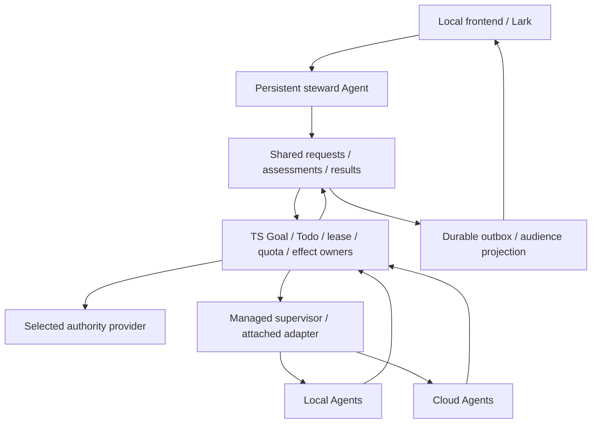

# LoopX Overall Roadmap v0: Product, Collaboration, Technology and Delivery

- Status: Accepted
- Supersedes / closes: none
- Scope baseline: architecture audit at 2026-09-16, `0aa6179de`; RFC inventory
  updated through 2026-09-28, `6643f3670`; steward reproduction baseline is
  preserved separately in Section 8.
- Ownership: overall product outcomes, cross-domain dependencies, priorities and portfolio acceptance here; concrete rules in domain RFCs/stable protocols; execution state in canonical Todos.
- Language: [中文版](loopx-overall-roadmap-v0.zh-CN.md) is the semantic mirror.

**Local authority closeout checkpoint (2026-10-02).** R5/T4 use the [current validation → migration → deletion plan](ledger/shared-goal-authority-state-provider-v0/2026-09-28-retirement-cadence.md#current-closeout-validation-migration-and-deletion-2026-10-02), rechecked at `9b0486dc1`. Close existing #5413/#5466/#5283, qualify one installed reversible candidate, then decide a bounded opt-in cohort separately from release-default admission. Canonical creation, legacy-policy migration and last-writer deletion have named exits; delete replaced Python owners with their last callers. R6 remains separate. No fixed remaining-PR count or historical test count certifies completion.

Conversational preparation from [PR #4376](https://github.com/loopx-project/loopx/pull/4376)
is integrated under R1/GQ01 through the existing Chat draft and reviewed Goal
creation path; see the [absorption map](app-conversation-and-async-inbox-v0.md#conversational-goal-preparation-integrating-the-team-workspace-proposal).
Its separate workspace/executor is not adopted. This entry improvement does not
close GQ01 execution/return or R2 small-team acceptance.

## 1. Overall Objective and Product Routes

LoopX aims to let people express, revise and accept complex goals through a local frontend or Lark, while a persistent steward coordinates long-running LoopX Agents with independent work commitments across local managed and cloud runtimes. Single-Agent long-horizon reliability is the foundation. Multi-Agent collaboration, handoff, recovery and convergence on shared goals are core capabilities. Hundred-Agent scale is a separate system qualification.

Product success means **accepted outcomes within constraints, human attention cost and recovery capability**. Online counts, generated text, tool calls and PR counts are process signals. Models, runtimes, storage providers, IM and memory services can change; Goal/Todo/claim/lease/quota/effect and acceptance rules retain explicit, traceable single owners.

| User and work | Shortest value path | Required accepted outcome |
| --- | --- | --- |
| Individual developer/researcher | Connect a project→existing or managed Agent→continued work→interruption recovery | Reproducible installation/first useful action; visible work, artifacts, cost and next step without learning every RFC |
| Project owner/steward operator | Goal and constraints→small team→dependent artifacts→direction correction→aggregate acceptance | Understand responsibility, blockers and decisions; direct worker conversations remain available |
| Multi-project/multi-host operator | Scoped parent/child goals→local/cloud division→shared authority/budget→overall return | Peer work, isolation, fairness and recovery hold; coordination roles do not grant global administrator authority |
| Adopter with existing agent systems | L1 passive diagnostics→L2 advice→authorized L3 seams→optional L4 control plane | Prove non-interference and diagnostic value before control effects; support adoption without replacing the native runtime |
| Capability/host/provider developer | Minimal adapter→compatibility/permission checks→qualification→install/uninstall | Extensions do not copy kernel truth, off-state preserves core behavior, versions and supported capabilities are discoverable |

Product scope includes reusable engineering delivery, research, material/knowledge work and office/content workflows. First prove transfer through one engineering and one knowledge/research journey. Domain behavior belongs to capabilities/packages; scenario scoring, stages and private semantics cannot become generic kernel rules. Protected external effects, including finance, qualify through separate domain contracts and simulated adapters; a general steward gains no such execution permission.

Two adoption routes share engineering assets but qualify independently: **native LoopX long-horizon coordination** prioritizes G1/G2; **observer-first reliability diagnostics** can demonstrate value without waiting for hundred-Agent scale or a shared service. Paid deployments, enterprise offerings and hosted services remain product hypotheses, not demonstrated market fit or operating commitments.

### App-first conversation delivery

The installed App is the primary interaction and qualification surface; Lark
follows through the same semantics with independent transport evidence. Move
ongoing managed **and attached** work conversations into LoopX: preserve the
existing responsible worker, context and execution driver, show actual progress,
accept corrections and return the result to the original conversation. Merely
embedding a transcript or sending an inbox ACK does not complete that transition.

[App conversations and asynchronous inbox](app-conversation-and-async-inbox-v0.md)
refines R1–R3 without adding a milestone: repair ordinary input and durable
entry; qualify connect/continue, truthful activity, stop/recovery and readable
results, including late returns after the active session changes. The nearest
observable exit is one natural App request through an
existing qualified owner to a reviewable draft, with adopted correction and
recovery, without manual owner lookup, reminders or result relay. A delivered
deferral stays deferred. Then complete G1's two real collaboration cycles.
Use the [concrete pilot and exits](app-conversation-and-async-inbox-v0.md#nearest-user-visible-exit-one-request-controllable-work-returned-result).
Prioritize these
before cross-channel visual parity or scale. Lark's reusable inbox lifecycle
should converge into the existing typed coordination owner, while provider
authentication/addressing/reactions remain in its extension. Product-facing TS
migration follows whole working journeys, not leaf-RPC counts or a rewrite gate.

### Relationship to Existing Documents

- This is the product, engineering, research and adoption roadmap. Section 2 defines S1–S13 streams; Section 3 defines G0–G5 portfolio milestones; Section 4 maps every RFC; Sections 5–6 detail the multi-Agent core path; Section 8 preserves the focused audit.
- [Technical directions](../../project/technical-directions.md) owns public contribution routes and trackers; the [RFC index](README.md) owns domain navigation. They project the cross-domain ordering here while domain RFCs retain their T/M/D/A identifiers and authority gates.
- [Product vision](../../product/vision.md), the [capability catalog](../../../loopx/capabilities/README.md), [stable protocols](../../reference/protocols/README.md) and released versions retain their scopes. This roadmap creates no second task ledger, state schema or release-support declaration.

## 2. Portfolio Streams: Outcomes, Gaps and Executable Slices

P0 blocks correctness or continuity in the current user journey. P1 enables repeatable delivery and collaboration. P2 expands scale, scenarios or adoption after evidence. P3 retains design pending a demand trigger. Priority guides work selection without overriding safety gates or live quota. Owners are module/capability boundaries, not predetermined models or individuals.

| Stream | Outcome and existing foundation | Next complete slice, dependencies and exit evidence |
| --- | --- | --- |
| **S1 Product and persistent steward · P0** | Request, investigation, decomposition, acceptance and return; manager runtime, team intake and settings exist, continuous end-to-end work is unqualified | R1/R2 first: preserve commitments, run bound workers and continue after owner corrections; qualify CLI/packaged frontend/Lark separately. Close a minimum journey through two cycles of dependent artifacts and independent acceptance |
| **S2 Typed kernel and durable authority · P0/P1** | Effect/Todo/quota/recovery owners, TS migration and store candidates exist; writer cutover/provider promotion remain incomplete | Migrate one real transaction/recovery lifecycle at a time, with semantic counterexamples before cutover/deletion. R1 correctness precedes migration volume. Require real backend, concurrency/fence, ambiguous commit, retention/export recovery, bridge costs and D1–D3 evidence |
| **S3 Goal planning and multi-Agent collaboration · P0/P1** | Vision/replan, peer frontiers, claim/lease, directory, manager_context and explicit continuation exist; general handoff/shared amendment remain incomplete | R2 proves peer dependency; R3 closes parallel joins, pipelines, help/review, continuation and automatic return; R4 delivers one intent-preserving amendment class. Cover cycles, invalidated inputs, rejection/deferral, lease transfer, competing bases and aggregate acceptance |
| **S4 Runtime/host/daemon · P0/P1** | Attached/managed, Turn, broker, runtime connectors and Desktop repairs exist; registration does not establish executable capacity | Qualify multi-Turn supervision for one real supported combination; restart/cancel/drain/stop retain work and fence old executors. Then expand host parity, unique service-profile ownership, clean installation and upgrades; show unsupported adapter capabilities |
| **S5 Frontend, Lark and human interaction · P0/P1** | Local chat, settings, proposals and partial Goal Channel verticals exist; shared audience/session/work readback needs qualification | One journey spans settings, work graph, handoff, blockers, cost, corrections, artifacts and return. Shared typed projections; reconnect/repeated-click/stale/original-route cases. [Live team workspace](live-team-workspace-v0.md) makes exchange, revision and original-coordinator continuation visible. Its [Work-scale map track](live-team-workspace-v0.md#11-delivery-order-and-relationship-to-aggressive-r2-progress) draws each Goal's typed Todo relations first (W1), then live state and outputs on the same nodes. Then intelligent review, keyboard accessibility, bilingual terminology, actionable errors and offline degradation; interrupt only for actual decisions |
| **S6 Materials, evidence, memory and learning · P1** | Authority registry, material lifecycle/frontier, decision context, reward memory and turn recall exist; direction baseline and parts of attribution remain proposed | Connect material revision→same-Agent read→decision reference→artifact/outcome. Expose expiry/revocation/source loss and forgetting policy. Handoff preserves decision-relevant summaries and authorized artifacts; qualify OpenViking/Obelisk as optional providers. Prove causal utility with controls, not relevance alone |
| **S7 Budget, scheduling and fleet scale · P0 observation/P1–P2 expansion** | Quota/scheduler and partial usage aggregates exist; full provider cost, distributed reservations and hundred-Agent concurrency need evidence | Separate configured budget, admission, consumption and estimates; unknown is not zero and replay cannot double-charge. R7 pagination/bounded summaries and [complete-history transport](typescript-control-plane-migration-v0.md), including refresh/replay/single-debit evidence beyond the RPC limit; provider/host limits, fairness, backpressure, event wake and isolation; report registration/activity/throughput and cost per accepted outcome separately |
| **S8 Capabilities, extensions and domain integration · P1/P2** | Capability catalog, extension lifecycle, hooks, engineering/research/content/office capabilities and computer-use contracts exist | First exercise the shared control plane with existing issue-fix/PR-review and material/research callers. Every provider has readiness/version/permissions/default-off/uninstall/rollback/isolation and real-entry evidence. New domain effects start with one simulated operation, not a marketplace or workflow DSL |
| **S9 Identity, authority, privacy and trust · continuous P0/P1–P2 remote** | Public/private scope, capability gates, fencing and confirmation contracts belong to existing owners | R1/R3 cover sender/audience/artifact scope and stale authority; R6 authenticates tenant/Goal/actor/host, rotation/revocation and least privilege. Qualify credential custody, untrusted tool/document inputs, dependency supply chain, audit retention/deletion and vulnerability response through real paths; roles/messages/memory mint no write authority |
| **S10 Reliability, diagnostics and operations · P0/P1** | Recovery/canary, read-only diagnostics prototype and DSH event adapter exist; C0/C1, overhead and full operations qualification are open | Failure classification→observable state→recovery drill→regression prevention; process/storage/network/delivery failures and data growth. Accepted Chat requests must settle even when runtime preparation fails before dispatch; qualify missing runtime assets, stop races and recovery without replay under [the shared conversation operational contract](capable-manager-semantic-handoff-v0.md#10-operational-contract). A context/provider read returning after the stop wait must honor the persisted Turn and exact Session claim: no late provider dispatch or handoff, even when a fresh request has completed. This bounded GQ08 repair does not certify upstream interrupt fidelity or effects already admitted elsewhere. Use [bounded repair lookup and targeted diagnostics](../../../skills/loopx-self-repair/references/targeted-diagnostics.md) to reduce redundant reads above the provider boundary; measure backend-specific cold/warm reads, writes and lock waits separately. Freeze SLO/RPO/RTO/capacity/retention boundaries and measure before qualification. Runbooks include upgrade, restore, stop and human takeover; test counts do not prove recovery |
| **S11 Evaluation and scientific research · continuous P1/P2 research** | Benchmark toolkit, Explore, long-horizon portfolio and ten frontier-science tracks have designs/partial implementations | Pin native/passive/governed arms, model/harness/budget/task split and evaluator; report native scores, cost, failures, attention and uncertainty. Prioritize sequential evidence, continuation and stride; memory, formal kernel, curriculum/evolution, active experiments and multiscale state follow T01–T10 gates without automatic production treatment |
| **S12 Release, developer experience and community governance · P0 hygiene/P1** | Install/source validation, registration, DCO/PR, test layers, contributor routes and bilingual docs exist | Qualify first work and upgrade/rollback from clean machines/release artifacts; host/OS support follows the release contract. Reduce localization/test/review effort for useful changes; preserve exact-head evidence, fixtures, compatibility, maintainer routing and contributor credit; retire duplicate protocols/stale evidence |
| **S13 Adoption, ecosystem and sustainability · P1 discovery/P2 pilots** | Public adoption loop, showcases, licensing/governance and observer-first product contract exist; paid PMF is unproven | Gather independent first/repeat usage and exit reasons; reproducible cases and pilots with fixed budgets/acceptance/rollback. Retain reusable adapters/delivery guides. Account for model/compute/storage/support and maintenance costs; only repeated demand justifies commercial hosting/support/distribution decisions, with no invented SLA or open-source-term change |

### Important Areas Outside RFCs and Their Owning Sources

These directly determine whether a long-running team is usable. A directory or README provides an implementation/contract entry, not installed readiness; read availability from `loopx capability list/show` and the selected release.

| Area and existing entry | Streams | Next requirement in this roadmap |
| --- | --- | --- |
| [Goal Vision/replan](../../reference/protocols/goal-vision-replan-contract-v0.md), [work graph](../../reference/protocols/task-graph-projection-v0.md), [peer runtime](../../reference/protocols/peer-agent-runtime-v1.md), [supervisor](../../reference/protocols/peer-supervisor-v0.md) | S2/S3 | Exercise dependencies, replanning, acceptance and handoff in one real case; aggregate closeout consumes acceptance facts |
| [Quota](../../quota-allocation.md), [cadence](../../operations/long-task-cadence-policy.md), [attention](../../operations/attention-queue.md) | S5/S7 | Budget exhaustion, deferral and blocking expose next triggers/readback; scale without frequent full-state polling |
| [Material lifecycle](../../reference/protocols/material-lifecycle-architecture-v0.md), [material frontier](../../reference/protocols/agent-material-frontier-v0.md), [authority registration](../../operations/authority-source-registration.md) | S6 | Agents discover roadmap/RFC revisions and record reads; reading grants neither agreement nor authority; archival preserves raw-source ownership |
| [Decision Context](../../../loopx/capabilities/decision_context/README.md), [Reward Memory](../../../loopx/capabilities/reward_memory/README.md), [Semantic Preference](../../../loopx/capabilities/semantic_preference/README.md), [Turn Recall](../../../loopx/capabilities/agent_turn_recall/README.md) | S6/S11 | Distinguish facts/preferences/advice/attribution/authority; scoped recall, expiry and outcome-feedback counterexamples first |
| [Issue Fix](../../../loopx/capabilities/issue_fix/README.md), [PR Review](../../../loopx/capabilities/pr_review_queue/README.md), [Change Quality](../../../loopx/capabilities/change_quality/README.md), [Integration Branch](../../../loopx/capabilities/integration_branch/README.md), [Change Window](../../../loopx/capabilities/repository_change_window/README.md) | S8/S12 | Engineering caller: issue→implementation→independent review→validation→authorized delivery; source-head drift invalidates old evidence |
| [Explore](../../../loopx/capabilities/explore/README.md), [Benchmark Toolkit](../../../loopx/capabilities/benchmark_toolkit/README.md), [auto-research](../../product/use-cases/auto-research/README.md) | S8/S11 | Second collaboration journey: question/hypothesis→parallel experiments→independent interpretation→successor; no uplift/failure remain valid outcomes |
| [Content Operations](../../../loopx/capabilities/content_ops/README.md), [Periodic Report](../../../loopx/capabilities/periodic_report/README.md), [office operations](../../product/use-cases/office-operations/README.md), [domain packs](../../product/domain-capability-packs.md) | S5/S8 | Public-safe projections feed sinks; separate drafts/review/publish authority/outcomes; generic sinks do not depend on project-private documents |
| [Extensions](../../reference/extensions.md), [runtime catalog](../../integrations/runtime-connector-catalog.md), [host surface](../../reference/protocols/host-integration-surface-v0.md), [skill delivery](../../../loopx/capabilities/project_skill_delivery/README.md) | S4/S8/S12 | Minimal adapter examples match registration readback; test compatibility/upgrade/disable/uninstall; host skills are not another kernel |
| [Computer Use](../../reference/protocols/computer-use-runtime-v0.md), [operator credentials](../../reference/operator-model-credential.md), [private boundary](../../public-private-boundary.md) | S8/S9 | Qualify actual host restrictions and sensitive-operation grants; external text cannot escalate authority; isolate and bound screenshot/log/credential retention |
| [Testing/quality](../../development/testing-and-quality.md), [CI impact](../../development/ci-impact-selection.md), [source correctness](../../reference/protocols/local-state-write-correctness-v0.md), [release readiness](../../product/release-readiness.md) | S2/S10/S12 | Independent expected semantics, real backend/install entry, negative/mutation cases; control validation cost without treating skipped checks as passed |
| [Install](../../guides/installing-loopx.md), [newcomer path](../../guides/newcomer-command-path.md), [design](../../development/design.md), [user guide](../../guides/personal-workspace-user-guide.md) | S1/S5/S12 | First-value path, error recovery, supported platforms, accessibility and bilingual consistency; existing design/first-screen review for UI changes |
| [Public adoption](../../product/public-adoption-loop.md), [scenario gaps](../../product/scenario-capability-gap-map.md), [SaaS assessment](../../product/roadmaps/saas-opportunity-assessment.md), [licensing](../../project/licensing.md), [governance](../../../.github/GOVERNANCE.md) | S12/S13 | Traceable public outcomes/failure feedback; independently qualify commercial hypotheses; existing license/credit/community-authority policies remain authoritative |

## 3. Portfolio Milestones, Resource Ordering and Completion

S streams describe ongoing ownership, G milestones qualify a product combination, and R cards specify the current core implementation slices. These are cross-references, not a runtime state machine. Progress is evidence-gated rather than date-promised. Changes in capacity or business priority update canonical Todos rather than assuming every stream starts simultaneously.

| Milestone | Product exit | Required streams / core path |
| --- | --- | --- |
| **G0 Trustworthy baseline** | Discoverable behavior/defaults/qualification; reproduced lost commitments, stale basis, empty success and partial commits repaired with regressions; release-artifact single-Agent loop and unknown costs visible | S1/S2/S7/S9/S10/S12; R1. Merging this roadmap does not complete it |
| **G1 Small-team delivery** | Steward and 2–3 long-running LoopX workers complete two real collaboration cycles with dependent artifacts, peer handoff, recovery, owner correction and independent acceptance; single-Agent path preserved | G0; S3/S4/S5; R2 plus minimum existing R3 path, without waiting for general migration/new store |
| **G2 Recoverable collaboration workspace** | General peer requests/review/return, session continuation and material/direction lineage; frontend/Lark consume the same facts; local durable profile passes applicable qualification | G1; S2–S7/S9/S10; R3/R4/R5. D3 and other explicit promotions remain separate decisions |
| **G3 Shared local/cloud work** | Two real hosts including cloud; authenticated scope, revocation, network failure, shared budget and returning-worker fences; recoverable cross-host dependent artifacts and returns | Relevant G2 contracts; S3/S4/S7/S9/S10; R6 |
| **G4 Hundred-Agent qualification** | Active cohorts 10→30→100+ meet frozen throughput/latency/cost/recovery SLOs; macro-goals converge through direction changes without steward message bottlenecks | G3; R7; S5/S7/S10/S11. A hundred registrations are insufficient |
| **G5 Repeatable adoption and ecosystem** | Independent install/reproduction/upgrade/export/rollback; verified engineering and knowledge/research journeys; recorded support costs, maintenance ownership and pilot outcomes | S8/S10–S13 start alongside G0; bounded adoption need not wait for G4. Commercial services require additional operational/licensing boundaries |

First resource ordering: complete R1 commitments/recovery, then qualify G1. One adjacent TS transaction/delivery repair and one read-only diagnostic/material qualification slice may prepare alongside it without hiding P0. Each implementation slice has one primary owner/outcome and explicit dependencies. Work in progress follows actual review/validation capacity rather than filling a board to match Agent count.

Pause/downscope when a design duplicates authority or widens defaults, real-backend qualification is missing, rollback is not independently possible, cost/attention grows uncontrollably with scale, benchmark integrity fails, or users cannot explain work and blockers. Preserve facts/receipts, stop affected new admission and repair rules or reduce the cohort. Do not weaken acceptance, remove failed samples, refresh test expectations or rename a stage into completion.

### Near-term local-agent product and launch

**Planning revision: 2026-09-20; proposal, not a release qualification.**
Make the native route approachable as **an open-source personal Agent that uses
an existing local Agent to carry work through to a checkable result**. Start
with developers and research-heavy users who already have a supported Agent
login. One persistent steward is the entry; specialists appear when useful.
This is a bounded S1/S4/S5/S12/S13 delivery of G0/G1 and early G5, not a third
runtime, another roadmap, or a prerequisite for the observer-first route.

“Make your local Agent work like Grok Bot or Muse” is a useful comparison hook.
The primary promise should be “Give your Agent a goal. Come back to the work.”
Use the comparison with the precise supported scope, not “full open-source
replacement”, model equivalence, free inference, guaranteed unattended success,
or an implication of affiliation. Local orchestration does not mean offline
inference or that providers never receive task data. Background work requires
an available execution host; closing a browser is not shutting down a laptop.

#### Research basis and product decisions

Sources inspected on 2026-09-20; vendor descriptions are **stated**, not tested.

| Direct source | Relevant observation | LoopX decision / remaining limit |
| --- | --- | --- |
| [Grok Bot product](https://x.ai/bot) and [launch](https://x.ai/news/introducing-grok-bot) | Vendor describes persistent cloud teammates, shared tools, handoff and returned work | Adopt conversational delegation and visible returned artifacts; local availability cannot inherit the vendor's cloud 24/7 promise |
| [Meta Muse announcement](https://about.fb.com/news/2026/09/introducing-muse-personal-ai-agent/) and [design rationale](https://introducing.muse.ai/) | Vendor describes a persistent main chat, Goals, meaningful proactive updates, rich artifacts and explicit action controls | Make one steward and first useful outcome primary; use deterministic controls for consequential actions and progressive disclosure for tools |
| [Original X comparison](https://x.com/Michaelzsguo/status/2101057424115253645) | One user's account favors Muse's integrated experience over configuring components | Treat as a productization hypothesis, not comparative performance evidence; test first use independently |

The X post was inspected through Ego Lite. Official pages were read; no signed-in
product run or complete demo video was tested. The Muse design page timed out in
the browser; its article was available through web retrieval. Do not infer actual
reliability, privacy equivalence or conversion rates from this investigation.

#### One first-use journey and one flagship result

1. Install the released package using the existing installation owner; open
   `loopx dashboard`. Diagnose Python/Node, the host login, selected model/profile
   and tool readiness in place. A package install alone is not a ready Agent.
2. Guide explicit configuration of eligible runtimes, model accounts, tools,
   budgets and authority. Honor the user's explicit intent; the Agent chooses and
   allocates eligible routes within that scope. A pinned steward/Chat profile is
   binding, while an authorized flexible pool permits autonomous selection.
   Codex and Ark are configurations, not universal preferences. Surface the
   effective choice; never copy credentials, migrate old sessions or silently
   fall back outside authorization. Missing readiness offers a concrete repair.
   Credentials are machine-owned; member allocation and requester grants are
   Goal-owned. The mixed-team showcase must reuse configured runtimes with
   adjustable member counts, show exact resolved models and interpreter readiness,
   and qualify dependent artifacts through independent acceptance and adoption
   before presenting a one-action launch as release-ready.
3. Give the steward a real task without first constructing a team or learning
   Goal/Todo/Turn vocabulary. Preview relevant scope, outputs and resource limits;
   routine already-authorized reversible work proceeds without repeated cards.
4. Deliver a sourced research brief from public documents. Add a contradictory
   or newer source, show an independent objection, the exact revision and check,
   then the requester's adopted synthesis. The first single-Agent result must
   remain useful even when team execution is unavailable.
5. Return the artifact and the next meaningful decision to the original
   conversation. Inspect evidence, change direction, pause or stop the named
   execution scope. Reopen the browser and recover context; stale/disconnected
   work remains explicit. Proactive updates require a material change.

Use this same episode for the product, a reproducible public sample and the
launch film. Domain-specific research can build on it without making financial
recommendations or transaction authority part of the generic kernel. Engineering
issue-to-reviewed-patch is the next already-owned use case, not a second blocker
for the first research preview. Lark is an optional later transport using the
same session, audience and result owners; first local onboarding must not require
Lark configuration. CLI readback remains part of every claimed local journey.
Merged [#4814](https://github.com/loopx-project/loopx/pull/4814) advances this
optional S1/S5 entry: manager and Goal Lark cards share one canonical team-plan
decision, authenticated delivery bindings and retry recovery. Qualify real
dual-card interaction separately; assignment is not execution, adoption or a
completed research journey. Keep readable results and local first use on the
critical path, then connect that proven journey to the optional Lark entry.

#### Delivery order, owners and release claims

Estimates are elapsed working time from a staffed start, assuming one dedicated
engineer with Agent assistance, shared design/QA support, daily maintainer review,
one macOS + Codex configuration, available model usage and authorized test tools.
They are planning ranges, not measured velocity, SLAs or a promise of all-host
support. A missing dependency moves the date, not the acceptance bar.

| Stage / cumulative target | Complete work and existing owner | Exit / permitted claim |
| --- | --- | --- |
| Narrative and storyboard · 2–3 working days | S1/S5/S13: one audience, one task, first-screen design, 60–90s script, bilingual copy and public evidence plan | Reviewable polished draft; label concepts and replays. No runnable-product claim |
| Recorded product preview · 5–7 working days | R2/R3 + S5: reuse merged collaboration and host-tool authorization, run one reproducible L1 correction; refine the actual result and evidence view | Packaged frontend plus CLI show exact-version objection/revision/acceptance/adoption, intervention and scoped stop. Record an actual run; no synthetic activity presented as live |
| Focused public alpha · 2–3 weeks | S1/S4/S12: release-package onboarding, intent-respecting steward/Chat selection, readiness repair, single-Agent fallback, restart/reconnect and useful result return; S5 supplies focused team view | Freeze five independent clean-install attempts before testing; at least four reach the first useful result without maintainer shell intervention, all failures retained. G1's two real cycles must pass before advertising continued team collaboration |
| Repeatable beta / full launch kit · 4–6 weeks | S4/S5/S10/S12/S13: upgrade/rollback, revoke/unavailable/quota recovery, pilot-driven UX, measured cost and support; qualify optional Lark separately | At least three independent users repeat a task on another day; publish denominator, interruptions and limitations. Each advertised platform/transport has its own release-artifact evidence |

Suggested alpha usability targets, to freeze before recruitment: setup within
10 minutes after documented prerequisites and authentication; first useful
artifact within 15 minutes for the bounded sample task at a declared budget.
These are proposed targets, not current performance facts. Report both complete
onboarding time (including prerequisites/login) and the post-readiness interval;
authentication or environment failures stay in the funnel. A small pilot is
feedback, not statistical reliability or product-market fit.

The [independent App first-use/repeat-use protocol](../../product/use-cases/steward/first-use-evaluation.md)
prepares the five-slot freeze sheet, ordinary GQ01 handout, independent oracle
and separate onboarding/result/attention/cost observations. It reuses existing
optional first-run/usage-story intake and keeps failed or absent trials in the
denominator. This is preparation only: execution waits for a qualified pinned
package and consenting participants; no cohort result or recruitment is claimed.

The critical path is usable evidence presentation → a reproducible real episode →
packaged first-use repair → independent reproduction. As of 2026-09-21, #4762 and
#4811 are merged; #4811 records native Codex MCP execution and a real-model
correction lifecycle. The earlier MCP approval block is resolved. This evidence
does not establish a released first-use journey, two continuing cycles or a
polished launch film. Reuse those owners and canonical Todos; qualify the actual
release package and record the episode through its frontend before publishing.
Never disable approvals globally to obtain a recording.

The first launch does not wait for hundred-Agent scale, a new state provider,
full 3D, all hosts, mobile-native shells, a connector marketplace, payment/booking
or teach-by-demonstration automation. Those retain their existing owners and
independent demand/qualification. Do not divert R1 reliability work to them.

#### Presentation and launch assets

The signature moment is **the conclusion changing because a peer found better
evidence**. A precise command surface holds conversation, result and decisions;
stable spatial stations and event-local motion make the exchange legible. Show
before/after claims, cited sources and the accepted adopted version. Keep one
focal event, an accessible list, reduced motion and honest quiet/failed states.
No ambient animation or Agent count substitutes for work. Follow the existing
[design contract](../../development/design.md); actual public first screens
still require their concrete preview approval.

Prepare one consistent kit: a 60–90s real-run film with disclosed time cuts,
a 15s excerpt, three annotated product screenshots, an accessible replay marked
historical, bilingual launch article and short social draft, one install/try
path, a supported-version/cost/privacy/availability FAQ, and a public-safe sample
with expected output, correction input and recovery steps. Draft these alongside
implementation, then replace placeholders with qualified evidence. Present the
user's request, returned result and correction first; configuration details
belong in setup help. Publication is separate from preparing the kit.

Each release sentence must trace to the tested package/version, entry point and
user-visible result. “Open source” describes LoopX under its existing license;
models, paid usage, third-party connectors and hosted infrastructure keep their
own terms. No license change, public post, live service provisioning or permission
expansion follows from this roadmap revision.

### Cross-Domain Measurement and Validation

| Dimension | Shared definition | Minimum evidence |
| --- | --- | --- |
| Outcomes/convergence | Accepted-outcome rate, Goal closeout quality, invalidated-artifact rework; separate no uplift, failure and unknown | Independent verifier/acceptance owner; complete failure denominators, Goal/input versions |
| Collaboration/continuation | Adoption latency, dependency waits, first useful action after handoff, original-route return fulfillment, duplicate protected effects | Request/work/artifact/receipt lineage; refusal, source loss, interrupted replay and old-lease counterexamples |
| Human attention/UX | Time to first useful outcome, interventions/decisions per accepted outcome, time to locate blockers | Real local/Lark journeys, explicit authority boundaries and untested entrypoints |
| Resources/scale | Host/provider concurrency, queue p50/p95, successful throughput, tokens/cost/storage, cost per outcome | Separate observed/estimated/unknown and registered/active; frozen load/budget/price source/sample window |
| Reliability/security | Stale/unauthorized rejection, duplicate effects, RPO/RTO, recovery latency, isolation/deletion results | Fault injection plus isolated real backend/hosts; restore and credential-revocation drills |
| Engineering/adoption | Compatibility/upgrades, module/bridge simplification, reproduction time, independent first/repeat use, support cost | Released artifact rather than source alone; redacted traceable cases/feedback; installs do not establish PMF |

Do not invent unmeasured performance targets. Before each experiment/pilot, its owner freezes thresholds, baseline, budget, stop conditions and evidence scope. A post-result threshold change belongs to a new experiment. G4 correctness requires no duplicate protected effects or stale/unauthorized commits; performance and cost thresholds require separate measured qualification.

Operational status used by post-writeback sinks must stay distinct from repository
publication audits. A Goal Channel gate decision still reads current Goal and
quota state, but a repository-wide public-boundary scan belongs to explicit
`loopx check`/premerge validation, not every `refresh-state` notification
attempt. The local status APIs already use this separation. For the next
long-history qualification, measure the full `refresh-state` and `quota
spend-slot` paths separately: lock wait, history/receipt readback, state
projection, optional sink work, and result delivery. Keep the required
authority and privacy checks; optimize repeated reads only with equivalent
positive, negative, retry, and stale-generation outcomes. A fast sink no-op
is not evidence that long-history status and quota admission meet G4 SLOs.


## 4. Every RFC: Ownership and Next Step

This maps the primary RFC inventory through the date in the header, counting
language mirrors once. The architecture status still uses the separately named
audit baseline. Accepted, partial, research and Held directions remain visible
without making every row active work. Status is based on RFC/reference
inspection and selected source checks; full runtime qualification of every
subsystem was not performed. Section 8 records the focused audit.

| RFC | Stream | Current boundary | Next slice / acceptance |
| --- | --- | --- | --- |
| [Composable State Machines and Recovery Verification v0](composable-state-machines-recovery-verification-v0.md) | S2/S3/S10 | Design only; local conformance is reusable evidence | P1: one typed boundary, then ownership/writeback/settlement fault sequences and conditional progress; production entrypoint and real-backend evidence |
| [Agent Loop Effect Interpreter](agent-loop-effect-interpreter-v0.md) | S2 | Accepted; core implemented, adoption continues | P0: reuse effect/recovery, cover R1 partial commits; retain domain-local replan ACK |
| [TypeScript Control-Plane Migration Direction v0](typescript-control-plane-migration-v0.md) | S2 | Accepted; whole-transaction migration active | P0/P1: R1–R4 hot transactions first; T0–T4 caller/deletion/cost evidence; no full rewrite prerequisite |
| [Semantic Vocabulary Convergence and Commit-Time Drift Checks (v0)](semantic-vocabulary-convergence-v0.md) | S2 | Accepted; registry/inventory/drift and subsequent typed slices exist | P1: converge by semantic role and active producer/consumer; no name-based enum merging; review schema changes separately |
| [LoopX Shared Control-Plane Authority and Pluggable State Providers (v0)](shared-goal-authority-state-provider-v0.md) | S2/S3/S7 | Accepted; stores, local transactions and service-admission foundations exist | P1→P2: R5 local D1–D3, R6 authenticated hosts; real backend/soak/recovery before promotion |
| [Shared Goal Alignment and Governed Amendment Protocol (v0)](shared-goal-alignment-and-governed-amendment-v0.md) | S3 | Accepted; Stage 1/2 and owner acceptance readback; full intent/commit incomplete | P1: #3836 governed acceptance amendments and peer adoption; R4 CAS/lease impact, conflicts and lost-response receipts |
| [Goal Direction Baseline (v0)](goal-direction-baseline-v0.md) | S3/S6 | Accepted; material read-model proposal | P1: #2831 direction-material revision to acceptance basis linkage; same-Agent/current-revision fixtures |
| [Goal Artifact Lifecycle Projection (milestone / guard / next-transition) v0](goal-artifact-lifecycle-projection-v0.md) | S3/S5 | Accepted; read-model proposal | P1: derive milestone/guard/next transition from typed facts; no process engine |
| [Capable Agent Manager and Semantic Work Handoff (v0)](capable-manager-semantic-handoff-v0.md) | S1/S3 | Accepted; partial profile/intake, M1–M4 not fully qualified | P0→P1: R1/R2 real teams, R3 semantic peer work and durable return; continuation matrix and A1–A20 |
| [Manager runtime profile v0](manager-runtime-profile-v0.md) | S1/S4 | Accepted; private Codex profile exists, general qualification incomplete | P0: real tools/session/recovery and scoped authority; runtime labels do not qualify behavior |
| [DSH / Pi: L1 Observation and Managed Runtime Selection](harness-selection-dsh-pi-v0.md) | S4 | Selection record; bounded runtime/team-card evidence | P0: R2 on qualified bindings; qualify harness/model/profile/host separately, not from one smoke |
| [Explicit Todo continuation: Stage A](cross-session-memory-substrate-v0.md) | S3/S6 | Stage A shipped; filename does not imply general memory substrate | P1: R3 reuses prepare/inspect/adopt; retain same-host/unleased limits until replacement qualifies |
| [Agent Session Execution Modes (v0)](agent-session-execution-modes-v0.md) | S4 | Accepted; partial attached binding/broker/fence | P0→P2: one executor per binding, managed supervision, then cross-host admission; no implicit mode changes |
| [Single-Owner Local Daemon (v0)](single-owner-local-daemon-v0.md) | S4/S10 | Accepted; Desktop ownership repair does not establish loopxd | P1: service-profile owner/readiness/drain/restart for one composition; no second scheduler |
| [LoopX Desktop Execution Frontends v0](desktop-execution-frontends-v0.md) | S4/S5 | Accepted; attached/managed/UI foundations, full journey unqualified | P0→P1: packaged settings→binding→team→correction→recovery→return; retain direct worker conversations |
| [Goal Channel Collaboration v0](goal-channel-collaboration-v0.md) | S5 | Accepted; partial Lark vertical shipped | P1: qualify team card/return/idempotency/audience; distinguish Goal channels from Agent session bindings |
| [Provider-Neutral Turn-Start Inbox Hook v0](provider-neutral-turn-start-inbox-hook-v0.md) | S3/S8 | Implemented with explicit configuration | P0 hardening: bounded read→semantic triage→ACK/replay; preserve default-off and private provider cursors |
| [Provider-Neutral Post-Writeback Capability Hooks v0](provider-neutral-post-writeback-capability-hooks-v0.md) | S3/S8 | Accepted; first periodic-report vertical implemented | P1: R3 return/successors reuse durable intent; isolate hook failure, no primary-transaction coupling/direct effects |
| [Agent IM, LoopX, And OpenViking Collaboration v0](agent-im-openviking-collaboration-v0.md) | S3/S6/S8 | Accepted; three-owner integration unqualified | P1/P2: separate IM delivery, LoopX work authority and OV context; reconnect/revoke/source-loss cases |
| [External Evidence Research Capability v0](external-evidence-research-capability-v0.md) | S8/S11 | Accepted; typed Core plan/admission/retirement and CLI slice implemented | P1: qualify one host-method and one connector execution with the same provenance receipt; then add frontend/Lark projection companions |
| [Automatic Execution Admission v0](automatic-execution-admission-v0.md) | S7/S2/S4 | Accepted; typed local policy/admission and M3 settings candidate, host promotion pending | P0: App floor/schedule readback; M3 ordinary single-Save settings with optional notes, inheritance/conflict/readback acceptance; next-eligible/wait parity and M2 host/hook qualification remain separate |
| [Per-Goal Usage, Token, and Cost Surfacing v0](goal-usage-token-cost-v0.md) | S7/S5 | Accepted; Codex aggregate/cost display slice exists | P0 observation→P1 provider coverage: unknown is not zero, deduplicate accounting, price source/freshness; usage grants no budget |
| [Intelligent Review and Dynamic Presentation Surfaces v0](intelligent-review-presentation-surfaces-v0.md) | S5 | Accepted; action/attention verticals and local delivery-chain/acceptance review implemented | P1: cross-channel disclosure and governed amendment/settlement review; local visibility does not qualify G2 |
| [Human Attention Wishlist v0](human-attention-wishlist-v0.md) | S5/S11 | Accepted; Held | P3: reopen only on repeated second real need; sidecar cannot alter gates/quota/scheduling |
| [Human-confirmed domain operations (v0)](human-confirmed-domain-operations-v0.md) | S8/S9 + R2/R3 | Accepted; canonical operation seam exists, managed native transport under owner review | Qualify source-context vs admitted-executor separation, exact human approval→one-shot consumption→domain evidence→original-route return; owned Turn/delegation need not await Desktop authentication. Live approval/effect/wakeup remain unqualified; finance provider stays separate |
| [Provider-side authorization at effect acceptance (v0)](provider-effect-acceptance-v0.md) | S8/S9, supporting S2/S4 | Accepted design only; no runtime integration or qualified provider | M1: controlled provider and deterministic revoke/crash/replay conformance; strict production wiring remains gated by exact Goal lifetime, receipt retention and independent provider qualification |
| [Research Exploration Control Plane v0](research-exploration-control-plane-v0.md) | S11/S3 | Accepted; partial M2 composition/successor | P1: independently verify observation/write-time gate/closure basis; defer inferred triggers and model selection |
| [Hierarchical Agent Stride Control v0](hierarchical-agent-stride-control-v0.md) | S11/S7 | Accepted; M1 read-only observation | P2: matched shadow stride experiment with costs/events; no direct production cadence change |
| [Goal-scoped Capability Portfolio v0](goal-scoped-capability-portfolio-v0.md) | S1/S3/S6/S8/S11 | Accepted; read-only settings/context inspection slice | P1: correction→fresh-session decision across existing owners, then demand-driven composition and measured method evolution; no universal memory database or second opt-in |
| [Post-Outcome Memory Utility Attribution v0](post-outcome-memory-utility-attribution-v0.md) | S6/S11 | Accepted; Stage 1 verified-outcome binding | P1 read-only reducer→P2 pilot: distinguish recalled/applied/utility, no automatic ranking change |
| [Obelisk Session Evidence Provider v0](obelisk-session-evidence-provider-v0.md) | S6/S8 | Accepted; optional read-only evaluation | P2: explicit gap recall with resolvable provenance/access, off-path parity; no work authority |
| [Frontier Science Research Program v0](frontier-science-research-program-v0.md) | S11 | Accepted; ten-track research proposal | P2: sequential evidence/continuation/stride first; T01–T10 use existing owners and frozen experiment/promotion gates |
| [Long-Horizon Harness Benchmark and Research Program v0](long-horizon-harness-benchmark-research-program-v0.md) | S11 | Accepted; active research program | P1 ongoing: native ALE/LHTB/DeepSWE outcomes, matched arms/cost/recovery; research runners outside product runtime |
| [Benchmark Study Upload and Dashboard Projection v0](benchmark-study-upload-dashboard-v0.md) | S11/S5 | Accepted; manifest/upload projection proposal | P2: compact public-safe study→readback; native score authority; explicit upload opt-in |
| [Long-Running Agent Reliability Diagnostics and Governed Delivery v0](long-running-agent-reliability-diagnostics-governed-delivery-v0.md) | S10/S13 | Accepted; default-off L1 prototype/DSH event adapter exist, P0 unqualified | P1: C0 adapter fidelity/C1 non-interference/overhead; then L2 advice/L3 seams/L4 adoption |

The shared-authority [evidence companion](shared-goal-authority-state-provider-v0-evidence.zh-CN.md) belongs to S2/S10 backend/soak qualification. The [template](TEMPLATE.md) and [index](README.md) are S12 maintenance contracts, not additional product capabilities. Every new primary RFC adds a row; retirement/merger preserves a successor pointer. Historical filenames never raise delivery maturity.

## 5. Multi-LoopX-Agent Architecture and Collaboration



This is the target dependency graph, not a claim that every seam exists.

| Boundary | Owner / placement | Forbidden substitute authority |
| --- | --- | --- |
| User intent and shared amendment | Alignment RFC's Goal intent/amendment owner | Chat summary, plan digest, manager persona or provider revision authorizing an amendment |
| Work, dependencies, claim, lease, quota and terminal state | Existing typed control-plane bounded contexts | Manager task DB, Python decision mirror or host-local work truth |
| Request, receiver assessment and result relationships | Collaboration boundary converged from `manager_context`; shared by manager→worker and worker→worker | Treating sent as adopted/completed or copying the Todo state machine |
| Processes and sessions | Session mode plus actual host adapter/supervisor | Presence-based takeover or implicit managed/attached switching |
| Persistence and cross-host admission | `AuthorityStore` and selected provider/service | Agents writing databases directly, or placing arbitrary Goal state in the coordination head |
| Presentation and return | Packaged frontend, Lark adapter and existing outbox | Independent frontend/Lark copies of plans, permissions or execution truth |

This change adds no capability/provider. R1/R3 should extend existing work-items/collaboration ownership; runtime profiles reuse `manager_runtime`, executor choice reuses `steward_executor`, and sessions reuse the current controller. Independently distributed cloud adapters belong in extensions/packages; generic registration/lifecycle belongs in `loopx/extensions/`. Each implementation PR records its placement rationale first.

Steward coordination permits logical goal decomposition, priority suggestions, delegation and synthesis. `peer_v1` does not prohibit that product role; it prohibits the role conferring unilateral writes, preemption or elevated authority. Macro-goals spanning Goals use existing Goal relationships and scoped requests. Where cross-Goal dependencies or aggregate acceptance lack an owner, deliver a bounded contract with a real caller first, not a global scheduling DSL.

The lead may be an existing attached Agent or a managed Agent; an authorized
worker can coordinate another level through the same operations. Separate Agent
creation/reuse, session attach/start, communication and work acceptance. The
[session RFC](agent-session-execution-modes-v0.md#reusable-agent-operations-and-continuation-ownership)
owns this common lifecycle and the single continuation owner per binding;
the [frontend RFC](desktop-execution-frontends-v0.md#agent-scoped-bot-ingress-modes)
owns inbox/queue/steer delivery, and the handoff RFC owns receiver adoption and
hierarchical return. These are proposed integration requirements, not a new
runtime, provider guarantee or permission default.

Agents choose and revise the work graph. Generic host services enforce admission,
dispatch, budget and recovery without encoding business phases. Qualify local and
cloud managed work against one governed Turn contract first, while retaining
native Goal and same-session driver profiles as distinct qualified paths. A
team's total resource allowance is not copied to each child coordinator.

The next R2/R3 integration should qualify one reusable contract chain, rather
than add more coordinator-specific tools: effective profile/context resolution
and registered/resident/active readback ([session RFC](agent-session-execution-modes-v0.md#effective-launch-context-and-recoverable-presence));
request identity independent of creation ancestry and recoverable requester
results ([handoff RFC](capable-manager-semantic-handoff-v0.md#request-identity-and-result-routing-across-a-team));
and delivery intent independent of wake admission ([frontend RFC](desktop-execution-frontends-v0.md#delivery-intent-does-not-choose-the-wake-policy)).
Reuse current operation, request, ingress and outbox owners. Prioritize sibling
requests, coalesced inputs, interrupted/no-answer members and result-commit versus
notification restart races before residency optimization. These are proposed
acceptance refinements, not new runtime guarantees or changes to G1–G4 gates.

The next reusable conversation checkpoint, with the steward as first adopter, is the original conversation itself: a
question receives a proportionate, readable result; genuine work events remain
inspectable; stop and correction affect the right Turn; a substantive request
reaches a context-affine active Agent; and its assessed, evidenced conclusion
returns to that same frontend or Lark audience. The [presentation RFC §8.8](intelligent-review-presentation-surfaces-v0.md#88-reusable-conversation-work-surface) owns the shared interaction; [manager RFC §5.14](capable-manager-semantic-handoff-v0.md#514-steward-adoption-of-the-reusable-conversation-work-surface) owns the steward adoption and A21–A24 journey. Deliver it through the existing
Chat, session, collaboration and presentation owners as R2/R3 integration work.
Do not call a candidate catalog, spinner or queued inbox receipt a completed
worker handoff. This checkpoint does not lower R1–R3 or G1 gates.

### Attention-cost acceptance: create, connect, collaborate, understand

The [public-safe golden-query pack](../../product/use-cases/steward/golden-queries.md)
is the next product evaluation target, not a statement of current support.
Users should express a short outcome or correction without finding Agent IDs,
repeating known constraints, chasing work or transporting results themselves.
Keep valuable learning, deliberate choices and necessary approvals separate
from avoidable coordination. Preserve direct conversations with long-term owners.

P0 starts at the entry: a creation request cannot disappear after submission;
Goal creation, reuse of an existing Agent and authorized new-worker setup have
observable outcomes. Then qualify R3/M2/M3 routing **alongside** R2 adoption:
responsible receiver, actual work, exact artifact use, independent acceptance,
and synthesized return to the initiating conversation. A registration is not a
live binding; a missing catalog row is not proof that no suitable owner exists.
Use scoped discovery and permitted recovery before requesting manual IDs.
Private-owner discovery is broad by default across registered local resources
and authorized connected sources; a delivery allowlist, missing live binding or
bounded first page must not hide an otherwise visible responsible Agent.
Keep discovery, audience evidence access, delegation and execution readiness
separate, as specified by [manager §5.5](capable-manager-semantic-handoff-v0.md#55-responsibility-discovery-and-receiver-owned-planning).

The P0 pilots are responsibility routing and real 2–3-worker coordination:
parallel joins, peer help, disagreement, independent review and engineering-to-
research adoption across two cycles. Entry checks, correction and recovery
accompany them. P1 adds materials, decision summaries, dependency replanning,
qualified mixed-model allocation and retained constraints;
P2 broadens scale and cinematic presentation after real outcomes are legible.
Reports, truthful activity and scoped controls support this same P0 journey;
finishing every presentation surface is not a prerequisite for attempting it.
Necessary R1/TS transaction repairs retain their owners, without making the
journey wait for the entire migration or optional memory infrastructure.

The pack freezes paired baseline/candidate tasks, outcome and attention measures,
negative cases and per-surface evidence. All live case results start unqualified.
Keep existing R/G/M/A identifiers and canonical Todos; do not create a parallel
roadmap, scheduler or achievement ledger. Release claims require observed
results, not this plan or merged prerequisite PRs.

### Goal lifetime across creation and small-team delivery

R1–R3/G1 adopt the [Goal-instance RFC's product integration path](goal-instance-identity-and-orphan-recovery-v0.md#product-integration-through-existing-roadmap-journeys)
through the existing [golden-query lifecycle variant](../../product/use-cases/steward/golden-queries.md#goal-lifetime-creation-collaboration-and-recovery).
Prioritize GQ01/02 creation and Agent reuse, GQ05/11/12 dependent delivery and
review, then GQ08/09 correction/stop/resume as one small-team journey. Distinguish
ordinary continuation within one Goal from explicit retirement and same-alias
recreation: registered Agent, host session/execution generation and work attempt
remain separate identities. Old work must not settle a successor's quota,
complete its work or enter its accepted synthesis; current and unrelated work
must still progress and return to the initiating conversation.

R5 lifetime/recovery delivery stays with #5206; R1–R3 retain entry, receiver
adoption, independent acceptance and return. #5389 qualifies the quota owner,
not the whole journey. Run the ordinary pilot on a supported profile; qualify
the isolated recreation variant only after the selected profile's M2/M3 gates,
plus M4 where recovery is used. Activation and `execution_authority: false`
holds remain. P1 adds GQ15 budget allocation and orphan recovery at create/connect;
P2 adds GQ16 authenticated cross-host recovery. Packaged App and independent CLI
readback come first, with Lark separately qualified. These refine existing
acceptance, without adding a roadmap milestone or treating a prerequisite merge
as product completion.

### Collaboration and Handoff Between LoopX Agents

Participants are long-running LoopX Agents with their own goals, commitments, frontiers and execution bindings, not merely temporary subtasks inside the steward process. Manager→worker and worker→worker share one collaboration contract. Workers can request help, provide results, challenge dependencies and propose replanning without asking the steward to relay every message. The steward owns overall progress and synthesis, not a serial transit point for every message or commit.

| Collaboration pattern | Durable relationship and correctness | Minimum real acceptance / route |
| --- | --- | --- |
| Parallel work and join | Branch identities, input versions, artifact/acceptance references and join conditions belong to the canonical work graph; message completion does not satisfy a join | Two workers supply independently accepted outputs to a third integration step; one failure cannot report overall success and independent branches continue. R2/R3 |
| Pipeline handoff | A's accepted result binds B's input; B accepts or reports a gap; upstream revision invalidates affected consumption bases | A→B→C progresses for at least two cycles; B rejects incomplete output and requests clarification from A. Three simultaneously created Todos are insufficient. R2/R3 |
| Peer help and independent review | Requests/replies reference original work and owed return, preserving existing commitments and audience scope; reviewing grants no commit authority | A worker requests bounded help/review from a peer; rejection, deferral and unreadable evidence are observable, with aggregate blockers visible to the steward. R3 |
| Execution responsibility continuation | Semantic context and ownership transfer are separate facts; receiving a message does not transfer claim/lease. Existing work/lease owners decide release, reacquisition or fenced transfer for active work | A is interrupted and B resumes eligible transferred work from durable context; returning A cannot duplicate a commit. #4094 only proves a narrow same-host, unleased path, not this full capability. R3/R4/R6 |
| Cross-Goal / cross-host work | Explicitly authorized parent/child goals or requests, artifacts and return relationships; authority owners validate remote identity, access and commit | Local planning/integration and cloud execution share verifiable dependencies; network replay, revocation and source-session disappearance preserve return obligations. R6 |

Minimum semantic handoff facts are Goal/request/work identity, sender/receiver, intent and input basis, purpose and decisions, constraints/non-goals, completed and remaining work, authorized resolvable artifacts/evidence, acceptance/return requirements and current claim/lease disposition. Carry them through existing contracts rather than creating an envelope for every table row. Exchange bounded work summaries, not raw session data or private reasoning traces. Request receipt, work adoption, effect commit, result acceptance and answer delivery are distinct facts; reuse their owners' receipts and idempotency identities. Timeout alone establishes neither rejection, failure nor successful takeover.

R2's dependency must use real requests/artifact handoff between LoopX Agents. This is a P0 small-team exit gate, not work deferred until hundred-Agent scale. R3 completes general peer collaboration, durable return and recovery migration; R4/R6 qualify leased and cross-host transfers. Detect dependency cycles, rejection, timeout and invalidated inputs as steward-visible blockers and resolve through existing replan ownership, not another global scheduler. Frontend and Lark should expose request→adoption→work→artifact→acceptance→return relationships and current blockers, not only online counts or message history.

## 6. Core Delivery Path: R1–R7 Execution Cards

| Card | Priority / accepted outcome | Hard prerequisites | Work that can progress alongside it |
| --- | --- | --- | --- |
| R1 | P0: confirmed commitments survive materialization; failure/retry is recoverable | Current main and F1–F4 regressions | Other TS transactions and provider promotion |
| R2 | P0: one steward drives 2–3 bound managed workers through continued work | R1 and real selected runtime/profile qualification | Full collaboration migration and PostgreSQL |
| R3 | P0: eligible owner → actual work → original-request return on supported paths; P1: general migration and broader recovery | Existing inbox/outbox and qualified runtime; new generic producers require transaction migration | Complete a real journey with R1/R2 before universal transport/storage migration |
| R4 | P1: shared intent/work basis and governed amendment close the loop | Alignment Stage 1/2 and affected TS transactions | R1–R3 that preserve shared intent |
| R5 | P1: durable local authority and long-horizon storage qualification | Affected T0–T3 transactions and D1/D2/D3 | Preparation alongside R1–R4; no full TS rewrite prerequisite |
| R6 | P2: local and cloud workers share authority and recover execution | R2/R3, selected shared profile, authenticated service and applicable R4 contracts | PostgreSQL service engineering can start earlier without promotion |
| R7 | P2: staged 10 / 30 / 100+ scale with capacity/recovery evidence | R1–R6 appropriate to the cohort | Early pagination/performance work; larger prompts or raised caps are insufficient |

These priorities do not change live Goal quota or authorize experiments/cloud resources. A small local team can use an already supported authority profile without waiting for a new provider. Changing profile or retention retains the original real-backend, soak and explicit promotion requirements.

### R1: Reliable Team-plan Commit

- **Entrypoint/owner:** `ChatActionService`, governed proposals, canonical Todo writer, frontend confirmation/readback; any Lark entry uses the same service.
- **Reproduce first:** F1–F4, then equal text on different lanes, an existing Todo completed/edited before retry, concurrent confirmations and response loss after receipt commit.
- **Smallest complete change:** classify every plan field as an execution constraint, retained acceptance reference or advisory fact. Preserve priority through the existing Todo contract. Quota/stop consume existing policy owners; unsupported enforced constraints must be rejected before confirmation, not merely stored as JSON. Retain lane→Todo→acceptance relationships.
- **Transaction:** bind relevant Goal/authorization/work facts and revalidate at commit; hashing the whole registry is insufficient. Use an existing suitable atomic transaction or a recoverable workflow with durable per-lane identity/receipts, recovery cursor and execution barrier. Declare the atomicity boundary. A function named settle is not proof of atomicity. Reuse Effect recovery, not a second scheduler.
- **Exit:** independent readback proves retained commitments; distinguish all-gap/partial/stale/rejected/committed; recovery neither duplicates nor expands work, and the initiating surface displays the exact outcome. Add independent semantic counterexamples, not only row-existence assertions.
- **Rollback:** stop new plan production, keep old previews/receipts readable and unfinished reconciliation available; do not delete materialized work.

**Recovery checkpoint (2026-09-24):** Enabled acceptance now routes missing as
well as stale associations through bounded agent-scoped replan. Exact hold
checkpoints survive crowded vision projections; a replan decision does not
simultaneously select a candidate monitor. Owner binding and fresh completion
validation remain required. This repairs R1/S2/S3 continuity, not R4's general
intent-preserving amendment or provider promotion. Real File/SQLite CLI
regressions cover recovery admission and continued refusal of unbound completion.

### R2: Continuous Small-team Execution

**Product responsibility.** The steward owns the owner's cross-project context,
priorities and attention; a project coordinator is an ordinary registered Agent
accountable for a scoped objective, substantive investigation and synthesis.
Members may coordinate narrower work through the same operations. Local Goal Chat
reuses scoped evidence, semantic handoff and original-conversation return.
Explicit [Goal Chat LoopX mode](../../reference/goal-chat-continuation.md) now
adds native continuation, authorized member delegation and pause/recovery;
ordinary conversation does not implicitly launch workers. See
[shared capabilities, local path and implementation order](../../reference/project-coordination.md).
This advances R3's local entrypoint without closing R2/G1 or new Lark qualification.

- **Entrypoint/owner:** existing session binding, Turn driver, quota/scheduler and manager runtime configuration; reuse the current settings editor/profile owner.
- **Delivery:** distinguish registered, addressable, bound, launchable, executing and blocked. Plan readiness cannot imply running work. For authorized, qualified managed bindings, launch the next bounded Turn through existing launch/supervision. Attached hosts retain their original execution driver.
- **Qualification:** use the actual selected runtime for at least two work→artifact→independent validation→settlement→successor cycles; interrupt/restart one worker while another progresses. Verify returning stale-executor fences, cancellation and no new launches after stop. Qualify DSH single-segment read-only Chat separately from Codex `trusted_owner`.
- **Exit:** 2–3 workers, one dependency, one failure and one direction correction; Agents select and revise delegation without manual phase input or result forwarding. Inspect through packaged frontend and independent CLI readback. An authorized Lark entry reads the corresponding audience-visible feedback. Untested Lark remains explicitly unqualified.
- **Rollback:** stop new admission, drain accepted work and retain bindings/receipts; attached fallback cannot be used to simulate availability.

**Optional mixed-team Turn slice.** The [Ark adapter](../../../packages/loopx-ark-turn/README.md)
uses the existing generic-cli Turn boundary alongside DSH. The
[shared local delegation interface](../../reference/local-delegation.md) now
composes semantic peer requests/adoption/return, explicit operator execution
bindings and the merged TS acceptance owner. It replaces demo-owned delegation;
coordinators and ordinary members use the same grant contract. Disabled stdio
servers retain their original five non-executing tools. Configuration files
compact provider launch arguments without changing default executor selection.

Independent work outside owner-selected acceptance now uses the canonical
Todo's explicit completion validator through the same TS validation plan.
Covered work still requires its current owner association and every applicable
check. Member completion keeps the Goal active, then resumes only the original
Turn's settlement; it does not assert terminal no-follow-up. File/SQLite CLI
and local host regressions qualify this boundary, not real-model research,
requester synthesis or Lark parity. No binding grant or provider is activated.

The [synthetic research example](../../../examples/managed-research-team/README.md)
uses a local lead, two DSH members and two Ark members. One cloud reviewer adopts
local analysis; another Ark member delegates to DSH before returning to local
synthesis. Five stable preauthorized tasks bind exact criteria once. Turn
validation and ordinary Todo completion independently execute current pinned
checks; accepted returns read canonical completion and exact artifacts. All
business questions/order remain model decisions; the Goal stays active.

Durable operation ids and existing Turn journals recover results after a source
conversation disappears. A real process-group interruption after Ark input ACK
has been resumed on the original Session/input to canonical completion; cloud
waiting for a local tool was observed, and owned resources were cleaned.
Uncertain creation/input acknowledgements or tool effects remain reconciliation
cases. The adapter retains the original deadline and does not resend work.
This is a local trusted-host foundation, not G1/G3 completion: attached persistent
sessions, generic Agent creation, dynamic governed work derivation, complete
inbox/queue/steer, authenticated remote authority and packaged frontend/Lark
companion work remain R2/R3/R4/R6 boundaries. Existing Goals are not promoted.

The disposable example now also accepts `--team-size LUNA DSH ARK`: independent
Luna max Turns consume the initial filing, DSH consumes accepted analysis and
the correction, and Ark consumes accepted corrected evidence. Preparation
reuses machine credentials and creates only Goal-owned bindings; the DSH lead
uses the same delegation service and must adopt every configured result. This
removes hand-edited roster setup for the synthetic qualification route. It does
not close the release frontier: actual public-source research, a visual launch
control, original-conversation result return and member stop/recovery must be
qualified together before advertising the one-action research showcase.

An existing shell-capable coordinator uses `delegation list/operations/start/read/wait/resume` without replacing its session. Requester-scoped `operations` recovers durable work after context loss, independently rechecks accepted results and preserves unavailable branches and pagination; enabled MCP and newly tool-equipped Goal Chat use the same read model. Existing native threads retain their tool schema on resume. It starts no work and does not infer overall readiness from a display list. The example's `prepare` still only provisions isolated operator bindings. A Codex binding can now pass an exact model/reasoning effort into an independent resumable Turn Session and expose the same profile through preflight and planning; this remains separate from a native temporary child profile inside the parent execution. Next, feed actual execution/acceptance facts into existing R2 readiness, extend registration/runtime configuration for approved identity provisioning, and qualify original-request return/lead continuation. Unattended wake, full cross-host inbox/queue/steer and Lark parity remain separate requirements; an exact profile parameter does not promote G1/G3.

The local Goal conversation now exposes that inventory on demand, with per-binding
preflight through the actual Turn dry-run and selected executor/profile. Task
admission, current pinned acceptance and runtime availability remain distinct;
unprobed generic/cloud availability stays unknown. The same inspection is available
to CLI and enabled MCP/new Chat tools, without a new state store or launch effect.
Turn exception readback now distinguishes uncertain invocation effects from the
original journal's checkpointed effects and prepared-effect recovery. This is a
bounded R2 recovery slice, not runtime provisioning or G1 completion; caller
admission, fresh task derivation and frontend/Lark qualification remain open.
中文：异常读回区分本次调用未知副作用与原 Turn 的持久观察/待核对效果，只完成
R2 的一个恢复切片；调用方准入、新任务生成与前端/Lark 验收仍未闭环。
The same owner-local panel now opens current validated artifact text and its
version/source identifiers, accepts feedback through the original coordinator
inbox and exposes coordinator pause with its actual scope. Stale reads clear prior
content; delivery does not establish application, acceptance does not establish
requester adoption, and coordinator pause does not stop workers. Optional typed
brief inputs now bind immediate response/revision/use relationships to exact
accepted source versions. An explicit requester adoption decision binds a current
accepted downstream result with that exact input; the panel links both artifacts
and withdraws current evidence when a version or acceptance fails. Domain
validators still own substantive dependency use. File/SQLite and packaged browser
qualification do not establish a real-model correction episode: that L1 acceptance,
including independent objection and useful synthesis, remains open.
This qualifies a local execution-facts readback, not the full R2 ladder: assignment
receipt integration, provisioning, remote probes, two-cycle continuation and Lark
qualification remain open under their existing owners.
For managed non-Chat work, [PR #4978](https://github.com/loopx-project/loopx/pull/4978)
added an accepted, exact-version Goal result readback and is merged: canonical Todo
completion binds local report bytes, the CLI verifies them, and packaged Goal
Files reads a Goal-scoped loopback projection. The [Live Team Workspace RFC](live-team-workspace-v0.md)
defines this producer-to-reader boundary. This merged report readback does not
qualify the full intent-routing, requester-adoption or recovery journey.

The managed-result readback binds a current accepted Todo report to
canonical completion and its exact digest. Goal Files can open it, and a
manager conversation can show one report only when its confirmed team-plan
receipt names that Todo. Multiple matching reports require selection in the
Goal; failed, stale or cross-Goal reads withdraw the text. This is a report
return, not requester adoption or a synthesized final answer. The original
coordinator still needs a real continuation and explicit adoption over the
accepted result before the one-action research journey is qualified.

**Live team experience is a core S5 outcome.** The [Live Team Workspace
RFC](live-team-workspace-v0.md) joins a precise command surface with a spatial
research studio: visible artifact exchange, sourced disagreement, conclusion
revision, replay and semantic zoom. It is a presentation slice of existing
owners, not a second orchestrator. The next complete frontend slice connects
one real objection→revision→independent acceptance→requester adoption episode
to the packaged workspace, with inspectable evidence, intervention/stop feedback,
independent CLI readback and honest degraded states.
Then qualify the original research coordinator through the same two real cycles
required above. Existing runtime admission/provider repairs retain their owner;
a synthetic scene is not readiness evidence. Expand display load 10→30→100 only
under frozen rendering/attention budgets, separately from live R7 concurrency.
Current status is design proposal; no G1 or default-screen promotion.

### R3: Semantic Requests and Automatic Return

**S1/S5 attention checkpoint.** Local steward/Goal Turns now receive canonical
blocker and concrete owner-request facts without a Lark connection. The shared
TS read model coalesces one Todo's blocker/decision; common content adapters and
blocker collection serve local intake and external transport. This closes a
Turn-preparation evidence gap. Existing external sends now use configured,
restricted steward synthesis, with saved-body retries and same-blocker coverage.
This does not close local proactive presentation or G1/G2 acceptance.
Presentation Stage 2 and the [Goal Channel contract](goal-channel-collaboration-v0.md#local-steward-intake-and-optional-channel-delivery)
retain material-delta admission, existing-budget wake, semantic synthesis,
presented/read/recovery receipts and independently authorized sink delivery.
Qualify one no-channel blocker/fallback/owner-decision/recovery journey through
the original packaged conversation before claiming smart automatic notices.


- **Owner:** manager RFC M2/M3; migrate existing `manager_context` request/tracking/return into one typed collaboration transaction, incorporating the #4094 adapter.
- **Delivery:** preserve purpose, decisions, constraints, evidence references and expected return. Receivers independently adopt/defer/reject/replan. Accepted work, committed result and delivered answer are separate facts; existing outbox provides automatic return.
- **Exit:** actual manager→worker and worker→worker callers; follow-up messages, lost source session, oversized answer, duplicate callback, successful send with lost ACK and transport restart. CLI, packaged frontend and Lark read back the same result with audience isolation. Ordinary already-authorized work gains no second confirmation.
- **Migration/rollback:** characterize first, record old writer/reader mappings and deletion payoff; disabling new production must leave old requests drainable. Do not retain two writable lifecycles.

The GQ08 App correction path now retains inline adjustments and ingress identity
across view changes/reload through the same TS client cache as the composer.
Restoration never dispatches work, and a terminal Turn cannot inherit a new
Turn's target. Shared conversation ordering keeps the original request before
its pending work even when durable admission timestamps arrive later; accepted
corrections retain their session identity and creation time. Packaged recovery,
blocked storage, coexisting drafts and real
Chat ingress/store regression are bounded evidence; live recipient adoption,
installed readback and Lark correction still belong to R3 qualification.

R3 also qualifies the handoff RFC's hierarchical A6/A8/A13 extension: a managed
worker requests, validates and integrates another peer's artifact before returning
to the lead. Reuse the same request and work owners at each level. The ingress
fixture distinguishes inbox receipt, subsequent queue work and applied steer
under a pending tool, cancellation and a late result; transport success alone
does not close the request. Keep existing R2/R3 successors rather than opening
a parallel team-orchestration program.

The next steward product slice exercises one cross-Goal question from the
original frontend and Lark conversations. It admits only authorized,
non-stopped, registered recipients with a qualified delivery/return route,
selects one by responsibility and current evidence before model fit, and
distinguishes live, queued and unavailable execution. The selected worker
assesses the source-linked request and returns its conclusion or PR outcome to
that same conversation. Include a registered-only decoy and a duplicate
callback; neither may appear as work completed or a second user-visible reply.
This uses the R3 collaboration owner and current managed Turn wake instead of
a separate steward scheduler.

For App continuity in GQ07–GQ09, qualify chosen Manager/Goal view restoration
through reload and browser Back/Forward using the existing typed route and
draft owner. Keep source/Goal identity and prove navigation causes no work
mutation or Turn replay. This bounded presentation qualification does not
close R3's receiver-adoption, steering or original-route return acceptance.

R3 entry qualification also covers ordinary human messages in an explicitly
configured steward group without a mention. The shared TS admission rule owns
trigger semantics; Lark supplies provider identity and the existing inbox owns
deduplication and return. App settings select and read back the trigger per
connection. External host-tool permission and sender-bound delegation remain
separate gaps; receiving a request does not establish execution authority.

Resolve source context before routing: a short reply retains the exact
same-conversation parent, with missing and truncated material explicit. TS owns the bounded context projection;
Lark transport and the private inbox preserve provider ancestry without granting
instruction or operation authority. Real store/protocol fixtures cover ingress
and replay; installed interpretation and original-route result remain R3 gates.

Before choosing a recipient, the shared conversation must resolve the desired
outcome against relevant current evidence. Already-satisfied requests return the
verified result without a duplicate assignment or effect; unavailable or stale
facts stay unknown. Explanation and judgment may be completed directly, and
unfinished work reuses a qualified existing owner. GQ03/GQ07 qualify this across
repository operations and completed reports, then qualify consecutive direct
group requests, correction, adoption and original-route return separately. This
is general semantic triage, not a new steward-specific classifier or scheduler.
Typed admission owns provider-independent trigger reasons; the App renders those
facts without treating a configuration change as retroactive execution.

### R4: Shared Goal Alignment and Evolution

- **Owner:** alignment RFC Stage 3–5 and TS Goal/work-graph owners.
- **First correction:** `intent_basis` remains the existing source-facts digest. Preserve compatible readers; introducing a real intent revision requires versioning and producer/reader inventory. Renaming cannot give historical receipts stronger semantics.
- **Order:** establish root intent/permissions/acceptance/stop authority, then one intent-preserving work-graph commit class. Ordinary Todo edits retain existing owners; do not require amendment for every add. Changes to shared commitments consume scoped policy, required verifier, exact CAS and lease-impact disposition.
- **Exit:** competing peers at the same basis produce at most one conflicting commit; response loss returns the original receipt; leased work receives explicit continue/rebase/stop handling; affected frontiers update or are gated. Permission expansion is rejected; unrelated peers continue without unanimous voting.
- **Rollback:** disable the commit class, retain effect-free proposals; do not restore old revisions or relax fences.

### R5: TS Convergence and Local Persistence

L2/L5 terminal checkpoint: Agent completion and Monitor stop now use source-bound
TS validation and canonical receipt/display recovery. Real-provider mixed-graph
counterexamples cover concurrent changes and lost responses. [Scope and remaining
boundaries](../../reference/canonical-terminal-review.md); this does not settle R5 or D1–D3.

L3 checkpoint: standalone acquisition/takeover, atomic claim admission and maintenance share typed lease facts/rules and provider opening. Exact acquisition retry verifies current execution proof; real CLI completion can recover missing Markdown display. Full-state scope conflicts, process interruption and File/SQLite/PostgreSQL read-only rehearsal are covered. [Remaining executor and integration boundaries](../../reference/canonical-lease-renew.md); R5, D2/D3 and default qualification remain open.

- **Owner:** TS T0–T4 and shared-authority D1–D3; retain their numbering and gates.
- **Selection:** prioritize an entire hot-path transaction or recovery lifecycle used by R1–R4. Record before/after callers, owners, crossings, actual deletions and performance. Stop adding per-field Python→TS RPCs; do not rebuild the merged Todo update.
- **Delivery:** qualify full-source reads, one-way Markdown projection, event/receipt retention, restart recovery, capacity and long-term cost on the selected local profile. Source failure cannot fall back to legacy. R1 cannot put large plan bodies into the coordination head.
- **Exit:** use shared-authority Section 7.2's separate decisions for a bounded change, reversible opt-in cohort and released default. Each requires affected real CLI/backend and independent baseline/negative/recovery evidence at its own scope. Formal D2 retains applicable volume and at least ten-day evidence; a cohort need not wait for that certificate. D3 retains explicit cutover authority. This plan runs no soak or provider promotion.
- **Rollback:** reviewed fenced export/import and schema-aware downgrade; replacing a binary cannot restore old write authority.

The [Goal instance/recovery RFC](goal-instance-identity-and-orphan-recovery-v0.md)
adds a bounded R5 dependency for R2/R3 retirement and late-result safety. The
codec and source-session lifetime transaction exist; attached Chat, handoff and
Turn-journal fences have individual qualification, and #5389 adds quota
settlement. First-party host enforcement is partial; remaining inventory owners,
old-writer/effect-drain qualification, M4 recovery and M5 product acceptance stay
open in #5206. Reuse those TS/provider owners and the creation/collaboration
journey above. R6 service identity and D1–D3 promotion remain separate. This
checkpoint does not activate identity or make every R1–R4 change wait for the
full lifecycle.

### R6: Local/Cloud Convergence

- **Owner:** shared-authority provider/service, session host adapters and collaboration. Extend existing PostgreSQL admission/identity-rotation foundations; do not rebuild the store.
- **Delivery:** authenticated transport, tenant/Goal/actor authorization, host identity and capability admission. Cross-host request/receipt/wake flows use their owners. Handle disconnection, lease expiry, stale workers, service restart/restore incarnation and ambiguous commit.
- **Exit:** at least two real hosts, including one cloud worker, collaborate in an isolated tenant; wrong-tenant/actor, revocation and split-brain negatives pass. Shared budgets/admission have explicit ownership; local quota is not a distributed resource reservation.
- **Rollback:** stop remote admission, retain committed facts and drain; do not import or rebind another host's raw session data.

A useful precursor may keep one already-supported local authority and execute
cloud work through a scoped host facade. It can advance R2/R3 and qualify a
provider adapter without deploying a shared database service. Label it **single
authority, mixed execution**: it does not pass G3/R6's independent-host recovery,
shared reservation or service qualification. Never clone independently writable
Goal state into the cloud; full R6 retains its authenticated-service and D1–D3
requirements. Evaluate each continuation profile separately, with no concurrent
outer Turn and native Goal driver on one binding.

### R7: Hundred-Agent Qualification

- **Owner:** existing directory/projection, quota/scheduler, authority/provider and host supervisor. The manager consumes bounded summaries, pages and evidence on demand.
- **Order:** make the 25th and later registered Agents discoverable by stable identity/pagination, then qualify concurrent cohorts of 10, 30 and 100+. Retain the bounded eight-lane plan contract; organize larger work as traceable batches/subgoals rather than changing the limit to 100.
- **Scheduling:** coalesce wakeups, back off, bound provider/host admission and budgets, preserve fairness and isolate failures. The existing scheduler remains the only scheduling owner. Completion/failure/decision events drive attention; periodic readback repairs gaps. Do not put every peer into every Agent's prompt each turn.
- **Exit:** at each size record registered/active counts, passed/failed/untested cases, p50/p95 queue/recovery latency, time to first useful action, duplicate effects, rejected stale writes, cost per accepted artifact, human interventions and queue/history growth. Freeze budget, load and SLO before experiments; do not tune thresholds after seeing results.
- **Final acceptance:** users submit and revise a macro-goal through both entries; heterogeneous local/cloud workers deliver dependent artifacts continuously. The manager detects blockers, replans within grants, reports and closes the Goal through independent acceptance. No duplicate protected effects or stale/unauthorized commits; performance claims need real measurements. Run synthetic pressure before an explicitly authorized live cohort. This plan starts no hundred-Agent paid run.
- **Rollback:** reduce concurrency/admission while retaining registrations, history and reconciliation; never weaken correctness gates.

## 7. Execution and Review Contract

Select one complete, verifiable slice whose prerequisites hold. Check latest main and canonical Todos first; qualify existing work instead of rebuilding it, update existing tasks and retain supersession lineage. These cards are a static roadmap. Actual assignees, status, PRs and blockers belong in LoopX Todos.

Each implementation Todo/PR must answer:

1. **Outcome:** user action and before/after behavior; R card and owning RFC acceptance ID.
2. **Facts:** baseline/head, shipped dependencies and unresolved fields/states; inspect code, not PR titles.
3. **Ownership:** one semantic owner, provider/profile and real callers; deleted decisions/writers and compatibility callers retained for a concrete reason.
4. **Invariants:** independent expected outcomes before characterization/negative tests; repair incorrect rules rather than updating goldens to hide defects.
5. **Failure:** select applicable no-effect rejection, concurrency, timeout, partial commit, crash/replay, stale-basis and default-off parity cases.
6. **Product:** CLI/managed, packaged frontend and Lark interaction, readback and feedback; verify why companion work is unnecessary, and label untested surfaces.
7. **Delivery:** explicit staging, DCO, relevant canary, public-boundary scan and PR; retain real authority and first-screen review gates.
8. **Continuation:** one executable successor, changed dependencies/blockers and rollback. Fields, passing tests or an arbitrary receipt do not establish a full milestone.

Less capable execution Agents can repair specified counterexamples and perform mechanical migration within this contract. New authority, state machines, cross-host identities and incompatible schema changes require the relevant owner's review of the exact diff, rules and evidence; model class or Agent self-assessment is not the oracle. The bounded future-facing pass should remove duplicate knowledge; larger adjacent refactors become scoped successors.

Recommended first batches: R1 semantic/readback repairs as a cohesive change; then durable recovery and source-basis constraints on the same path; then R2 small-team acceptance. Existing-result delivery repairs under R3 and selected-profile qualification preparation under R5 may proceed in other tasks without concealing R1 blockers.

## 8. Recent Steward Delivery Audit and Evidence

Current main has a steward channel, executor configuration, team-plan confirmation, initial Todo materialization and a local peer directory. Recent delivery is useful: it reuses the canonical Todo owner and preserves same-Goal validation and audience boundaries. It has not yet demonstrated a steward coordinating continuously working Agents through independent Goal acceptance and automatic return. Existing tests mainly prove local paths; some plan commitments disappear at materialization, and unsuccessful outcomes are not fully distinguished from success.

The target is an owner expressing goals, adding constraints and changing direction through the local frontend or Lark, while a persistent steward investigates, organizes work, coordinates local managed and cloud Agents, recovers failures and reports verifiable outcomes. The scale target starts with hundreds of registered Agents, then qualifies hundreds of simultaneously active Agents. Registration count, active executors and measured throughput must be reported separately.

Progress means another independently reproducible user journey, not more fields or merged PRs. This assessment concerns commits and implementation. It does not infer quality from model or author identity, or attribute adjacent contributors' changes to one Agent.

### Useful Delivery and Its Limits

| Area | Reusable facts | What they do not establish |
| --- | --- | --- |
| Channel and configuration | `steward_executor` machine configuration and channel readback; private Codex `trusted_owner` in `manager_runtime`; #4510, #4557 | Equivalent capable, persistent tool sessions through single-segment DSH Chat |
| Team intake | #4519/#4522/#4524/#4535/#4538: bounded plan, Goal identity, registration validation, Todo owner and receipts; #4547/#4548/#4552: frontend confirmation and browser fixture | Team launch, enforced budget, Goal-intent alignment or the same qualified Lark path |
| Peer discovery | #4544: same-Goal local directory, 24-row cap, explicit presence/lease coverage gaps | Complete discovery of 100 Agents, authenticated remote identities or takeover/lease authority |
| TS kernel | Typed owners and partial whole-transaction cutovers for Todo, lease, quota/replan | Every writer migrated, or new Python orchestration automatically satisfying replacement-first |
| Shared authority | `AuthorityStore`, File/SQLite candidates, PostgreSQL store/service admission seam, recovery and conformance foundations | A deployed authenticated cross-host service, a promoted default provider or distributed quota |
| Alignment | Stage 1/2 source-basis reader and amendment admission/retention | A full Goal-intent revision in `source_basis_digest`, or Stage 3 automatic commit |
| Managed execution | `turn run-once`, managed step, attached broker and executor fences | Unattended long-horizon supervision from one bounded segment, or a healthy executor for every registered Agent |
| Semantic peer delivery | Existing Inbox/reply owners now carry immutable briefs, same-Goal peer requests, explicit result consumption and original-conversation readback; [real managed demo](../../../examples/collaboration-delivery/README.md) | Controller-driven phases do not qualify autonomous scheduling, cross-host/Lark peers or full G1/M2–M4 |

### Verified Findings

These are synthetic-fixture results at the exact baseline, without live user content. F1–F4 exercise existing `ChatActionService.preview/apply` with isolated Goals. F4 injects failure immediately before the second Todo write; the other writes use the actual local Todo writer. F5–F7 are source/contract findings.

**R1 acceptance coverage checkpoint.** New owner acceptance configurations must
explicitly select named work or all advancement work; bounded experiments no
longer implicitly gate future independent tasks. Legacy contracts retain their
scope until owner reconfiguration. Claim, lease, completion, verification and
read-only delivery surfaces share the TS acceptance owner. A blocker ACK remains
a wait checkpoint, not recovery completion; scope correction must prove restored
independent admission without weakening task-level validation. See the
[acceptance contract](../../reference/goal-acceptance-observations.md#owner-authorized-contract-v0).
This narrows a local recovery gap, not the full R1/R2 coordination acceptance.

**R1 transaction checkpoint.** Team-plan admission and whole-batch planning now live in `work_items/team_plan.ts`. Confirmation assigns all admitted lanes in one write with a durable operation receipt; identity is proposal + lane, never Todo text. File/SQLite authority uses the existing CAS and receipt owner; legacy Markdown writes the records and immutable receipt together under its existing fence and lock. Exact replay reads historical results even after a receiver changes, completes or deletes work. A precommit failure creates no lane prefix, and pending canonical display delivery requires recovery before Chat reports verified success. The card names partial assignments and gaps; quota/stop remain advisory and an explicit enforcement claim is rejected. Agent-originated settlement binds the same state basis at its journal's first write and re-reads it at settlement; a plan whose basis is missing or moved, or whose every lane is a gap, is a typed failed receipt that creates no Todo and replays unchanged.

This closes the local assignment/retry portion of F4, not R1's collaboration acceptance. Registered receivers are assigned without being impersonated as authors; agent-originated settlement cannot assign another peer without owner confirmation. Assignment does not attest receiver adoption, a lease, execution, dependency consumption or independent acceptance. Do not add a second confirmation to ordinary already-authorized work. Gap resolution requires new explicit intent; replay must not silently extend the confirmed subset. The fingerprint binds current local state and canonical revision, not a full shared Goal-intent transaction. R2/R3/R4 still own executor qualification, receiver adoption/result return and shared intent/authorization; the cross-host Turn lease is not a plan barrier.

Validation: production Chat apply and real file projection recovery; packaged confirmation card; typed batch cases on FileAuthorityStore and an isolated PostgreSQL server, including equal-text identities, concurrent commit, invalid final lane, lost response and receiver changes. These fixtures do not qualify Lark transport or cross-host worker execution.

| ID / Priority | Trigger, result and consequence | Location and successor |
| --- | --- | --- |
| F1 / P0 | A plan declares P0, apply succeeds, and `list_goal_todos` returns null `priority`. Lane acceptance, quota envelope and stop condition also do not enter this apply path's work/execution constraints. Confirmed commitments differ from actual work. | `governed_transition_proposal.py::_apply_team_plan` passes text/action/claim; `team-plan-preview.ts` displays the declarations. → R1 |
| F2 / P0 | Change the active-state objective after preview without changing registry bytes; the old plan still returns `team_plan_applied`. Preview binds registry bytes, not intent or relevant work/authorization facts. | `chat_actions.py::_registry_fingerprint`, `_apply_team_plan`; `_intent_basis_for` reads only at apply and may omit the result. It is not a commit precondition. → R1/R4 |
| F3 / P1 | Every lane is unregistered and zero Todos are created, but the result is `team_plan_lanes_already_present`, `projection_verified: true`, and an empty Todo id. Success language hides missing staffing. | `chat_actions.py::_apply_team_plan`; the existing gap test checks only the empty list. → R1 |
| F4 / P0 | Failure on the second lane leaves the first Todo committed, the Chat proposal `applying`, and no complete receipt. Manual retry fills the gap; durable per-lane reconciliation, automatic recovery, an execution barrier and replay after intervening work changes are not demonstrated. | Multiple `add_goal_todo` calls precede checkpoint; the Chat caller supplies empty receipts and a no-op checkpoint. → R1 |
| F5 / P1 | `intent_basis` and prose calling it a canonical intent revision overstate the evidence. Alignment explicitly defines a source-facts/event-axis digest, plus the applicable Todo revision, rather than the complete intent envelope. | `goals/shared_goal_alignment.py` module contract and the old harness-selection team section. → documentation correction here + R4 |
| F6 / P1 | `ready` validates registration and action kind, not runtime binding, actual tool eligibility or configured execution capacity. Having gap reason codes does not prove those conditions are machine-detected. | `validate_steward_team_plan_preview`; `agents/directory.py` explicitly has no presence provider. → R2 |
| F7 / P1 | The manager RFC still calls delivery a proposal, the selection RFC still says no frontend confirmation surface, and later paragraphs separately add shipped progress. The authority introduction still says service admission is unshipped. This can cause duplicate work or skipped gaps. | This revision aligns checkpoints, compresses stale progress and establishes one roadmap. Do not repair competing current truths by appending another dated paragraph. |

The assessment is to retain the useful local implementation and boundary discipline, while strengthening cross-module semantic preservation, recovery, current-state maintenance and whole-journey acceptance. The current product is suitable for bounded trials and hardening. Plan confirmation, one answer or a test count cannot substantiate hundred-Agent long-horizon coordination.

At the stated baseline with source-checkout Python 3.13.13, these groups returned **69 passed** and **108 passed**, respectively:

```sh
uv run --extra test python -m pytest -q tests/test_steward_team_plan_preview.py tests/test_steward_team_plan_apply.py tests/test_chat_team_plan_action.py tests/test_manager_team_plan_guidance.py tests/test_manager_channel_binding.py tests/control_plane/test_peer_agent_directory.py tests/capabilities/test_steward_executor_machine_defaults.py tests/capabilities/test_manager_runtime_profile.py
uv run --extra test python -m pytest -q tests/test_turn_managed_executor_binding.py tests/test_loopx_turn_managed_step.py tests/test_attached_session_cli.py tests/test_manager_context_handoff.py tests/test_manager_context_roundtrip.py tests/control_plane/test_shared_goal_alignment.py tests/control_plane/test_shared_goal_alignment_cli.py
```

These 177 tests are not a full repository run or live cloud/model, packaged-browser, Lark or PostgreSQL qualification. The #4552 browser fixture and live source-read record in the selection RFC are historical evidence, not rerun here, and do not qualify team execution. F1–F4 reproduction steps are fixed in the findings table; implementation should add the corresponding independent semantic regressions to existing tests, not commit temporary diagnostic scripts or private run logs.

Update the current assessment, card boundaries and qualifying evidence in place. Move long historical ledgers to companions and keep domain RFC status synchronized. If domain state/authority/migration contracts conflict, stop affected implementation and repair the documents rather than overriding accepted authority through this roadmap. Merging this document accepts a discoverable, claimable design route; it does not complete R1–R7 or pass implementation and promotion gates.
