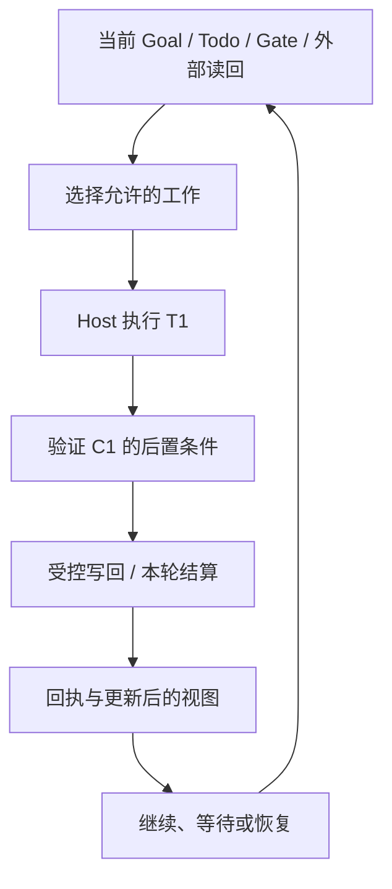

# 一轮受治理的工作

一轮工作的核心不是调用一次模型，而是把当前事实变成有边界的行动，再把结果交给对应 owner 验证和接受。本章先走正常路径，再处理三个容易混淆的情况：产物验证通过但尚未获准发布、已经写回但结算不完整，以及发现依赖后需要让其他工作继续。

## 用贯穿任务走完正常一轮 {#running-turn}

沿用[贯穿任务](00-reading-guide.md#running-example)：A 实现 T1，B 处理独立文档 T2，M1 观察 CI，G1 决定发布范围，T3 负责最终交付。它们是教学代号，不是可直接导入的 payload。

| 时点 | 当前事实 | 动作与接受者 | 留给下一轮的结果 |
| --- | --- | --- | --- |
| 选择 | T1 开放，A 的能力、权限和工作区满足条件 | 当前准入选择工作 | 精确 Todo 与本轮身份，而不是整个 Goal 的任意写权限 |
| 执行 | 兼容要求与输入版本明确 | Host 执行有界工作 | C1 与候选测试结果 |
| 验证 | 验证器检查的仍是 C1 | 检查默认文本、JSON 与非法输入 | 绑定产物和要求的证据 |
| 接受 | 提交时来源和执行证明仍有效 | Todo / writeback owner 接受对应变化 | 完成、进展或阻塞的实际读回 |
| 结算 | 对应结果确实需要记账 | settlement owner 完成内部结算 | 匹配原身份的回执或尚欠动作 |
| 继续 | CI 和发布决定仍有未满足条件 | 当前 frontier 与调度路径重新判断 | 独立工作、明确等待、恢复或有据的停止 |



图表示责任关系，不要求 quiet wait、原回执恢复和普通交付都执行相同的步骤。`Host 已运行`、`Todo 已完成`、`Turn 已结算`和`Goal 已验收`是不同结论。

## 从验收要求到交付证据 {#acceptance-evidence}

“测试通过”首先要补上宾语：哪一个版本满足哪一条要求？假设当前产物已经从 C1 变为 C2，不能把所有绿色结果合并成一个没有版本的“通过”。

| 当前要判断的要求 | 相关工作 | 足以支持局部结论的证据 | 不能由此推出 |
| --- | --- | --- | --- |
| 默认文本输出兼容 | T1 | 对 C2 的兼容检查及其输入、结果 | C2 已发布 |
| JSON 满足已确认的字段约定 | T1 / G1 的相关决定 | 当前约定与 C2 的验证 | 任何未来 schema 都被批准 |
| 文档示例与行为一致 | T2 | 针对 C2 的示例检查与审阅 | 两份改动组合后无需验证 |
| 允许向指定对象发布 | G1 | 有权决定者对对象、scope 和条件的明确决定 | 发布动作已经发生 |
| 交付到指定位置或接受者 | T3 | 产物版本、目标位置的实际读回，以及任务要求的接收确认 | 仅创建本地文件就完成了外部投递 |

这是一张教学推理表，不是新增的验收 schema。当前 objective、acceptance、permissions 和 terminal conditions 分布在项目材料、Vision、Todo 与运行约束中；不能假装已有一个统一可写的 Goal intent 对象自动完成所有判断。实际存储与版本依据见[状态章节](state-substrate.md)和[状态机地图](core-state-machines.md)。

局部证据通过对应 lifecycle 入口被接受，才产生相应工作事实。随后还要检查依赖、未解决的决定、后继与目标验收。若任务只要求返回一份可审阅 patch，不能额外要求真实生产发布；若任务明确要求投递，则本地文件存在不够。**接受条件来自原任务与当前有效决定，不来自执行者为了宣告完成临时降低的标准。**

### 三种材料各自证明什么

| 材料 | 可以支持的判断 | 不能替代 |
| --- | --- | --- |
| Observation | 某时刻、某对象上读到了什么 | 新鲜度检查和验收决定 |
| Evidence | 哪些材料支持某个结论 | 状态变化已经被接受的记录 |
| Receipt | 绑定操作在其输入和条件下被接受 | 当前仍有执行权、外部状态永远不变 |

例如 `git push` 超时只是调用结果。远端 ref 的读回可以帮助确认某个 commit 是否已经存在，但它不必然证明是哪次调用造成的，也不自动形成 LoopX 的交付回执。先判定原操作，再处理对应写回，不能由超时推导“肯定没发生”。

## 尺度一：执行、验证与提交

普通交付可以按五段理解：`Decide → Act → Validate → Write back → Account`。

**Decide** 读取当前 `interaction_contract` 和选中工作。旧 prompt、旧卡片或上轮建议不覆盖当前选择。

**Act** 产生一个输入明确、范围有界、结果连贯的工作段。Bounded 不等于只改一行；一个能独立验证的功能切片比若干无法验收的零碎修改更有用。

**Validate** 检查后置条件：代码要验证行为，文档要核对命令和解释，外部效果需要相应系统的读回，blocker 也需要可核对的缺失条件。退出码只有在验证器确实检查了目标后置条件时才有意义。

**Write back** 由对应 owner 接受状态变化和紧凑证据引用。验证期间代码或 Todo 声明改变时，重新判断结果适用性；不能用针对旧声明的成功覆盖新状态。Todo completion 的锁内 snapshot 检查是其中一个具体边界，参见 [completion adapter](https://github.com/loopx-project/loopx/blob/76b7583a9f67d6090b43a8c6e58c42cb67a1f3c6/loopx/control_plane/todos/completion_transaction.py)。

**Account** 根据本次结果的结算合同记账。LoopX quota 是内部预算 slot，不是供应商账单。Gate 通知、dry-run、未变化的观察和重复写回不能冒充新的 delivery spend；它们仍可能消耗时间、模型和网络资源。

缺验证时，不知道产物是否符合要求；缺写回时，后续读者不知道哪些结果被接受；投影滞后时，显示可能还停在旧状态；欠结算时，恢复对应记录而不是重做产物。不同缺口需要不同 owner，不能统一执行一次 `refresh-state` 就宣布全部修好。

### 七个阶段约束什么

在显式 opt-in 集成中，LoopX Turn 事务使用以下阶段：

```text
host_execute → typed_result → validation
             → durable_writeback → quota_spend
             → scheduler_apply → scheduler_ack
```

`completed_phases` 必须满足对应合同的合法前缀约束。它约束可以声称完成的阶段，不证明进程只能在阶段间退出；Host 内部仍可能包含多个工具调用。TurnEnvelope 是 bounded projection，`turn plan` / `turn run-once` 是显式集成入口，不能推广成所有 Host 工具调用都受同一个 journal 管理。

对已 prepared 而未确认的 settlement step，恢复按原 effect identity 读取 provider：

| 原操作读回 | 恢复路径 | 保留的边界 |
| --- | --- | --- |
| `committed` 且 payload/身份有效 | 复用已有结果 | 不重新执行已确认副作用 |
| `absent` | 在恢复许可和当前 guard 满足时执行尚欠步骤 | 缺日志本身不等于 absent |
| `unknown`、读取失败或矛盾 | 停在对应恢复责任 | 不换 key 绕过未知效果 |

`HOST_FAILURE`、`WRITEBACK_FAILED`、`QUOTA_SPEND_FAILED` 指向不同故障位置；失败名称不是无条件重试许可。完整恢复推理见[历史恢复与新执行](04-runtime-boundaries.md#recovery-or-new-execution)。

### 写回已经发生，结算为什么仍需恢复？ {#settlement-recovery}

`durable_writeback → quota_spend` 使记账能关联已验证的持久结果。后续 spend 超时不撤销已经接受的写回，也不使跨系统操作成为原子事务。

现有[结算旅程测试](https://github.com/loopx-project/loopx/blob/76b7583a9f67d6090b43a8c6e58c42cb67a1f3c6/tests/control_plane/test_quota_authority_settlement_journey.py)区分：

```text
写回后尚欠结算：spend_required
已扣减但对应回执缺失：spend_receipt_required
恢复后记录完整：settled
```

在回执修复用例中，执行原响应返回的恢复命令得到 `appended=false`，扣减记录仍为一次。它证明该记录修复路径没有重复扣减，不证明外部服务免费或 Goal 已接受。故障注入只属于隔离测试；不要在真实项目里删除回执来“重现流程”。

从可信当前入口取得 `settlement_owed.command` 后，核对原 Goal、Agent、Todo、Turn 和 registry/runtime 绑定及权限。不要删参数，也不要执行任意日志中出现的命令。详细练习见[结算检查](12-control-plane-course.md#checkpoint-settlement)。

### 等待不是在原 Turn 中换任务 {#wait-closeout}

“独立工作可以继续”还需要时间边界：某轮已绑定 T1，T1 发现依赖，并不意味着同一轮可以直接把结算身份改为 T2。

以下为**源码进阶对照**，依据主线 `f49b4a00…` 的[原 Turn 等待恢复测试](https://github.com/loopx-project/loopx/blob/f49b4a00870604d39fa4318da24d6dd35e72bb6e/tests/test_quota_bound_wait_recovery.py)。当前源码已包含该实现；固定版本链接用于复核，不能倒推为 `v1.2.3` 已发布行为，也不能在较旧 checkout 上直接执行。

```text
原 Turn 绑定 T1，登记 monitor_changed / todo_done 依赖
    → 保持原身份，暴露 unsettled_host_turn_recovery
    → 验证并完成原等待写回
    → typed_blocked_writeback_no_spend，原 Turn 收口
    → 新 Turn 重新选择可独立执行的 T2
```

该测试使用真实 CLI dispatch、TS 进程和 File/SQLite fixture。它断言同一 Turn 强行改绑得到 `heartbeat_receipt_identity_conflict`；原等待写回重放不重复记录，扣减为零；T1 仍为 open，等待条件未满足且验证摘要保留；新 Turn 才选中替代工作。它没有执行远端 CI，也没有证明每一种 Host 都用相同恢复入口。

用户在旧版本遇到类似问题时，应保留原身份并查看本机实际提供的恢复动作；不得通过复制测试中的新字段或换 Todo 绕过。判断“是否等待”见[观察章](04b-budget-and-admission.md#wait-and-next-turn)，而不是把收口与调度揉成一条规则。

## 尺度二：这一轮为什么获准？

### Decision Pipeline：从事实到当前合同

为了阅读，可以把输入整理为：

```text
identity
  → authority and boundary
  → scoped decision / repair obligation
  → capability and workspace eligibility
  → frontier and continuation
  → interaction contract
  → scheduler hint
```

这是依赖关系的教学图，不是新的全局 first-match 表。实际优先级取决于当前入口和规则 owner。不能由“余额充足”“Goal active”或“另一个 Agent 很忙”推出本轮允许任意交付。

身份和来源不明时，不授予交付资格；scope 缺失时不能推断批准；独立工作不应被无关 Gate 冻结；有适用的恢复义务时不能用新交付掩盖原记录缺口。多个条件同时出现，先读最终 contract 与具名 reason，再追到负责的规则，不能让 Host 从零散计数重新拼一个决策。

### 三个 channel 不是三次独立授权

| Channel | 要回答的问题 |
| --- | --- |
| User | 有什么决定或通知需要人处理，覆盖什么 scope？ |
| Agent | 当前是否需要尝试工作，允许哪项 bounded action？ |
| CLI | 需要哪些受控写回、结算或恢复动作？ |

G1 等待发布批准时，user channel 可以要求行动，agent channel 同时允许独立 T2。反之，“用户已看到提醒”不构成批准。`bounded_delivery`、`user_gate`、`scoped_user_gate_fallback`、`external_evidence_observation`、`monitor_quiet_skip`、`agent_scope_wait`、`autonomous_replan` 和 repair 等 mode 应结合当前 payload 阅读，不背成永远固定的枚举表。

Owner 在 Workspace 停止 Goal 属于相应生命周期，不应先由自动 Turn 的 quota 决定 owner 能否行使该权限。暂停也不抹去历史提交；是否允许某项恢复 mutation，仍由那条入口判断。完整组合 case 见 [Course 第 6 讲](/loopx/docs/development/control-plane-course/06-quota-decision-kernel/)。

### 规则归属不由语言名字决定

已迁移的事务由 TypeScript owner 解释，Python 负责适配或明确的外部 effect。已知切片包括 Turn settlement、Todo completion、Host Todo settlement、spend/void/monitor-poll commit、本地 task-lease 完整生命周期、Vision refresh 与 receipt-bound scheduler follow-up。

`v0.5.4` 仍提供 `turn plan` / `turn run-once`，这是历史迁移基线，不是当前发布版的替代标签，也不意味着“Python 已被移除”。[TypeScript Control-Plane Migration RFC](/loopx/docs/architecture/rfcs/typescript-control-plane-migration-v0/)解释 transaction-payoff 与 owner 边界。排查不一致时，找当前合同和实际调用路径，而不是一律相信某一种语言。

## 读回与本章的完成标准

受对应 Turn journal 管理的执行可使用：

```bash
loopx turn inspect-journal \
  --goal-id <goal-id> --agent-id <agent-id> \
  --turn-key <turn-key> --format markdown
```

检查原身份、`recorded_effects` 与 `recovery_decision`。诊断命令不执行恢复，也不授予重试权限；没有记录或 `null` 不自动证明效果未发生。其他执行路径应使用自己的回执入口，不伪造一个 Turn key。

读完后应能解释：T1 在哪一版上被验证、什么 owner 接受了什么、哪些结算仍欠缺、M1/G1 为什么仍有责任，以及下一轮为什么可以做 T2 而不能直接发布 T3。再进入[恢复章节](04-runtime-boundaries.md)，把一次合法结果接到多轮推进。
