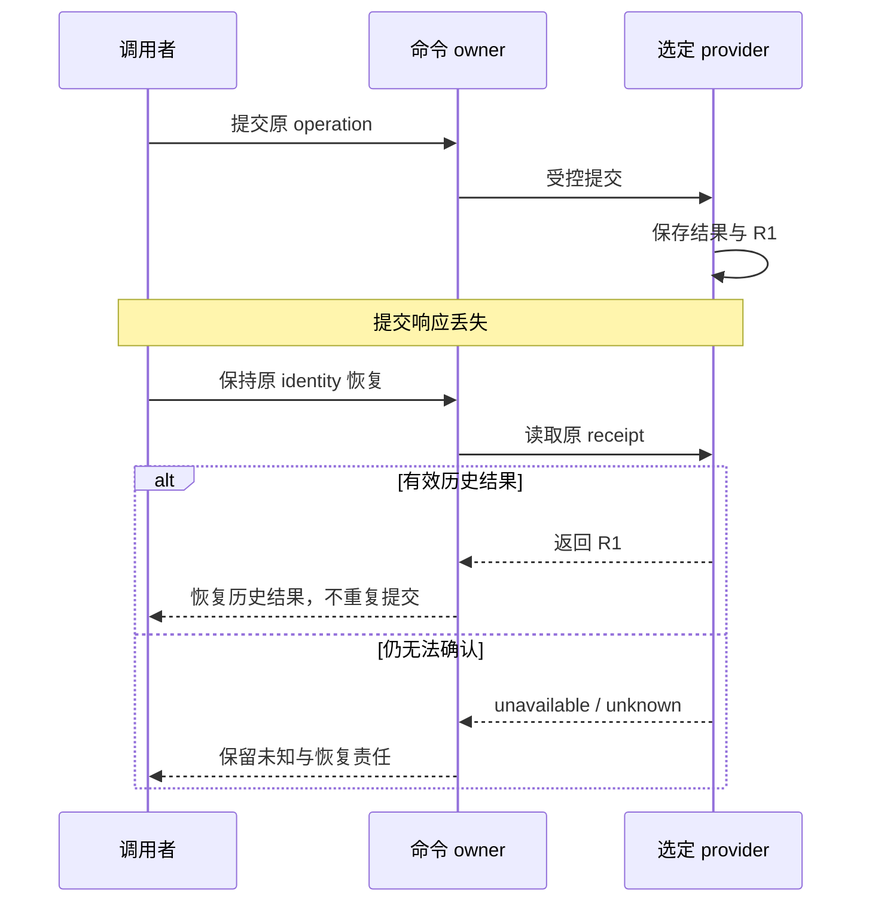

# 恢复、自修复与运行边界

上一章说明一轮怎样留下可接受的结果。本章把时间拉长：会话更换、代码更新、权限撤销、外部请求超时以后，哪些工作可以沿用，哪些判断必须重做，什么时候应改路或停止。

恢复不是加载一段旧思维，而是重建**当前行动条件**。历史 transcript 可以按 Host 的规则保存并用于理解背景；它不是当前授权、有效验收或外部状态的替代品。恢复历史事实与批准下一次行动，始终是两个问题。

## 同一任务：响应丢失之后恢复哪一项 {#receipt-recovery}

这是一个合成情境：T1 的某项受控操作已经提交，回执 R1 已持久化，但调用者没有收到响应。调用失败不能证明效果没发生。



图的第一条分支有“R1 确实存在且有效”的前提。只有错误输出而没有 provider 读回时，不能猜自己位于哪条分支。已确认 absent 后是否可以执行，仍取决于当前恢复合同、身份和授权，不是从缺失记录直接得到许可。

R1 恢复后，继续读取 T3 的当前条件。C1 的提交成功不能验收 C2；T1 的结算也不能替代 G1 对发布的决定。

## 历史恢复还是新的执行？ {#recovery-or-new-execution}

“保留原 identity”和“取得新的执行 key”看似矛盾，是因为它们回答不同问题。

| 情况 | 现在要确认的事实 | 身份处理 | 下一步与停止条件 |
| --- | --- | --- | --- |
| 原操作响应丢失，结果尚未确认 | 同一次操作到底发生了什么 | 保留原 operation / effect identity 与参数 | 由原 owner 读回，不申请新 key 掩盖未知 |
| 原操作确已提交，回执缺失 | 历史结果如何完整返回 | 按原操作恢复或重放回执 | 核对返回结果，不重新制造同一副作用 |
| 原执行已合法释放或结束，要开始新工作 | 当前工作、owner 和输入是否允许新执行 | 历史不删，新执行按准入取得新证明 | 条件不满足就拒绝，不能拿旧 receipt 复活权限 |
| 验证以后输入或要求改变 | 旧证据还适用于哪一部分 | 保留历史证据，绑定新输入重新验证 | 只更新受影响判断，不假造全局版本 |

[租约回归测试](https://github.com/loopx-project/loopx/blob/76b7583a9f67d6090b43a8c6e58c42cb67a1f3c6/tests/control_plane/test_canonical_lease_acquire.py)给出具体例子：renew 后原 acquire 的读回保留 original receipt，却返回当前 lease；release 后复用退役 acquire key 被拒。历史说明与当前执行证明是两种材料，不能互相顶替。

恢复请求也不是允许修改原意图的窗口。某个接口要求重放原参数时，不能顺手换 receiver、Todo、TTL 或版本；要先确认原操作，再通过新的合法生命周期动作表达新意图。各接口的 request digest 和重放规则以当前合同为准。

## 不同版本分别防止什么错误？ {#revision-bases}

| 标识或版本 | 回答的问题 | 不能替代 |
| --- | --- | --- |
| artifact / commit revision | 哪一份产物被验证或投递？ | provider 的提交版本、执行权限 |
| provider revision | 对应存储快照是否仍可提交？ | 产物版本、lease epoch |
| lease version | 此次 lease 生命周期请求基于哪个当前记录？ | 其他 Todo 或其他 provider 的版本 |
| lease epoch / execution key | 哪次执行持有当前证明，旧实例是否已退役？ | 外部系统实际效果的读回 |
| Turn / operation identity | 哪次行动、写回或结算被关联与恢复？ | 新一轮工作的准入 |
| evidence 时间与来源 | 观察来自哪里，是否仍适用？ | 单靠“刚读过”保证对象和 scope 正确 |

当前系统没有一个整数可以同时代表这些维度。两次读取也未必来自同一原子快照。记录各自 basis 和来源；字段缺失时报告缺失，而不是自己补一个 `version=0`。相关 source、聚合与写入边界见[状态章节](state-substrate.md)和[状态机专题](core-state-machines.md)。

### C1 变成 C2 后，哪些东西失效？ {#changed-evidence}

C1 的检查仍是可信的历史事实，但不再自动证明 C2。首先确认实际变化：代码、验证声明、依赖、批准范围或运行环境中的哪一项变了？

只改文档排版，未必需要重复所有领域实验；改变输出 schema，则必须重新检查依赖它的代码、示例、验收与批准。这个影响判断应有 diff、当前要求和验证计划支持，不能凭“改动很小”跳过。

G1 是否仍覆盖 C2，取决于原决定绑定的对象和条件；不是所有决定都必然失效，也不能把一个历史 approved 永久沿用。通过原规划和决定入口修正适用关系，重新验证受影响的工作，再由当前准入选择下一步。

## 四种延续动作，修复四类问题

**Continuation**：目标和路线仍有效，开始下一段合法工作。即使 Host 能恢复旧 session，也重读当前 guard，不沿用旧 selected Todo。

**Retry / reconcile**：原意图仍成立，但需要确认或完成原操作。只对具有已核对幂等和恢复边界的操作重试；外部结果未知时，优先 reconcile / readback。`unknown` 不是失败的另一种拼写。

**Replan**：工作含义需要改变，例如新证据推翻方案、验收改变、工作候选耗尽但目标未满足。它应产生当前协议接受的 Todo、Vision、successor、acceptance 关系变化或有据的终止结果，不是再写一遍计划。

**Self-Repair**：目标工作可能仍然正确，但来源、投影、路由或回执链存在缺口。先定位 owner，再修具体缺口；不能把删 Gate、降低 validator 或清空历史当成修复。

Dreaming 产生候选方向或假设，不直接获得执行权。只有被当前规划/决定路径接受并通过相应 lifecycle 写入后，它才影响真实工作。Capability 与 Provider 的领域结果也通过各自合同进入控制面，不反过来拥有通用权限。

## Material Evidence Delta：有活动不等于有进展

设想一个教学案例：一天里不断改笔记、补无关测试、重排目录，却没有降低目标的任何验收缺口。每项产物可能真实存在，但这不足以说明整体收敛；这也不是声称当前规则会无条件允许无限次同类工作。

Material Evidence Delta 关注新增的、能改变下一步判断的证据或状态，而不是只数 Turn、文件或字符。负面结果也可能有价值：排除一个假设、确认一个真实 blocker、缩小未知范围，都能改变后续路线。

Delivery Batch Scale 描述改动范围；Delivery Outcome 描述成果与目标的关系。`multi_surface` 或 `implementation` 不自动意味着完成 Goal。`surface_only`、`outcome_gap`、`outcome_progress`、`primary_goal_outcome` 要按对应合同解释；执行者选择一个好看的标签不能替代证据。

### Vision checkpoint 与 baseline

Vision 是 per-Agent 的执行路线，不是随手笔记。适用的 material refresh 需要说明路线被 patch、保持不变的依据、retired/superseded 的关系，或该角色为何不需要 Vision。

“保持不变”需要可比较的 baseline。没有 baseline 时先建立当前路线；不能把从未检查过写成没有变化。出现 `vision_checkpoint_missing` 等 gap 时，回到负责的 checkpoint 入口，补实际关系，而不是增加愿景 prose。不同 replan/repair 的优先级仍由当前 owner 决定，不把这段教学说明变成所有 Host 的全局规则表。

### 六条收敛不变量

这六个问题用于检查完整性，不新增公共字段或一条自动通过算法：

1. **方向**：当前工作如何关联 Goal / Acceptance 与适用的 Vision？
2. **权限**：正确主体是否在正确对象和 scope 上具有当前资格？能力存在不等于得到授权。
3. **证据**：观察、验证与决定是否绑定正确输入和来源，仍满足新鲜度要求？
4. **Delta**：新增了什么可重读事实，或确认了哪项合法等待？
5. **活性**：未完成目标还有工作、可执行观察、决定、修复或明确停止责任吗？
6. **终局**：后继、等待、回执与验收缺口是否按适用合同全部处理，而不是只看列表为空？

安全避免错误推进，活性避免在缺少下一入口时永久卡住；二者都不保证任意目标必然成功。更多案例见[长程收敛专题](/loopx/docs/development/control-plane-course/topic-long-horizon-convergence/)和[证据与修复课程](/loopx/docs/development/control-plane-course/08-evidence-refresh-and-self-repair/)。

## 两个页面不一致时，先修哪一个？ {#projection-repair}

```text
发现差异
  → 核对同一 Goal、来源、模式、时间与截断范围
  → 找负责该事实的 source
  → 区分未提交、source 错误、投影滞后、读取失败与迁移差异
  → 由相应 owner 修复
  → 读回并重新判断依赖该结果的工作
```

Legacy Markdown 可能仍是源；已选 canonical provider 的 Todo 不能从旧 Markdown 兜底。若源已提交但显示旧，修投影；若源本身错误，通过原 lifecycle 修正；若读取不可用，保留未知。让几个页面手工显示相同内容，不等于恢复了正确状态。

`refresh-state` 是受控写回，不是所有故障的通用查询。纯查看入口与 mutation 分开，参见[现场查阅](appendix-reference.md#read-before-change)。Workspace 操作回执与页面状态的具体比较见[暂停案例](workspace-v1.md#pause-readback)。

## 停止、闭环与补偿

Goal 被 owner 停止、quota 暂停或 Host 退出，不能反证目标已完成。`terminal_no_followup` 需要对应 frontier/acceptance 的终局条件；可见 Todo 数量为零不充分，因为列表可能截断，或还存在 Monitor、Gate、successor、handoff、replan 和结果交付责任。

若当前要求确实满足，按已有终局入口留下依据；若仍需工作，保留后继；若结果未知，保留观察或 blocker。被验证的负向结果和有覆盖依据的 no-follow-up 可以诚实结束一条路径，不需要伪造成功。

已经生效的错误操作需要补偿，不是删除历史。[Rollback packet 协议](/loopx/docs/reference/protocols/rollback-packet-v0/)帮助表达影响对象、来源、恢复选择、批准与验证，但 packet 不是执行许可。Revert、fix-forward、外部清理和支持请求有不同前提；回滚安装也不必然逆转状态格式或远端效果。

补偿完成后重新检查真实后置条件，并明确哪些结果仍需接受者确认。内部记录收口、收件人收到产物和整体验收是分开的，参见[第一份交付](05-connect-existing-project.md#first-delivery)。

## 恢复的代价与公开边界

恢复依赖可读的原记录、可用的 provider 读回与当前权限。缺少它们时可能需要人工或外部支持，不能靠换身份推断问题消失。反复修投影的成本也应成为工程问题，而不是把“系统能自修复”当成持续故障的理由。

证据采集消耗时间与资源，应与风险匹配；检查太少会漏掉变化，过度重复又可能吞噬交付。正文讨论的是如何保存最小充分证据，不要求把每段思考永久记录下来。

私有 registry、active state、lease、session handle、凭据和 raw transcript 不进入公开例子。Handoff 传递必要的 bounded refs、freshness 和合法获取入口，不复制全部私有材料。项目的 `.loopx/`、`.loopx/goals/`、`.local/` 需要按实际用途建立 Git 边界；忽略规则不是凭据扫描或已提交历史检查的替代品。

读完后应能给一次中断归类、指出要保留的原身份、要重新观察的条件、负责恢复的入口及其停止条件。无法确认结果时，可以明确交还恢复责任；不应只说“再跑一次看看”。

只有同时满足下列条件，一次 writeback 才可以把 vision 标记为 unchanged：

- 存在可比较的 baseline（上一轮已写入的 vision）；
- 本轮 delivery 确实没有改变任何 vision 前提；
- 写回时用 `--vision-unchanged-reason` 给出“不变”理由；LoopX 会自动把已有 vision 绑定为 baseline，
  不需要另外传入 revision。

如果 baseline 缺失但 agent 仍声称 unchanged，quota 会产生 `vision_checkpoint_missing` gap。这不是
为了惩罚，而是为了防止 agent 在 never-checked 状态上积累错误假设。完整失败回放见
[Control-Plane Course 第 8 讲](/loopx/docs/development/control-plane-course/08-evidence-refresh-and-self-repair/)。

## Terminal Closure

Todo 全部 done 只说明当前列表结束，不自动证明 Goal 完成。Terminal audit 至少检查：

```text
open todos = 0
due monitors = 0
unresolved blocking gates = 0
pending successors = 0
replan obligations = 0
acceptance gaps = 0
retryable postconditions = 0
required external readbacks are fresh
```

如果 acceptance 已满足且没有 follow-up，记录结构化 no-follow-up；如果仍有工作，创建 successor；
如果外部结果尚未确定，保持 monitor 或 blocker。不要为了让 Goal “看起来完成”而删除未闭合状态。

## 四种运行责任

长期 Agent 系统容易把所有组件都称为“工具”或“插件”。LoopX 使用四种运行责任：

| 责任 | 合同 |
| --- | --- |
| Agent / Executor | 在 Host 中规划并执行一个被允许的 bounded action |
| Provider | 调用外部系统，返回 observation、effect result 或 readback |
| Capability | 定义 caller outcome，规范 Provider 输出，应用 domain policy |
| LoopX Kernel | 接受或拒绝 proposal，拥有通用 Goal/Todo/Gate/Quota/Recovery state |

正常流向不是“Agent 调工具后直接写完成”：

```text
Agent -> Capability -> Provider -> external system
Provider readback -> Capability validation/proposal -> LoopX transition
```

Capability 描述调用者可依赖的 outcome contract；Provider 实现或访问外部系统；Kernel 保持跨领域
生命周期。Issue-Fix、Explore 等领域结果可以拥有自己的 Domain State，但不能反向拥有通用 quota、
Gate 或 permission。

## Extension 是交付与生命周期边界

**Extension**拥有独立的：

- packaging；
- installation；
- enable / disable；
- upgrade / rollback；
- compatibility；
- provider ownership。

它不是第五种运行责任，也不自动获得 domain authority：

```text
Extension package
└── delivers Provider
      └── participates in Agent -> Capability -> Provider -> Kernel flow
```

对于零权限、确定性的 standalone Extension，LoopX 可以通过 managed runtime 调用 bounded
request/response command。一旦操作需要 read、write、send、publish 或 manage authority，就必须
进入能检查 permission、decision scope 与 domain policy 的 Capability 或领域命令。

“安装成功”“doctor ready”和“有权执行某次 effect”是三个不同状态。

## 谁拥有事实

### LoopX canonical state

LoopX 拥有工作生命周期事实：

- Goal、Todo、Gate；
- claim、lease、dependency 与 successor；
- quota、monitor、scheduler hint；
- accepted evidence pointer 与 receipt；
- event lineage、Vision checkpoint 和 projection inputs。

### 外部系统

外部系统继续拥有自己的事实：

- Git 拥有 commit 与 branch；
- GitHub 拥有 PR、Issue 与 check 当前状态；
- CI 拥有 job 结果；
- cloud service 拥有资源实际状态；
- Host 拥有 session 与真实唤醒效果。

LoopX 可以保存 bounded observation、readback 和 evidence pointer，但不能让一份过期复制品替代
外部权威。

### Host 与 Agent

Host 拥有 session、模型 Turn、工具表面和实际唤醒机制。Agent 拥有当前推理与临时计划。两者都
不能成为项目 Goal state 的唯一持有者。

Host 应服从 current `interaction_contract` 与 `scheduler_hint`，不能把项目专属控制逻辑永久复制
进 heartbeat prompt。Agent 也不能因为“上一轮做过类似动作”而推断本轮仍有 authority。

## Public 与 Private Boundary

项目状态常包含不能公开提交的内容：

- 本地 registry 与 active goal state；
- task lease、Host session handle；
- raw transcript、trajectory 与 verifier tail；
- credentials 与 provider private config；
- 本机路径、内部链接和私有组织叙事；
- 未脱敏的外部 evidence。

项目接入章要求将以下目录排除在 Git 外：

```text
.loopx/
.loopx/goals/
.local/
```

忽略规则只是第一层保护。公开提交前仍要扫描 credentials、absolute paths、raw logs、private links
和 runtime artifacts。需要长期公开保存的结论应先压缩成 public-safe behavior、schema、fixture
或 evidence pointer。

Handoff 也不能把 private material 复制到另一个公开 packet。它只传 stable ids、bounded refs、
freshness、omission note 与重新获取材料所需的合法路由。

## LoopX 不替代什么

LoopX 不替代：

- Agent runtime：模型仍负责推理；
- Host scheduler：Host 仍负责实际唤醒；
- Git：代码历史和 branch 仍由 Git 管理；
- CI：测试执行和 check 状态仍由 CI 管理；
- 外部服务认证：TurnEnvelope 和 receipt 都不是 security token；
- domain system：LoopX 不伪造外部资源事实；
- independent validator：Executor 自述不能单独证明 completion。

这个边界会支撑后续两条实践主线：

1. **接入现有项目**：复用这些协议，不修改 LoopX 源码；
2. **开发者贡献**：从调用者结果和协议选择 owning boundary，可交付 Control Plane、
   Capability/Domain State、Provider、Host/Runner、Projection/Dashboard、Docs/fixtures 或
   Extension。

Extension 是开发者贡献中的独立 packaging/lifecycle 路径，不是所有贡献的统一抽象。两条主线共享
同一控制面模型，但不互相要求。下一部分先从最常见的项目接入开始。
