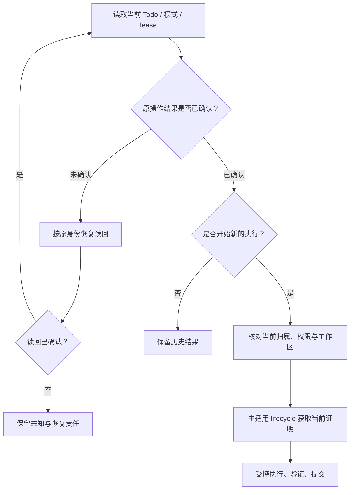

# 工作图、权限与 Peer 协作

A 可以实现 JSON，B 可以补文档，维护者仍未批准发布。这三件事可以同时成立。工作图的价值是把它们表达成有身份、有依赖和有接受条件的工作，而不是让“有人正在做”成为所有动作的许可。

本章先分清工作归属、执行证明与决定范围，再走一次交接和集成。实际写入仍由当前 authority、handoff mode 与对应 writer 校验；本章不新增一个统一授权者。

## 从一项任务拆出可接受的工作 {#design-choice}

沿用[贯穿任务](00-reading-guide.md#running-example)。T1 的结果是兼容实现；T2 的结果是与当前行为一致的文档；M1 是外部观察；G1 是明确的决定；T3 将已接受结果交付到目标位置。

| 选择 | 能解决什么 | 留下的代价 |
| --- | --- | --- |
| 单个 Agent 持续执行 | 简化交接与冲突 | 仍需跨会话状态、验证和外部等待 |
| 多个 peer 使用软 claim | 表达责任与可接手工作 | claim 本身不能排除失效或竞争实例 |
| 对适用写入使用 lease 与围栏 | 让当前执行证明参与受控提交 | 要处理 TTL、版本变化、续租和恢复 |
| 分离工作区并独立验收 | 减少直接编辑干扰 | 不能替代集成验证与合并权限 |

拆分不以 Agent 数量为目标。若 B 必须等待 A 每次修改的结果，两者可能仍在同一关键路径；若它们可以独立产生可验证结果，才有并行价值。每项工作的输入、产物和后续接受条件应能单独说清楚。

## 四个不能合并的判断 {#authority-layers}

| 判断 | 依据 | 不充分的替代信号 |
| --- | --- | --- |
| 这项工作现在存在且可推进吗？ | 当前 Todo source、status、依赖和边界 | 旧列表仍显示 open |
| 它归谁处理？ | claim、binding、exclusion 与 peer/lane 规则 | Agent 的自我介绍或进程名 |
| 这个执行实例现在可以提交吗？ | 适用模式的 lease、当前 owner/key/version 与 writer fence | 原 acquire 曾成功 |
| 这个具体动作被允许吗？ | Goal/repository 权限、Gate scope、能力和工作区要求 | 工具可调用、目录可写或 quota 有余额 |

Agent identity 是工作 lane，不证明具体 Host，更不证明组织职级。`claimed_by` 表达归属而不是进程活性；lease 的有效性也不能证明模型判断正确。外部服务最终是否拒绝旧执行者，还取决于那个写入端实际执行的约束，不能从本地 lease 推导出全系统围栏。

## Gate 覆盖动作，不靠数量冻结全局

G1 限制 T3 的 publication scope。T2 如果确实独立且自己的条件满足，可以继续；G1 仍应在用户通道中可见。独立 fallback 不是绕过 Gate，而是根本没有执行被它覆盖的动作。

```text
G1: publication scope 尚未批准
T3: requires G1 → 不执行发布
T2: 不依赖 G1，其他条件满足 → 当前准入可选择文档工作
```

scope 缺失或矛盾时不能猜成批准，也不能为了省事创造一个隐式 global Gate。由原 source/projection/decision owner 修复关系，或提出需要有权决定者回答的具体问题。`user_action` 提醒也不能替代 `user_gate` 的决定。

用户操作有自己的生命周期权限；自动工作的准入有自己的 quota contract。Workspace 点按钮不产生权限，quota 也不是所有 owner 操作的通用批准器。具体操作见[Workspace](workspace-v1.md#action-owners)。

## Claim、lease 与当前执行证明

当前 `handoff_mode` 决定适用约束：默认 `legacy` 保留软 claim / hard lease 的兼容路径，`soft_claim` 与 `hard_lease` 有自己的规则。部分 legacy terminal 路径可以出现 `terminal_fence_not_required`。因此，不能把一种模式上的回归测试推广为全部 writer 的强互斥证明。

对已经提升的 File/SQLite authority，精确读取应来自选定 provider；读取失败不退回旧 lease 文件。来源选择、registration 和当前 Todo 约束与 lease 共同参与判断。`task-lease inspect` 是一次观察，不是跨后续操作持有的锁。

| 生命周期动作 | 在适用合同中表达什么 | 调用者需要保留什么 |
| --- | --- | --- |
| acquire | 为新的合法执行取得证明 | 工作与执行身份、当前条件和结果 |
| renew | 延续当前执行的有效期 | 当前 owner/key/version；不能只用很早的版本 |
| transfer | 把执行权交给满足条件的接收方 | 精确发送者证明、接收者与原请求意图 |
| release | 合法退役当前证明 | 原 owner/key/version 与操作回执 |

不要从这张表反推出通用参数。使用当前 `--help` 和实际 readback；尤其 renewal、transfer 与 release 对版本、epoch 和清理的规则不同。历史恢复与新申请的区别见[恢复章](04-runtime-boundaries.md#recovery-or-new-execution)。

### 过期或被接管的执行者回来时怎么办？

A 的旧操作可以有历史 receipt，但 B 已取得新的当前证明时，不能让 A 据此继续修改。先分开读取历史回执与当前 lease；需要恢复历史结果时走原操作，需要新工作时重新检查当前资格。



同名 Agent、重新启动的终端和旧成功截图都不是绕过该过程的方法。`version_mismatch` 应触发当前状态核对；release 后的 `idempotency_key_reuse` 不通过修改历史 key 来“修复”。

## 从交接到集成：把一次协作走完 {#handoff-to-integration}

交接不只是发送一条消息。接收者需要知道接到哪个工作、接受哪份输入、尚欠哪些条件，并在自己的实际执行环境重新确认资格。

**第一步，A 返回具体产物。** T1 的回报引用 C1、验证声明和结果，以及尚未满足的 M1/G1。不能只写“JSON 已完成”。

**第二步，B 确认采用哪份输入。** B 的文档基于 C1 的字段约定；若无法访问该产物，问题是交接输入缺失，而不是需要重新实现 T1。Handoff 使用 bounded refs 和合法读取入口，不把全部私有 transcript 复制到公开 packet。

**第三步，当前归属合法转换。** Lease 转移与 Todo claim 是否同时改变，由所选命令合同决定。不要假设 lease-only transfer 自动改 claim，也不要在要求原子交接的路径上拆成两次手工写。接收方仍须满足 registration、binding、exclusion、scope 和 workspace 条件。对应操作说明以[canonical lease reference](https://github.com/loopx-project/loopx/blob/f49b4a00870604d39fa4318da24d6dd35e72bb6e/docs/reference/canonical-lease-renew.md)中的版本范围为准。

**第四步，分别验证以后再验证组合。** T1 的代码检查和 T2 的示例检查只证明各自结果；集成者要检查两者在同一个候选版本上是否一致。两个分支都绿，不是组合提交也绿。

**第五步，变化沿依赖传播。** A 将 C1 修正为 C2 时，B 检查字段或行为变化是否影响文档与验证。保留原历史，只更新受影响结论；已经基于 C1 完成的工作不是自动作废，也不是自动适用于 C2。

**第六步，结果回到接受者。** 由 T3 对当前产物与决定再做判断。消息送达、接收者采用输入、工作被接受、发布被允许、外部交付发生，各有证据；不能用其中一项代替其余全部。

这个六步过程是教学案例，不是在声明系统会自动完成所有跨 Host、跨设备或跨仓库编排。协作是否成功，必须检查用户所需的关系是否真正闭合。

## 工作区隔离不等于集成正确 {#parallel-editing}

传统保守做法对冲突写范围保持排他。读者还需要知道，新出现的协作编辑模式为什么可以允许某些“同路径编辑”，却仍不授予合并权。

下面是**源码进阶对照**：主线 `f49b4a00…` 的[独立 worktree 编辑说明](https://github.com/loopx-project/loopx/blob/f49b4a00870604d39fa4318da24d6dd35e72bb6e/docs/reference/canonical-lease-renew.md)提供显式 `--write-worktree` 路径。当前源码已包含该实现；这里解释已有合同，不能倒推为发布版 `v1.2.3` 已支持。

在该已提升 File/SQLite 路径上，经过校验的同机 sibling worktree 可以在指定条件下拥有重叠代码编辑范围，并返回 `integration_overlap_advisories`。仓库身份来自权威 Todo；Host/path 别名、同一 Todo、同一 worktree、未验证 workspace 或其他机器仍受相应排他规则约束。

| 已取得的条件 | 可以说明什么 | 还不能说明什么 |
| --- | --- | --- |
| 工作区隔离已验证 | 编辑发生在被区分的 checkout | 可以修改共享运行数据或 Git 管理目录 |
| lease admission 接受 | 当前协调模式允许这次执行 | 工具权限被扩大、跨 Goal 获得全局锁 |
| 两份改动独立验证通过 | 各自产物满足已检查条件 | 组合后行为正确 |
| 集成验证通过 | 当前组合满足相关检查 | 有合并、远端写入或发布权限 |

该模式是合作式代码编辑协调，不是 OS sandbox。旧 grant 不会因读取或续租自动升级为新模式；需要变更执行意图时，按当前生命周期退役并重新取得证明。安装 provider 或改变目录名不构成提升与授权。

## 依赖与后继怎样保持可追溯

`todo_done:<todo-id>`、`monitor_changed:<todo-id>`、`capacity_available:<capability>` 和 `pr_merged:<pr-id>` 表达不同恢复条件。条件满足产生下一步判断的依据，不必然自动改写旧 Todo status。

跨仓库依赖需要正确 repository identity。`pr_merged:#123` 可以由 Todo 的 GitHub `task_repository` 解析仓库；显式 `pr_merged:owner/repo#123` 直接指定对象。两者都不能确定仓库时，不按相同编号猜测。

Successor 表达下一项有身份的工作；supersede 保留旧工作与替代关系（对应生命周期会把 predecessor 记为 done 并标记替代）；no-follow-up 说明为什么这一条路线不再需要后继，不能自动等同 Goal 全部验收。`independent_handoff` 与 `same_agent_non_delivery` 表达不同 continuation policy，按实际写回读取而不是从 prose 推断。

## 用具名证据核对边界

| 要核对的结论 | 源码测试入口 | 不能扩大为 |
| --- | --- | --- |
| 历史 acquire 与当前 proof 不同 | `tests/control_plane/test_canonical_lease_acquire.py` | 所有并发和 TTL 场景都已证明 |
| 续租与转交的当前记录规则 | `test_canonical_lease_renew.py`、`test_canonical_lease_lifecycle.py` | 任意外部写入端都强制围栏 |
| 旧 writer 不能绕过已生效来源 | `test_legacy_coordination_writer_fence.py` | 旧模式已被全局删除 |
| runtime root override 不绕过来源围栏 | `test_split_root_todo_writeback_fence.py` | 改一个 CLI 参数就能获得新权限 |

这些测试属于各自固定输入和 writer 的证据，不是运行中的 Goal 已经健康的证明。练习和断言解释见[lease 检查](12-control-plane-course.md#checkpoint-lease)；实际取证入口见[附录](appendix-reference.md#read-before-change)。

协作的最终标准是：接手者知道接受了什么，当前执行者具有什么资格，组合结果由谁验证，剩余决定由谁负责。范围、证明或输入不清楚时先补齐这一处关系，不重新分派全部任务碰碰运气。
