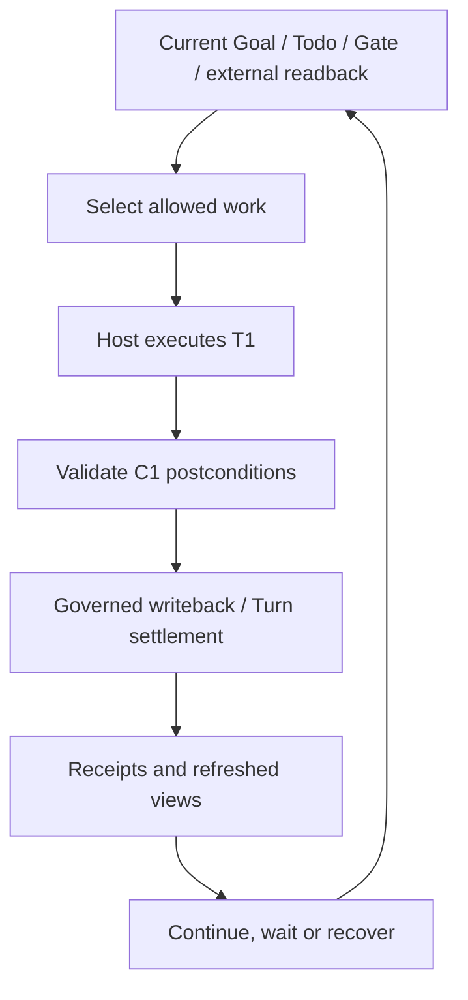

# One governed turn

A turn is not merely a model invocation. It turns current facts into bounded action, then presents the result to the owner that can validate and accept it. Start with normal work before distinguishing artifact acceptance, incomplete settlement, and continuation after discovering a dependency.

## Follow one normal turn {#running-turn}

In the [running example](00-reading-guide.md#running-example), A implements T1, B documents independent T2, M1 observes CI, G1 decides publication scope, and T3 delivers. These are teaching labels, not importable payloads.

| Point | Current facts | Action and accepting owner | Result for the next turn |
| --- | --- | --- | --- |
| Selection | T1 is open; A satisfies capability, authority and workspace conditions | Current admission selects work | Exact Todo and Turn identity, not arbitrary Goal-wide write permission |
| Execution | Compatibility requirements and input revision are known | Host performs bounded work | C1 and candidate test results |
| Validation | The validator still checks C1 | Check text compatibility, JSON and invalid inputs | Evidence bound to artifact and requirements |
| Acceptance | Source and execution proof still permit commit | Todo/writeback owner accepts its transition | Actual readback of completion, progress or a blocker |
| Settlement | This result requires accounting | Settlement owner completes internal accounting | Matching receipts or an outstanding action |
| Continuation | CI and publication still have unmet conditions | Current frontier and scheduling path reassess | Independent work, explicit wait, recovery or justified stop |



This is a responsibility chain, not a requirement that quiet waits, receipt recovery and normal delivery execute identical steps. Host execution, Todo completion, Turn settlement and Goal acceptance are different conclusions.

## From acceptance requirements to delivery evidence {#acceptance-evidence}

“Tests passed” needs an object: which revision satisfies which requirement? When the artifact changes from C1 to C2, do not combine every green result into a revision-free pass.

| Requirement being judged | Related work | Evidence supporting the local conclusion | What it does not establish |
| --- | --- | --- | --- |
| Default text output remains compatible | T1 | Compatibility checks on C2, including inputs and results | C2 has been published |
| JSON satisfies the agreed fields | T1 and the relevant G1 decision | Current agreement and validation on C2 | Every future schema is approved |
| Examples match behavior | T2 | Example checks and review against C2 | Combined changes need no integration validation |
| Publication to the named target is allowed | G1 | An authorized decision covering object, scope and conditions | Publication has occurred |
| Delivery reached its target or acceptor | T3 | Artifact revision, target readback, and receipt of delivery when the task requires it | A local file completes external delivery |

This is a teaching reasoning table, not a new acceptance schema. Objective, acceptance, permissions and terminal conditions currently span project material, Vision, Todos and runtime constraints. Do not pretend that a unified writable Goal intent object already makes every judgment. See [state](state-substrate.md) and the [state-machine map](core-state-machines.md) for storage and revision bases.

Evidence becomes an accepted work fact through the relevant lifecycle entrypoint. Dependencies, unresolved decisions, successors and Goal acceptance still need checking. A task asking for a reviewable patch does not acquire a new production-deployment requirement; a task requiring delivery cannot stop at a local file. **Acceptance comes from the task and currently valid decisions, not a standard lowered by the executor to report completion.**

### Three kinds of supporting material

| Material | What it can support | What it cannot replace |
| --- | --- | --- |
| Observation | What was read from a particular object at a particular time | Freshness checks and acceptance decisions |
| Evidence | Materials supporting a conclusion | A record that a transition was accepted |
| Receipt | Acceptance of a bound operation under its inputs and conditions | Current execution rights or an unchanging external world |

For example, a `git push` timeout is a call outcome. A remote-ref readback may establish that a commit is present, but not necessarily which invocation caused it, and it does not automatically create a LoopX delivery receipt. Resolve the original operation before its writeback; timeout is not proof of absence.

## Scale one: execute, validate and commit

Normal delivery has five useful stages: `Decide → Act → Validate → Write back → Account`.

**Decide** reads the current `interaction_contract` and selected work. An old prompt, card or recommendation does not override current selection.

**Act** produces a coherent segment with explicit inputs and boundaries. Bounded does not mean one line: an independently verifiable feature slice is more useful than fragments that cannot be accepted.

**Validate** checks postconditions. Code needs behavioral validation, documentation needs command and explanation checks, external effects need appropriate readback, and blockers need inspectable missing conditions. An exit code matters only when the validator actually checked the intended postcondition.

**Write back** asks the relevant owner to accept state and compact evidence references. If code or Todo declarations changed during validation, recheck applicability rather than applying an old success to new state. The Todo completion snapshot comparison under its mutation lock is one concrete boundary; see the [completion adapter](https://github.com/loopx-project/loopx/blob/76b7583a9f67d6090b43a8c6e58c42cb67a1f3c6/loopx/control_plane/todos/completion_transaction.py).

**Account** follows the result's settlement contract. LoopX quota uses internal budget slots, not provider bills. Gate notification, dry runs, unchanged observations and repeated writeback must not masquerade as new delivery spend, although they can consume time, models and networks.

Missing validation leaves artifact suitability unknown; missing writeback hides accepted results from successors; a stale projection can display old state; outstanding settlement calls for record recovery, not repeating the artifact. These are different owners, not problems a universal `refresh-state` can automatically repair.

### What the seven phases constrain

These are explicit opt-in integrations. LoopX Turn transactions use:

```text
host_execute → typed_result → validation
             → durable_writeback → quota_spend
             → scheduler_apply → scheduler_ack
```

`completed_phases` must satisfy the applicable legal-prefix contract. It constrains claimed progress, not the instants at which a process can exit; Host execution can contain multiple tool calls. TurnEnvelope is a bounded projection, and `turn plan` / `turn run-once` are explicit integration entrypoints. These facts do not put every Host tool invocation under the same journal.

For a prepared but unconfirmed settlement step, recovery reads the provider under the original effect identity:

| Readback of the original operation | Recovery path | Boundary retained |
| --- | --- | --- |
| `committed` with valid payload and identity | Reuse the result | Do not repeat a confirmed effect |
| `absent` | Execute the outstanding step when recovery permission and current guards allow | Missing logs alone do not establish absence |
| `unknown`, failed or conflicting readback | Remain at the owning recovery boundary | Do not bypass uncertainty with a new key |

`HOST_FAILURE`, `WRITEBACK_FAILED` and `QUOTA_SPEND_FAILED` identify different failure locations, not unconditional retry permission. Continue with [historical recovery versus new execution](04-runtime-boundaries.md#recovery-or-new-execution).

### Why recover settlement after writeback exists? {#settlement-recovery}

`durable_writeback → quota_spend` relates accounting to validated durable results. A later spend timeout does not revoke accepted writeback or make cross-system work atomic.

The existing [settlement journey tests](https://github.com/loopx-project/loopx/blob/76b7583a9f67d6090b43a8c6e58c42cb67a1f3c6/tests/control_plane/test_quota_authority_settlement_journey.py) distinguish:

```text
Outstanding settlement after writeback: spend_required
Debit exists but its receipt is missing: spend_receipt_required
Recovery makes the records complete: settled
```

In the receipt-repair case, the recovery command from the original response returns `appended=false`, and the debit count remains one. This establishes no second debit on that repair path, not a free external service or accepted Goal. Fault injection belongs in isolated tests; never delete live receipts to reproduce the lesson.

After obtaining `settlement_owed.command` from a trusted current entrypoint, verify original Goal, Agent, Todo, Turn, registry/runtime binding and authority. Do not remove arguments or execute arbitrary commands found in logs. See the [settlement exercise](12-control-plane-course.md#checkpoint-settlement).

### Waiting does not rebind the original Turn {#wait-closeout}

“Independent work may continue” has a timing boundary. A Turn already bound to T1 does not switch its settlement identity to T2 merely because T1 discovers a dependency.

This is an **advanced source comparison**, grounded in the [original-Turn wait recovery test](https://github.com/loopx-project/loopx/blob/f49b4a00870604d39fa4318da24d6dd35e72bb6e/tests/test_quota_bound_wait_recovery.py) at main `f49b4a00…`. The current source includes that implementation. The pinned link supports verification; it does not establish shipped `v1.2.3` behavior or make the example executable on an older checkout.

```text
Original Turn binds T1 and records a monitor_changed / todo_done dependency
    → preserve identity and expose unsettled_host_turn_recovery
    → validate and finish the original blocked writeback
    → typed_blocked_writeback_no_spend closes that Turn
    → a new Turn reselects independent T2
```

The test exercises actual CLI dispatch, TS processes and File/SQLite fixtures. It asserts that same-Turn rebinding returns `heartbeat_receipt_identity_conflict`; replay does not duplicate the blocked record and debits remain zero; T1 stays open with an unmet wait condition and preserved validation digest; only a new Turn selects the alternative. It does not run remote CI or qualify the same recovery entrypoint for every Host.

On an older release, preserve the original identity and inspect the recovery action actually offered locally. Do not paste new test fields or swap Todos to bypass a failure. [Observation policy](04b-budget-and-admission.md#wait-and-next-turn) explains why to wait; closeout and scheduling are not one rule.

## Scale two: why was this turn admitted?

### Decision pipeline: current facts to contract

A useful reading order for inputs is:

```text
identity
  → authority and boundary
  → scoped decision / repair obligation
  → capability and workspace eligibility
  → frontier and continuation
  → interaction contract
  → scheduler hint
```

This is a teaching dependency map, not a new global first-match table. Actual precedence belongs to the current entrypoint and rule owner. Identity is an input, not a guess from a display name. Positive balance, an active Goal or another busy Agent does not authorize arbitrary delivery.

Unknown identity or source does not grant delivery eligibility; missing scope does not imply approval; unrelated Gates must not freeze independent work; applicable recovery duties must not be hidden by new delivery. When conditions coexist, read the resolved contract and named reason, then trace the owning rule. A Host must not reconstruct a decision from scattered counters.

### Three channels are not three independent grants

| Channel | Question |
| --- | --- |
| User | Which decision or notification needs a person, and for which scope? |
| Agent | Must work be attempted, and which bounded action is allowed? |
| CLI | Which controlled writeback, settlement or recovery actions are needed? |

While G1 awaits publication approval, the user channel can require action and the Agent channel can allow independent T2. A user having seen a reminder is not approval. Read modes such as `bounded_delivery`, `user_gate`, `scoped_user_gate_fallback`, `external_evidence_observation`, `monitor_quiet_skip`, `agent_scope_wait`, `autonomous_replan` and repair with their current payload, not as a timeless enum list.

An owner stopping a Goal in the Workspace uses its lifecycle authority; automatic Turn quota is not a universal permission check on the owner. Pause also does not erase historical commits. Whether a recovery mutation is permitted remains the responsibility of that entrypoint. See combined cases in [Course Lesson 6](/loopx/docs/development/control-plane-course/06-quota-decision-kernel/).

### Implementation language does not select the rule owner

Migrated transactions have TypeScript owners; Python handles adapters or explicit external effects. Known slices include Turn settlement, Todo completion, Host Todo settlement, spend/void/monitor-poll commit, the full local task-lease lifecycle, Vision refresh and receipt-bound scheduler follow-up.

`v0.5.4` still ships `turn plan` / `turn run-once`: this is historical migration context, not a replacement label for the current release or evidence that “Python has been removed.” The [TypeScript Control-Plane Migration RFC](/loopx/docs/architecture/rfcs/typescript-control-plane-migration-v0/) explains transaction-payoff and ownership boundaries. Diagnose disagreement from the current contract and caller path, not from a blanket preference for one language.

## Readback and the chapter's exit condition

For execution managed by the corresponding Turn journal:

```bash
loopx turn inspect-journal \
  --goal-id <goal-id> --agent-id <agent-id> \
  --turn-key <turn-key> --format markdown
```

Inspect original identity, `recorded_effects` and `recovery_decision`. Diagnosis does not execute recovery or grant retry permission. Missing records or `null` do not automatically prove absence. Other execution paths use their own receipts; do not invent a Turn key.

You should now be able to identify the revision validated for T1, the owner that accepted each result, outstanding settlement, remaining M1/G1 responsibility, and why the next turn can do T2 but not publish T3. Continue to [recovery](04-runtime-boundaries.md) to connect one legal result to long-running progress.
