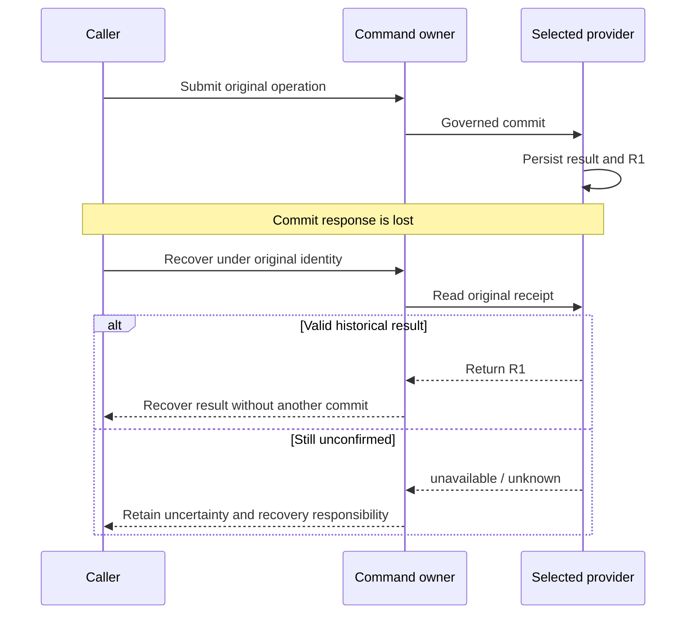

# Recovery, self-repair, and runtime boundaries

The previous chapter explained how one turn leaves an acceptable result. Extend the timeline: sessions change, code advances, permission is revoked and external calls time out. Which work remains usable, which judgments must be repeated, and when should the route change or stop?

Recovery reconstructs **current conditions for action**, not hidden reasoning. Historical transcripts may persist under Host rules and help explain context; they do not replace current authority, applicable acceptance or external state. Recovering a historical fact and authorizing another action remain separate questions.

## Which operation is recovered after a lost response? {#receipt-recovery}

In this synthetic situation, T1's governed operation committed and persisted receipt R1, but the caller lost the response. A failed call does not prove the effect never happened.



The first branch assumes R1 actually exists and is valid. An error without provider readback does not identify the branch. Even confirmed absence permits execution only under the current recovery contract, identity and authority, not merely because a local record is missing.

After R1 is recovered, reread T3's current conditions. A commit for C1 cannot validate C2, and T1 settlement does not replace G1's publication decision.

## Historical recovery or a new execution? {#recovery-or-new-execution}

“Keep the original identity” and “obtain a new execution key” answer different questions.

| Situation | Fact to establish now | Identity handling | Next step and stopping condition |
| --- | --- | --- | --- |
| Response lost; original outcome unconfirmed | What happened to this exact operation? | Preserve operation/effect identity and arguments | Original owner reads back; no new key to hide uncertainty |
| Original operation committed; its receipt is missing | How can the historical result be returned completely? | Recover or replay the original receipt | Check the result without recreating the effect |
| Execution legally released or finished; new work is intended | Do current work, owner and inputs permit another execution? | Retain history; obtain a new proof through admission | Refuse unmet conditions; old receipts do not revive permission |
| Input or requirements changed after validation | Which part does old evidence still support? | Retain history; validate against new inputs | Reassess affected judgments without inventing a global version |

The [lease regression test](https://github.com/loopx-project/loopx/blob/76b7583a9f67d6090b43a8c6e58c42cb67a1f3c6/tests/control_plane/test_canonical_lease_acquire.py) provides a concrete example: after renewal, replayed acquisition preserves the original receipt but returns the current lease; after release, reusing the retired acquire key is rejected. Historical explanation and current execution proof are different materials.

Recovery is not an opportunity to change the original intent. When an interface requires exact replay, do not casually replace receiver, Todo, TTL or version. Resolve the original operation first, then express new intent through a new legal lifecycle action. Request-digest and replay requirements belong to each current contract.

## What do different revisions protect? {#revision-bases}

| Identity or revision | Question answered | What it cannot replace |
| --- | --- | --- |
| Artifact / commit revision | Which artifact was validated or delivered? | Provider commit revision or execution permission |
| Provider revision | Can this storage snapshot still be committed? | Artifact revision or lease epoch |
| Lease version | Which current lease record does this request use? | Another Todo's or provider's revision |
| Lease epoch / execution key | Which execution holds current proof; was the older one retired? | Readback of an external effect |
| Turn / operation identity | Which action, writeback or settlement is bound and recovered? | Admission for a new turn |
| Evidence time and source | Where did the observation come from, and is it applicable? | Correct object and scope merely because it was just read |

No one integer represents all these dimensions. Separate reads also need not be one atomic snapshot. Retain each basis and source; report missing fields instead of supplying an invented `version=0`. See [state](state-substrate.md) and the [state-machine topic](core-state-machines.md).

### What becomes stale when C1 changes to C2? {#changed-evidence}

Checks on C1 remain trustworthy history, but do not automatically validate C2. Identify what changed: code, validation declarations, dependencies, approval scope or the execution environment.

A formatting-only documentation edit need not repeat every domain experiment; an output-schema change requires reassessing dependent code, examples, acceptance and approval. Support impact judgment with the diff, current requirements and a validation plan, not the assertion that a change is small.

Whether G1 still covers C2 depends on the object and conditions of the original decision. Not every decision necessarily expires, and historical approval is not perpetual permission. Use existing planning and decision entrypoints to update applicability, revalidate affected work, and let current admission choose the next action.

## Four continuation actions for four kinds of problem

**Continuation:** the objective and route remain valid, and another legal segment begins. Even a resumable Host session must reread current guards rather than reuse an old selected Todo.

**Retry / reconcile:** original intent remains valid, but the original operation must be confirmed or finished. Retry only under a verified idempotency/recovery boundary; prefer reconciliation or readback while external outcome is unknown. `unknown` is not another spelling of failure.

**Replan:** the meaning of the work must change, for example after contradictory evidence, changed acceptance or an exhausted frontier with unmet objectives. Produce a result accepted by the current contract: Todo, Vision, successor or acceptance relationships, or a justified terminal result, not another copy of the plan.

**Self-repair:** the work may remain correct, but sources, projections, routing or receipt lineage have a gap. Locate the owner and repair that gap. Deleting Gates, weakening validators or clearing history is not repair.

Dreaming proposes directions or hypotheses; it does not acquire execution authority. Accepted planning/decision and lifecycle writeback are required before proposals affect actual work. Domain results likewise enter through Capability/Provider contracts and do not own generic permission rules.

## Material evidence delta: activity is not progress

Imagine a teaching case in which a day produces notes, unrelated tests and directory reorganization, but reduces none of the acceptance gaps. The artifacts may exist; that alone does not establish convergence. This is not a claim that current policy unconditionally permits infinite repetition.

Material evidence delta concerns new evidence or state that changes the next judgment, not counts of turns, files or characters. Negative results can matter: rejecting a hypothesis, confirming a blocker or narrowing an unknown can change the route.

Delivery Batch Scale describes change scope; Delivery Outcome describes its relation to the objective. `multi_surface` or `implementation` does not automatically complete a Goal. Interpret `surface_only`, `outcome_gap`, `outcome_progress` and `primary_goal_outcome` under their contract; an attractive label is not evidence.

### Vision checkpoints and baselines

Vision is a per-Agent execution route, not a scratchpad. Applicable material refresh must account for a patched route, supported unchanged result, retirement/supersession, or why the role does not require Vision.

“Unchanged” needs a comparable baseline. Establish the route when none exists rather than describing never-checked as unchanged. For gaps such as `vision_checkpoint_missing`, return to the checkpoint owner and supply the actual relationship, not more aspirational prose. Current owners still determine precedence among replanning and repair; this explanation is not a global rule table for all Hosts.

### Six convergence invariants

These questions check completeness; they add no public fields or automatic acceptance algorithm:

1. **Direction:** how does current work relate to the Goal or Acceptance and applicable Vision?
2. **Authority:** is the correct actor currently eligible for the correct object and scope? Capability is not permission.
3. **Evidence:** do observation, validation and decisions bind the correct inputs and sources and satisfy freshness requirements?
4. **Delta:** what rereadable fact was added, or which legitimate wait was established?
5. **Liveness:** does unfinished work have an action, executable observation, decision, repair or explicit stopping responsibility?
6. **Terminal state:** were successors, waits, receipts and acceptance gaps handled under the applicable contract, rather than merely finding an empty list?

Safety avoids incorrect progress; liveness avoids getting stranded without a next entrypoint. Neither guarantees arbitrary objectives will succeed. See [long-horizon convergence](/loopx/docs/development/control-plane-course/topic-long-horizon-convergence/) and [evidence and repair](/loopx/docs/development/control-plane-course/08-evidence-refresh-and-self-repair/).

## Which surface should be repaired when two disagree? {#projection-repair}

```text
Detect disagreement
  → verify Goal, source, mode, time and truncation range
  → identify the source owning that fact
  → distinguish non-commit, source error, stale projection, read failure and migration differences
  → repair through the appropriate owner
  → read back and reassess dependent work
```

Legacy Markdown can still be source; a Todo under a selected canonical provider cannot fall back to old Markdown. If source committed but display is old, repair projection. If source itself is wrong, use its lifecycle. If reads fail, retain uncertainty. Manually making several pages agree does not restore correct state.

`refresh-state` is controlled writeback, not a universal diagnostic query. Separate inspection from mutation using the [field reference](appendix-reference.md#read-before-change). See the Workspace [pause case](workspace-v1.md#pause-readback) for comparing an operation receipt with a displayed status.

## Stop, closure and compensation

An owner-stopped Goal, paused quota or exited Host does not prove completion. `terminal_no_followup` needs its frontier/acceptance conditions. Zero visible Todos is insufficient: output may be truncated, or Monitors, Gates, successors, handoff, replanning and result-return responsibilities may remain.

When requirements are satisfied, record the basis through the existing terminal entrypoint. Keep a successor for unfinished work or observation/blocker for unknown results. Verified negative results and coverage-backed no-follow-up can honestly end a route without inventing success.

A wrong effect that already occurred needs compensation, not deleted history. The [rollback packet protocol](/loopx/docs/reference/protocols/rollback-packet-v0/) describes affected objects, origins, recovery choices, approval and validation; the packet is not execution permission. Revert, fix-forward, external cleanup and support requests have different prerequisites. Rolling back installation need not reverse state formats or remote effects.

After compensation, recheck actual postconditions and identify what the acceptor still needs to confirm. Internal closeout, recipient receipt and overall acceptance remain separate; see [first delivery](05-connect-existing-project.md#first-delivery).

## Recovery costs and public boundaries

Recovery depends on readable original records, available provider readback and current permission. Missing prerequisites can require people or external support; changing identity does not make the problem disappear. Repeated projection repair is an engineering problem, not justified merely because the system can repair itself.

Evidence collection costs time and resources and should match the risk. Too little checking misses changes; excessive repetition can consume the delivery budget. Retain minimally sufficient evidence, not every thought forever.

Private registries, active state, leases, session handles, credentials and raw transcripts do not belong in public examples. Handoff carries necessary bounded references, freshness and legal retrieval routes, not all private material. Establish Git boundaries for `.loopx/`, `.loopx/goals/` and `.local/` according to actual use; ignore rules do not replace credential scans or inspection of already committed history.

You should now be able to classify an interruption, identify preserved identity and freshly observed conditions, and name the recovery entrypoint and stopping condition. When the result remains unknown, return explicit recovery responsibility rather than “run it again and see.”

A writeback may mark the vision unchanged only when all of the following hold:

- a comparable baseline exists (the vision written in the previous round);
- this round's delivery did not genuinely change any vision premise;
- the writeback gives the "unchanged" reason with `--vision-unchanged-reason`; LoopX binds the existing
  vision as the baseline automatically, so no separate revision is passed.

If the baseline is missing but the agent still claims unchanged, quota will produce a
`vision_checkpoint_missing` gap. This is not a punishment, but a guard against the agent accumulating
wrong assumptions on a never-checked state. For the full failure replay, see
[Control-Plane Course Lesson 8](/loopx/docs/development/control-plane-course/08-evidence-refresh-and-self-repair/).

## Terminal closure

Every current Todo being done proves only that the list ended. A terminal audit also checks:

```text
open todos = 0
due monitors = 0
unresolved blocking gates = 0
pending successors = 0
replan obligations = 0
acceptance gaps = 0
retryable postconditions = 0
required external readbacks are fresh
```

If acceptance is satisfied and no follow-up is needed, record structured no-follow-up. If work remains,
create a successor. If an external result is still pending, preserve a monitor or blocker. Do not delete
open state to make the Goal look complete.

## Four runtime responsibilities

Long-running Agent systems often call every component a "tool" or "plugin." LoopX uses four runtime
responsibilities:

| Responsibility | Contract |
| --- | --- |
| Agent / Executor | Plans and executes one allowed bounded action in a Host |
| Provider | Calls an external system and returns an observation, effect result, or readback |
| Capability | Defines a caller outcome, normalizes Provider output, and applies domain policy |
| LoopX Kernel | Accepts or rejects a proposal and owns generic Goal, Todo, Gate, quota, and recovery state |

The normal flow is not "the Agent called a tool, therefore the Todo is done":

```text
Agent -> Capability -> Provider -> external system
Provider readback -> Capability validation/proposal -> LoopX transition
```

A Capability is the outcome contract a caller can depend on. A Provider implements or accesses an external
system. The Kernel owns cross-domain lifecycle. Domain results such as Issue-Fix or Explore can own their
Domain State, but they must not own generic quota, Gates, or permission in reverse.

## Extension is a delivery and lifecycle boundary

An **Extension** has independent:

- packaging;
- installation;
- enable and disable;
- upgrade and rollback;
- compatibility;
- provider ownership.

It is not a fifth runtime responsibility and does not automatically gain domain authority:

```text
Extension package
└── delivers Provider
      └── participates in Agent -> Capability -> Provider -> Kernel flow
```

For a deterministic, zero-permission standalone Extension, LoopX can call a bounded request/response
command through the managed runtime. As soon as an operation needs read, write, send, publish, or manage
authority, it must enter a Capability or domain command that can enforce permission, decision scope, and
domain policy.

"Installed," "doctor-ready," and "authorized for this effect" are three different states.

## Who owns each fact

### LoopX canonical state

LoopX owns work-lifecycle facts:

- Goal, Todo, and Gate;
- claim, lease, dependency, and successor;
- quota, monitor, and scheduler hint;
- accepted evidence pointer and receipt;
- event lineage, Vision checkpoint, and projection inputs.

### External systems

External systems remain authoritative for their facts:

- Git owns commits and branches;
- GitHub owns current PR, Issue, and check state;
- CI owns job results;
- a cloud service owns actual resource state;
- the Host owns its session and actual wake-up effect.

LoopX may retain bounded observations, readbacks, and evidence pointers. A stale copy must not replace the
external authority.

### Host and Agent

The Host owns sessions, model turns, tool surfaces, and actual wake-up mechanisms. The Agent owns current
reasoning and a temporary plan. Neither can be the sole owner of project Goal state.

The Host follows the current `interaction_contract` and `scheduler_hint`. It must not preserve
project-specific control logic indefinitely in a heartbeat prompt. The Agent cannot infer current
authority merely because a similar action was legal in a previous turn.

## Public/private boundary

Project control state commonly contains material that must not be committed publicly:

- local registry and active Goal state;
- task leases and Host session handles;
- raw transcripts, trajectories, and verifier tails;
- credentials and private Provider configuration;
- machine paths, internal links, and private organizational narrative;
- unredacted external evidence.

The project-onboarding chapter requires these directories to stay outside Git:

```text
.loopx/
.loopx/goals/
.local/
```

Ignore rules are only one defense. Before publication, still scan for credentials, absolute paths, raw
logs, private links, and runtime artifacts. Durable public conclusions should first become public-safe
behavior, schema, fixtures, or evidence pointers.

A handoff must not copy private material into a public packet. It transfers stable ids, bounded references,
freshness, omission notes, and legal routes for reacquiring material.

## What LoopX does not replace

LoopX does not replace:

- Agent runtime: the model still performs reasoning;
- Host scheduler: the Host still performs actual wake-up;
- Git: code history and branches are still managed by Git;
- CI: test execution and check state are still managed by CI;
- external service authentication: TurnEnvelope and receipt are not security tokens;
- domain system: LoopX does not fabricate external resource facts;
- independent validator: an Executor's own completion claim is not sufficient proof.

These boundaries support two later practice paths:

1. **Project onboarding**: reuse these protocols without modifying LoopX source.
2. **Developer contributions**: locate the owning boundary from the caller outcome and protocol, and
   deliver Control Plane, Capability/Domain State, Provider, Host/Runner,
   Projection/Dashboard, Docs/fixtures, or Extension.

Extension is an independent packaging/lifecycle path within developer contributions, not the unified
abstraction for all contributions. The two paths share the same control-plane model and do not require one
another. The next part starts with the most common job: project onboarding.
