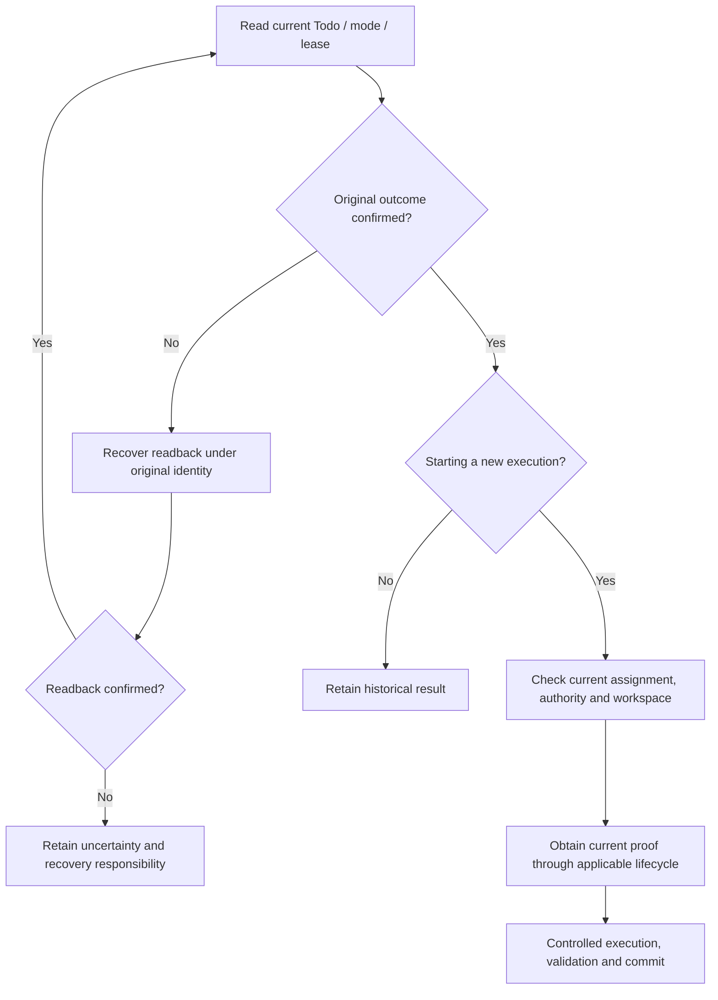

# Work graphs, authority, and peer collaboration

A can implement JSON, B can document it, and the maintainer can still withhold publication approval. A work graph makes these separate, identified pieces of work with dependencies and acceptance conditions. “Someone is working” does not permit every action.

Separate assignment, execution proof and decision scope, then follow handoff through integration. Actual writes remain governed by the current authority, handoff mode and writer; this chapter adds no universal authorizer.

## Split a task into acceptable work {#design-choice}

In the [running example](00-reading-guide.md#running-example), T1 produces a compatible implementation, T2 produces matching documentation, M1 observes external state, G1 records a decision, and T3 delivers accepted results.

| Choice | Problem addressed | Remaining cost |
| --- | --- | --- |
| One Agent continues | Simpler handoff and conflict handling | Still needs cross-session state, validation and external waiting |
| Peers use soft claims | Makes responsibility and available work explicit | Claim alone does not exclude stale or competing instances |
| Applicable writers use leases and fences | Current execution proof participates in controlled commit | TTL, revisions, renewal and recovery need handling |
| Isolated workspaces and independent acceptance | Reduces direct editing interference | Does not replace integration validation or merge permission |

Do not decompose merely to increase Agent count. If B depends on each successive A result, both can remain on one critical path. Parallelism is useful when each can produce an independently verifiable result. Define input, artifact and downstream acceptance for each piece.

## Four judgments that must not be collapsed {#authority-layers}

| Judgment | Basis | Insufficient substitute |
| --- | --- | --- |
| Does this work exist and remain actionable? | Current Todo source, status, dependencies and boundaries | An old list still showing open |
| Who should handle it? | Claim, binding, exclusion and peer/lane rules | An Agent introduction or process name |
| May this execution instance commit now? | Applicable lease, current owner/key/version and writer fence | An earlier successful acquire |
| Is this action allowed? | Goal/repository permission, Gate scope, capability and workspace conditions | Callable tools, writable directories or available quota |

Agent identity denotes a work lane, not a Host or organizational rank. `claimed_by` is not process liveness, and a valid lease does not establish correct reasoning. Whether an external sink rejects a stale executor depends on that sink's enforcement; a local lease does not imply system-wide fencing.

## Gates cover actions, not a global count

G1 constrains T3's publication scope. T2 can continue if it is genuinely independent and satisfies its own conditions, while G1 remains visible to the user. Independent fallback does not bypass a Gate; it never performs the covered action.

```text
G1: publication scope remains unapproved
T3: requires G1 → do not publish
T2: does not require G1 and other conditions hold → current admission may select documentation
```

Missing or conflicting scope must not become guessed approval or an implicit global Gate. The source/projection/decision owner repairs the relationship or asks an authorized person a concrete question. A `user_action` reminder does not substitute for a `user_gate` decision.

Owner operations have lifecycle authority; automated work has quota admission. Clicking a Workspace button creates no permission, and quota does not approve every owner operation. See [Workspace actions](workspace-v1.md#action-owners).

## Claims, leases and current execution proof

`handoff_mode` determines applicable constraints. Default `legacy` retains soft-claim/hard-lease compatibility; `soft_claim` and `hard_lease` have their own rules. Some legacy terminal paths can return `terminal_fence_not_required`. A regression in one mode is not proof of strong exclusion across every writer.

Promoted File/SQLite authority reads from the selected provider rather than falling back to old lease files. Source selection, registration and current Todo eligibility participate alongside the lease. `task-lease inspect` is an observation, not a lock held across subsequent work.

| Lifecycle action | Meaning under the applicable contract | What the caller preserves |
| --- | --- | --- |
| acquire | Obtain proof for a new legal execution | Work/execution identity, current conditions and result |
| renew | Extend the current execution's validity | Current owner/key/version, not an arbitrarily old revision |
| transfer | Hand execution to an eligible recipient | Exact sender proof, recipient and original request intent |
| release | Legally retire the current proof | Original owner/key/version and operation receipt |

This table does not define generic CLI arguments. Use current help and actual readback: renewal, transfer and release differ in revision, epoch and cleanup rules. See [recovery](04-runtime-boundaries.md#recovery-or-new-execution) for historical replay versus a new acquisition.

### What happens when an old executor returns?

A can retain a historical receipt after B holds a new current proof. That does not let A keep writing. Read history separately from the current lease. Use the original operation to recover history, and current admission to start new work.



An identical Agent name, restarted terminal or old success screenshot does not bypass this path. `version_mismatch` calls for current-state inspection. `idempotency_key_reuse` after release is not repaired by editing a historical key.

## Follow a handoff through integration {#handoff-to-integration}

Handoff is more than sending a message. A recipient must know which work was received, which input was adopted, and which conditions remain, then confirm eligibility in its actual execution environment.

**First, A returns a concrete artifact.** T1 references C1, validation declarations/results and outstanding M1/G1, not merely “JSON is done.”

**Second, B identifies the adopted input.** Documentation follows C1's field contract. An inaccessible artifact is a missing handoff input, not a reason to reimplement T1. Handoff uses bounded references and legal retrieval, not a public copy of every private transcript.

**Third, assignment changes legally.** Whether lease transfer also updates the Todo claim depends on the selected command. Do not assume lease-only transfer changes claim, or replace an atomic handoff with two manual writes. Recipients must still satisfy registration, binding, exclusion, scope and workspace conditions. Follow the version scope in the [canonical lease reference](https://github.com/loopx-project/loopx/blob/f49b4a00870604d39fa4318da24d6dd35e72bb6e/docs/reference/canonical-lease-renew.md).

**Fourth, validate the combination after validating each artifact.** T1 code checks and T2 example checks establish their own outcomes. Integration must test the two on one candidate revision. Two green branches do not prove a green combined commit.

**Fifth, propagate relevant changes through dependencies.** When A revises C1 to C2, B checks whether field or behavior changes affect documentation and validation. Retain history and update affected conclusions. C1-based work is neither automatically worthless nor automatically valid for C2.

**Sixth, return the result to its acceptor.** T3 reassesses current artifacts and decisions. Message delivery, recipient input adoption, work acceptance, publication permission and actual external delivery each require appropriate evidence. None alone establishes the whole chain.

This six-step teaching case does not claim automatic coordination across every Host, device or repository. Qualify the relationships the user actually needs.

## Workspace isolation is not integrated correctness {#parallel-editing}

Ordinary conservative coordination excludes conflicting write scopes. A newer collaborative-editing mode can permit some same-path edits while still withholding merge authority.

This is an **advanced source comparison**: main `f49b4a00…` documents an explicit `--write-worktree` path in the [independent-worktree reference](https://github.com/loopx-project/loopx/blob/f49b4a00870604d39fa4318da24d6dd35e72bb6e/docs/reference/canonical-lease-renew.md). The current source includes that implementation; the explanation follows its existing contract and must not be backdated to released `v1.2.3` behavior.

On that promoted File/SQLite path, verified sibling worktrees on one machine can hold overlapping code-edit scopes under specified conditions, returning `integration_overlap_advisories`. Repository identity comes from the authoritative Todo. Host/path aliases, the same Todo or worktree, unverified workspaces and other machines retain their applicable exclusion rules.

| Condition established | What it supports | What remains unproved |
| --- | --- | --- |
| Verified workspace isolation | Edits occur in distinguished checkouts | Permission to modify shared runtime data or Git administration |
| Accepted lease admission | The coordination mode permits this execution | Wider tool permission or a cross-Goal global lock |
| Both changes independently validated | Each artifact satisfies checked conditions | Correct behavior after combining them |
| Integration validation passed | This combination satisfies relevant checks | Merge, remote-write or publication authority |

This is cooperative code-edit coordination, not an OS sandbox. Reads and renewals do not upgrade old grants into the new mode. Change execution intent through legal retirement and new proof. Installing a provider or renaming a directory does not promote authority or grant permission.

## Preserve dependencies and successors

`todo_done:<todo-id>`, `monitor_changed:<todo-id>`, `capacity_available:<capability>` and `pr_merged:<pr-id>` express different resume conditions. A satisfied condition informs the next judgment; it need not automatically change persisted Todo status.

Cross-repository dependencies require correct repository identity. `pr_merged:#123` may resolve from the Todo's GitHub `task_repository`; `pr_merged:owner/repo#123` supplies an explicit target. If neither resolves the repository, do not guess from an equal PR number.

A successor identifies subsequent work. Supersede preserves replacement lineage; its lifecycle records the predecessor as done with the replacement marker. No-follow-up explains why this route needs no successor and does not automatically accept the whole Goal. Read actual `independent_handoff` or `same_agent_non_delivery` policy from writeback, not from prose.

## Inspect named evidence boundaries

| Claim to check | Source-test entry | What it must not become |
| --- | --- | --- |
| Historical acquire differs from current proof | `tests/control_plane/test_canonical_lease_acquire.py` | Proof of every concurrency and TTL case |
| Current records govern renewal and transfer | `test_canonical_lease_renew.py`, `test_canonical_lease_lifecycle.py` | Enforcement at every external sink |
| Old writers cannot bypass an active source fence | `test_legacy_coordination_writer_fence.py` | All legacy modes have been removed |
| Runtime-root override does not bypass source fencing | `test_split_root_todo_writeback_fence.py` | A CLI argument grants extra permission |

These tests establish their named inputs and writer boundaries, not the health of a live Goal. See the [lease exercise](12-control-plane-course.md#checkpoint-lease) for assertions and the [appendix](appendix-reference.md#read-before-change) for actual inspection.

Collaboration succeeds when the recipient knows what it adopted, the current executor has applicable proof, integration has an owner, and outstanding decisions have a destination. Repair an unclear scope, proof or input relationship instead of redistributing every task and hoping for a different result.
